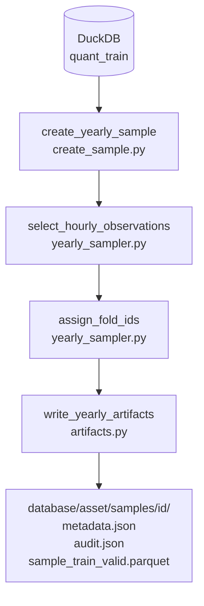
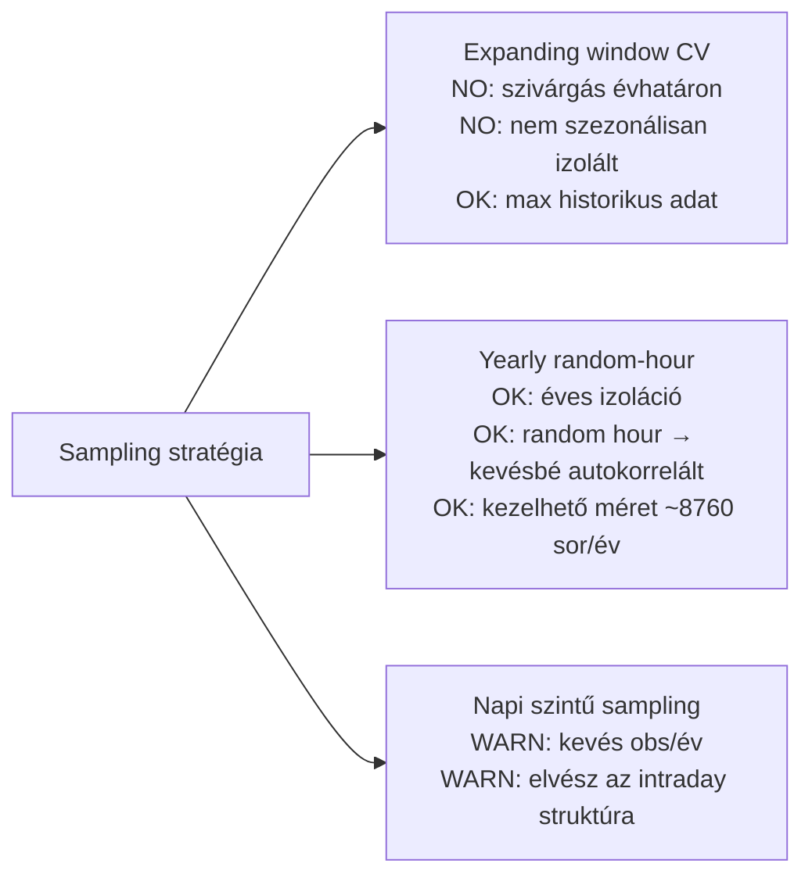
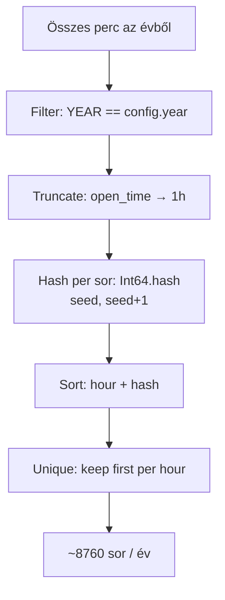
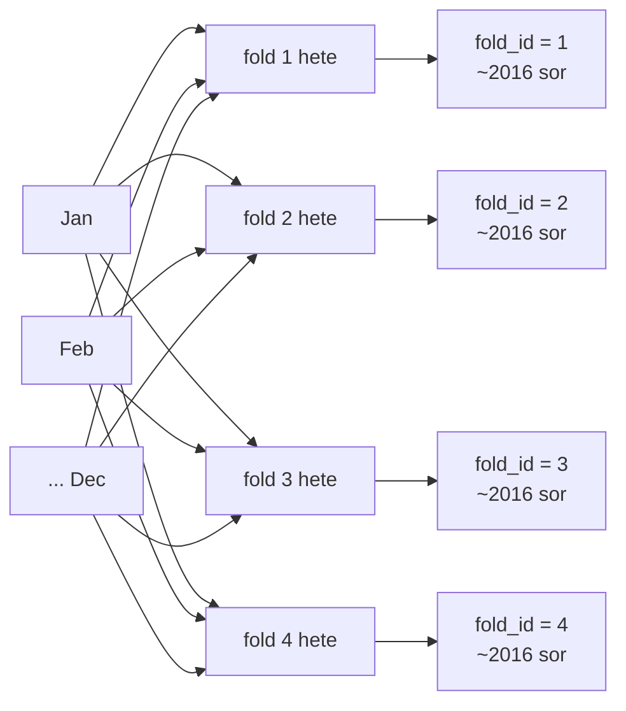

# 5010 — Yearly Random-Hour Sampling

Az éves, random-óra-alapú sampling stratégia lényege: egy naptári évre pontosan egy
random percet választ óránként (~8 760 sor/év), majd 4-fold stratifikált CV struktúrát
rendel a sorokhoz hónapon belüli fold-id hozzárendeléssel.

---

## Overview



A pipeline input-ja a `quant_train` tábla (feat_* + target oszlopok, NULL target sorok
kizárva); kimenetei:
- `database/<asset>/samples/<sample_id>/metadata.json`, `audit.json`, `sample_train_valid.parquet`

---

## Üzleti és módszertani háttér

> **Két sampling mód létezik:**
>
> - **Legacy (yearly random-hour + random-week fold assignment)** — kutatási iterációra alkalmas, nem production-szerű validációhoz. Egy naptári éven belül stratifikáltan oszt foldokat hetek szerint.
> - **Walk-forward (ACTIVE)** — production-szerű: `9 hónap train + 3 hónap validation`, időalapú, szezonálisan izolált ablakok. Ez az ajánlott módszer éles előminősítőkhöz.

### Miért kritikus ez a lépés?

A yearly sampling dönt arról, hogy melyik percek kerülnek melyik fold-ba. Egy rossz
split → információszivárgás train→valid irányba → a model jónak látszik backtesten,
de élesben alulteljesít.

Az éves granularitás egy további célt is szolgál: minden naptári év egy önálló
megfigyelési egységként értékelhető, így a modell éven belüli stabilitása és az
évek közötti rezsimváltás hatása külön mérhető.

---

### Miért ezt a megközelítést?



| Megközelítés | Előny | Hátrány | Státusz |
|---|---|---|---|
| **Yearly random-hour** | Éves izoláció; random hour → kevésbé autokorrelált minták; kezelhető méret | Nem maximalizálja a historikus adatot | ✅ Választott |
| Expanding window CV | Maximális historikus kontextus; hagyományos ML-CV analógia | Évhatáron átnyúló szivárgás lehetséges; nem mér éves stabilitást | ❌ Elvetett — éves izolációt nem biztosít |
| Napi mintavétel (1 bar/nap) | Minimális korreláció | Elvész az intraday mintázat; ~365 sor/év → túl kevés | ❌ Elvetett — intraday struktúra elvész |
| Minden perc (nincs mintavétel) | Maximális adatsűrűség | Erős autokorrelációval torzított metrikák | ❌ Elvetett — szivárgás kockázata magas |

---

### Random hour selection: miért kell és hogyan működik?

Az 1 perces OHLCV sorok erősen autokorreláltak — egymást követő percek közel azonos
feature-vektorokat adnak. Ha minden percet betennénk, a validációs metrikák optimistán
torzítottak lennének (a model "emlékszik" az előző percre).

Az **óránkénti random mintavétel** csökkenti ezt az autokorrelációt: az egy percnyi
ugrás + random kiválasztás biztosítja, hogy szomszédos sorok ne ugyanazon árjelből
következzenek.

**Szabály:** Egy naptári évből pontosan 1 sort választunk minden teljes óra-egységre.
Szökőévben 8 784, standard évben 8 760 sort kapunk (ha az adatbázis teljes).

**Reprodukálhatóság:** a kiválasztás `open_time.cast(Int64).hash(seed, seed+1)` alapú
— row-ordering független, azonos seed + év → azonos kiválasztás.



---

### 4-fold stratifikált CV assignment: miért kell és hogyan működik?

A validáció célja a generalizációs képesség mérése. Egy szezon-izolált validáció
(pl. csak Q4) elfogult lehet a piaci ciklus adott fázisára. Ezért **4 foldot**
hozunk létre stratifikált hozzárendeléssel — minden fold kap 1 hetet/hónap —,
így minden naptári hónap és piaci szezon mind a négy foldban képviselve van.

A hetek **teljes Monday–Sunday egységek**: ez megőrzi az intraday és intraweek
periodikus mintázatokat a validációs ablakban. Az esetleges hónaphatár-átlépés
(pl. dec. 29 → jan. 4) elfogadható — a hét integritása prioritás.

**Fold assignment logika (havonta ismételve):**
1. Kiszedi a hónap összes hétfőjét (4 vagy 5 db)
2. Random shuffle (`random.Random(seed)`) — determinisztikus, reprodukálható
3. Ciklikus fold_id hozzárendelés: `fold_id = (i % 4) + 1`
4. Minden napnak a héthez tartozó fold_id-t rendeli (Mon–Sun intervallum)



**Eredmény:** minden fold ~12 hetet tartalmaz (~2 016 sor); a maradék sorok
(hetek, amelyek nem kerülnek validba az adott foldban) alkotják az adott fold
training adatát (~6 048 sor).

---

### Walk-forward CV

> **ACTIVE** — Ez a production-szerű validációs stratégia. Az egyszerű random-week fold assignmenttel ellentétben explicit időablakokat definiál: minden fold train és validációs periódusa idő szerint sorban következik.

**Konfiguráció:**
- `train_months = 9` — a train ablak hossza hónapban
- `valid_months = 3` — a validációs ablak hossza hónapban
- `shift_months = 3` — az egymást követő foldok közötti eltolás

**Fold séma (anchor = 2021):**

| Fold | Train start | Train end | Valid start | Valid end |
|------|------------|-----------|-------------|-----------|
| 1 | 2021-01-01 | 2021-09-30 | 2021-10-01 | 2021-12-31 |
| 2 | 2021-04-01 | 2021-12-31 | 2022-01-01 | 2022-03-31 |
| 3 | 2021-07-01 | 2022-03-31 | 2022-04-01 | 2022-06-30 |
| 4 | 2021-10-01 | 2022-06-30 | 2022-07-01 | 2022-09-30 |

- Az első fold validációs ablak az anchor év 10. hónapjától kezdődik
- A validációs ablakok **non-overlapping** — nincs átfedés köztük
- A validáció átnyúlhat a következő évre (elfogadott viselkedés)
- `fold_id = 0`: train-only sorok — egyik validációs ablakba sem esnek
- `fold_id 1–4`: az adott fold validációs ablakába eső sorok

**Metadata különbség a Legacy-hez képest:**
- `fold_time_windows` a `metadata.json`-ban (a `fold_week_assignments` helyett): lista, foldonkénti időhatárokkal (train_start, train_end, valid_start, valid_end)

**Purge:** 240 perc (konzervatív; `max(target_horizon=60, longest_feature_lookback=140)` feletti safety margin biztosítja, hogy train sorok ne szivárogjanak a valid ablakba)

**Miért walk-forward?**
- **Időrendi szivárgás kizárása:** a train ablak mindig a validációs ablak előtt végződik
- **Production-like értékelés:** az éles rendszerben is időrendben kerülnek elő az adatok
- **Szezonalitás reprezentáció:** 4 különböző negyedéves validációs ablak → éven belüli rezsim-eltolódások láthatók

---

### Purge (±240 perc): miért kell és hogyan működik?

A `feat_ohlcv_quant` feature-ök rolling ablakokkal számítottak. Ha egy validációs
hét elején lévő sor feature-vektora egy train-beli percből "visszanéz" az előző
ablakba, az implicit tudást hordoz a train adatból — ez szivárgás.

A **purge** ezt kezeli: a validációs hét előtti és utáni `purge_minutes` percben lévő
sorokat a search során dinamikusan zárjuk ki a train halmazból.

```
... [train] ... [purge 240 perc] [valid hét Mon–Sun] [purge 240 perc] [train] ...
```

**Fontos:** A purge **nem pre-komputált** szegmensként tárolódik a parquetben —
a sample parquet csak `fold_id` oszlopot tartalmaz. A purge kizárást a
`lgbm_search.py` (és a training pipeline) számítja dinamikusan minden fold
kiértékelésekor.

**Miért 240 perc?**
A `features.json`-ban a leghosszabb rolling ablak 140 bar (= 140 perc 1m chart-on).
A 240 perces purge ~71%-os biztonsági margót ad a 140 perces max lookback fölé.
Ez biztosítja, hogy még a leghosszabb feature-ablak is biztosan a train-en belül
marad, nem "néz bele" a validációs ablak előtti percekbe.

**Szabály:** Purge sorok sem train, sem valid set-be nem kerülhetnek egy adott fold
kiértékelésekor.

---

### Per-fold méret összehasonlítás

| Stratégia | Foldok | Valid sorok/fold | Train sorok/fold | Fit/trial | Valid ablak | Fold assignment | Státusz |
|-----------|--------|-----------------|-----------------|-----------|-------------|-----------------|---------|
| Régi (12-fold) | 12 | ~168 (1 hét) | ~6 648 (fix) | 12 | 1 hét/fold | `segment` oszlop | Legacy |
| 4-fold stratifikált (random-week) | 4 | ~2 016 (12 hét) | ~6 048 (36 hét) | 4 | 12 hét, stratifikált | `fold_week_assignments` | Legacy |
| Walk-forward (9+3m) | 4 | ~2 760 (valid) | ~7 000–9 000 (train, bővülő) | 4 | 3 hónap/fold | Explicit időablak | **ACTIVE** |

---

### Paraméter alapértékek és indoklásuk

| Paraméter | Alapérték | Indoklás |
|-----------|-----------|---------|
| `n_folds` | `4` | 4 fold → kellő valid méret (~2016 sor/fold) és kezelhető train/valid arány (3:1); kevesebb fit/trial mint a 12-fold megközelítésnél |
| `purge_minutes` | `240` | Max feature lookback = 140 perc; 240 perc ~71%-os biztonsági margó; biztonságos default a jövőbeli feature-bővítésekre is |
| `seed` | `42 + year` | Évenként eltérő seed → különböző óra- és hétválasztás; reprodukálható, dokumentálható; 42 konvencionális ML alap |
| `target_cols` | `("long_mfe_fw60", "short_mfe_fw60")` | Aktív target páros a v4 modellekhez; tuple → immutable config |
| `feature_cols` | `()` | Üres tuple = minden `feat_*` oszlop auto-discovery quant_train-ből futásidőben |
| `sample_id` | `{asset_id}_fw60_yearly_{year}` | Emberi olvashatóság + programmatikus parse-olhatóság; egyértelműen azonosítja az évet és stratégiát |

---

### Ismert kockázatok és korlátok

| Kockázat | Tünet | Mitigáció |
|---|---|---|
| Év-határon átnyúló validation week (pl. dec. 29 → jan. 4) | 2025-ös évben az adott fold valid sora kevesebb — jan. adatok hiányoznak | Elfogadott viselkedés; audit.json tartalmaz `missing_hours` mezőt; alert ha bármelyik fold_row_count < 1800 |
| Szökőév (pl. 2024) | Egy-egy fold enyhén több sort kaphat | Elfogadott; dokumentált; fold_row_counts-ban látható |
| Hiányzó DB adatok az évben | `missing_hours > 0` az audit-ban | Ellenőrizd az audit.json-t minden generált sample-nál; ne használd ha `missing_hours > 500` |
| Random hour selection nem fed le minden intraday mintát | Szisztematikus intraday anomáliák alulreprezentáltak | Elfogadott — hash-based random egyenletes eloszlást közelít; manuális audit ajánlott ha intraday pattern ismert |
| 5 hétfős hónap (pl. egyes hónapokban 5 hétfő van) | Az 5. hét az `(i % 4) + 1` logika szerint az 1. foldba kerül vissza | Elfogadott — mindegyik fold kap ~13 hetet az ilyen hónapokban; fold_week_assignments-ban látható |

---

### Validációs checklist

- [ ] `sample_train_valid.parquet` létezik a sample könyvtárban
- [ ] `metadata.json` tartalmaz: `year`, `seed`, `n_folds`, `fold_week_assignments` (4 kulcs, mindegyikben ~12 elem), `fold_row_counts` (4 kulcs)
- [ ] `audit.json` tartalmaz: `missing_hours`, `total_quant_train_rows_in_year`, `actual_hourly_rows`
- [ ] Standard évben: minden fold `fold_row_count ≈ 2 016` (12 hét × 168 óra)
- [ ] `fold_id` oszlop típusa: `Int8`, értékkészlete: `{1, 2, 3, 4}` — semmi más
- [ ] A parquet **nem tartalmaz** `segment` oszlopot
- [ ] Nincs `open_time` átfedés a különböző fold valid ablakjai között
- [ ] Azonos seed + év → azonos `sample_train_valid.parquet` (reprodukálhatósági teszt)
- [ ] `missing_hours < 500` (ha felette van: vizsgáld meg az adatbázis hiányait)

---

## Kapcsolódó fájlok

| Szám | Fájl | Tartalom |
|------|------|----------|
| 5100 | [5100_sampling_config.md](../database_and_code_doc/5100_sampling_config.md) | YearlySamplingConfig dataclass |
| 5200 | [5200_sampling_artifacts.md](../database_and_code_doc/5200_sampling_artifacts.md) | write_yearly_artifacts / load_yearly_sample |
| 5300 | [5300_create_sample.md](../database_and_code_doc/5300_create_sample.md) | create_yearly_sample orchestrator + CLI |
| 5400 | [5400_sampling.md](5400_sampling.md) | **LEGACY** — expanding window CV (archív, nem aktív) |
