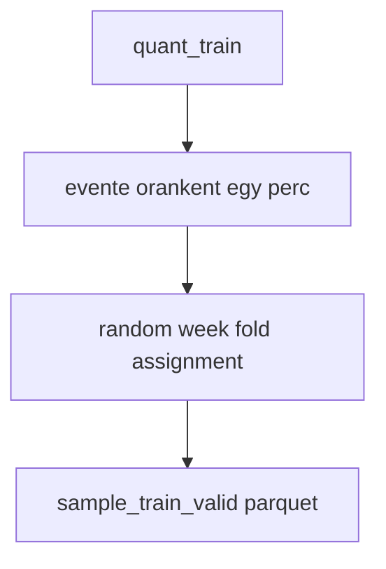
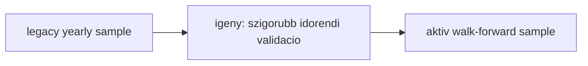

# 5010 - Legacy Yearly Sampling

Ez a dokumentum a korabbi yearly random-hour sampling megkozelitest rogzíti.
Megorzesre erdemes, mert a projekt gondolkodasanak egy elozo allapotat mutatja,
de uj modellekhez mar nem ez az ajanlott ut.

## Overview

## Uzleti es modszertani hatter

### Miért kritikus ez a lépés?

A legacy sampling annak idején arra szolgált, hogy az 1 perces adatsűrűséget erősen
visszafogja, és évente kezelhető méretű mintát adjon a kutatáshoz. Ez fontos lépés
volt a gyors iterációhoz, de már nem fedi pontosan az aktuális deployment-közeli
validációs szerződést.

### Miért ezt a megközelítést?

| Megközelítés | Előny | Hátrány | Státusz |
|--------------|-------|---------|---------|
| Éves random-hour + random-week fold assignment | Gyors, könnyen kezelhető és jól ritkított minta | Foldlogikája ma már nem az aktív pipeline logikája | Legacy |
| Aktiv walk-forward snapshot sampling | Jobb időrendi szerződés | Több infrastruktúrát igényel | Leváltotta |
| Minden perc megtartása | Teljes lefedés | Túl nagy és túl korrelált | Elvetett |
| Napi egy pont | Nagyon gyors | Túl durva információvesztés | Elvetett |

### Miért lett leváltva és hogyan értelmezzük ma?

A legnagyobb problema nem az volt, hogy a yearly minta hasznalhatatlan, hanem az,
hogy a strategyhoz es a snapshot-native provenance-hez mar nem ugyanazt a logikat
beszelte. Emiatt ma inkabb archív referencia, nem pedig aktiv ajanlas.

**Szabály:** ha új modellről van szó, a `5400_sampling.md` az irányadó.

### Paraméter alapértékek és indoklásuk

| Paraméter | Alapérték | Indoklás |
|-----------|-----------|----------|
| mintavételi egység | óránként egy perc | Erős ritkítás, mégis marad intraday szerkezet |
| éves scope | egy naptári év | Könnyen kommunikálható vizsgálati egység |
| foldok | havi/heti szórású fold-hozzárendelés | Szezonális szórás biztosítására szolgált |
| output | parquet-artifact | A régi pipeline ezen keresztül dolgozott |

### Ismert kockázatok és korlátok

| Kockázat | Tünet | Mitigáció |
|----------|-------|-----------|
| Nem aktiv foldlogika | A dokumentáció más CV-szerződést sugall, mint a kód | Egyértelmű legacy címkézés |
| Túl erős ritkítás | Egyes intraday mintázatok elvesznek | Csak történeti referencia, nem új fejlesztés |
| Régi artifact-feltételezés | Parquet-alapú gondolkodás összekeveredik a snapshot-native útvonallal | Aktiv és legacy út szétválasztása a dokumentációban |

### Validációs checklist

- [ ] Az olvasó számára világos, hogy ez archív megközelítés.
- [ ] Nem ez van aktív ajánlásként feltüntetve új modellhez.
- [ ] A dokumentum nem keveri össze a régi parquet-alapú és az új snapshot-native szerződést.
- [ ] Az aktuális modellezési döntésekhez a 5400-as fejezetre történik visszautalás.
