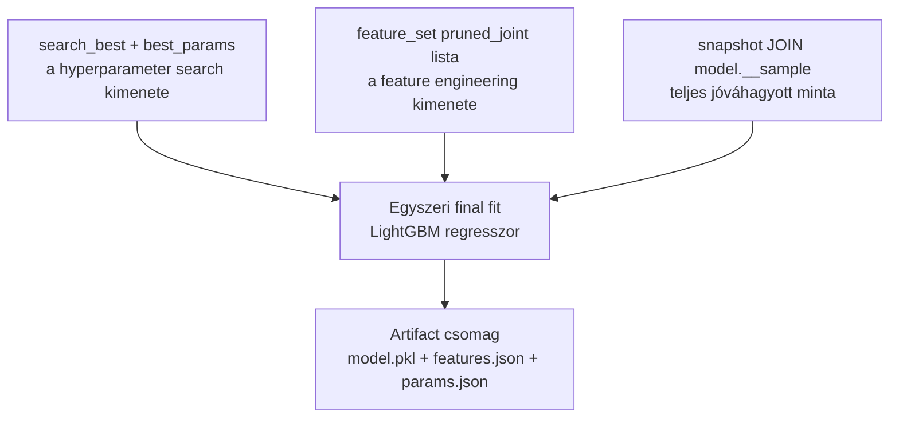
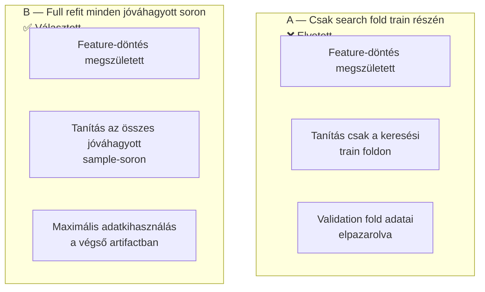
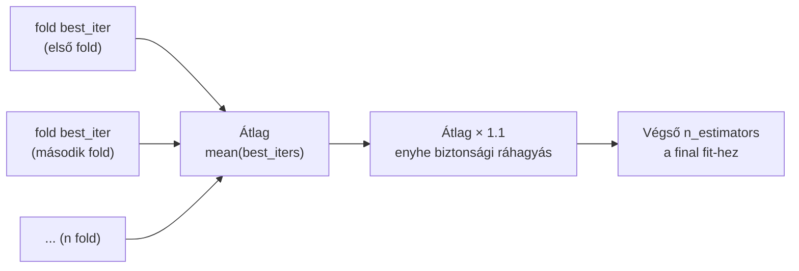

# 5100 — Model Training

## Overview

A training lépés a search után egyetlen végső modellt illeszt. Itt már nincs új CV-keresés: a cél az, hogy a kiválasztott parametrizációt a teljes jóváhagyott mintán refitáljuk, és deployolható artifact-szerződést adjunk tovább.

**A training lépés nem hoz új döntéseket.** A feature lista, a hyperparaméterek és az adatscope mind a megelőző lépésekből érkeznek. A training feladata csak a rögzített szerződés végrehajtása.

---

## Üzleti és módszertani háttér

### Miért kritikus ez a lépés?

A search eredménye önmagában még nem deployolható modell. A trading és a strategy szempontjából egyetlen, konkrét, újrafelhasználható artifact kell. A training lépés teszi a keresést működő modellé — és ezen a ponton dől el, hogy mi kerül be a `model.pkl`-be, milyen feature-listával, milyen famélységgel és hány fával.

### Miért full refit és nem csak a search fold modellje?

| Megközelítés | Előny | Hátrány | Státusz |
|---|---|---|---|
| **Full refit az összes jóváhagyott sample-soron** | Maximalizálja a felhasznált információt; validation fold sem megy veszendőbe | A training külön lépés, nem "egy gombos" a searchsel | ✅ Választott |
| Csak egy kiválasztott fold train részén tanítás | Egyszerűbb | Feleslegesen adatot dob el a végső modellből | ❌ Elvetett |
| Search és train összeolvasztása | Rövidebb pipeline | Nehezebb provenance, nehezebb hibaelemzés | ❌ Elvetett |
| Minden predikció előtt újratanítás | Mindig friss | Operációsan instabil és drága | ❌ Elvetett |

**A full refit azért védhető,** mert a hyperparameter-döntés már korábban megszületett a keresési foldokon. A training lépés nem választ új modellt — a kiválasztott szerződést illeszti újra, ezúttal maximális adatmennyiségen.

**Szabály:** A final fit nem használható arra, hogy utólag új hiperparaméter- vagy feature-döntést igazoljunk.

### N_estimators: hogyan kerül át a search-ből?

A training nem vakon a keresési felső korlátot (3000) használja, hanem a keresési fold best-iteration értékeiből vezeti le a végső `n_estimators`-t.

Ez a mechanizmus biztosítja, hogy a final modell mérete a keresésből származó információt használja, de nem egyetlen fold véletlen optimumát másolja át. A 10%-os puffer konzervatív biztonsági ráhagyás, amellyel a full-refit tanítás (több adat) idő alatt eléri az optimumot.

### Adatbetöltési invariáns — scope-konzisztencia

A training lépés adatbetöltője a `snap ⋈ model.__sample` INNER JOIN path-on olvas — pontosan ugyanúgy, ahogy a search is.

| Kérdés | Válasz |
|---|---|
| Mi történik, ha a train sorainak száma eltér a sample-étől? | A final modell más adat-eloszláson tanul, mint amire a hyperparameter-döntés született. A search eredménye nem transzferálható az eltérő scope-ra. |
| Mikor sérülhet az invariáns? | Ha a `model.__sample` vagy a snapshot tartalma módosulna a training előtt. Ezért a snapshot immutability az invariáns előfeltétele. |

**Szabály:** Ha bármely downstream lépés időablakos szűréssel dolgozna (MIN/MAX open_time alapján) az INNER JOIN helyett, megbontaná a scope-konzisztenciát.

---

## Paraméter alapértékek és indoklásuk

| Paraméter | Alapérték | Indoklás |
|---|---|---|
| Trainer | LightGBM regresszor | Illeszkedik a folytonos MFE targethez |
| Final `n_estimators` | fold best iterációk átlaga × 1.1 | Kiegyensúlyozott kompromisszum, enyhe biztonsági ráhagyással |
| `random_state` | `42` | Reprodukálható final fit |
| Input feature-lista | `feature_set.json["pruned_joint"]` | A training nem talál ki új feature-listát |
| Input adat | snapshot JOIN model sample (INNER JOIN) | Ugyanaz a jóváhagyott adatbázis-szerződés |

### Ismert kockázatok és korlátok

| Kockázat | Tünet | Mitigáció |
|---|---|---|
| Search/train feature mismatch | A training más feature-listát vagy más snapshotot használ | Manifest és registry provenance kötelező |
| Túlzott bizalom a refit-allban | A végső modell túl optimista elvárásokat kap | A validációs döntés továbbra is a search foldjain születik; refit nem hoz új scope-ot |
| Best iteration instabil foldok között | Egy-két fold szélsőségesen eltér | Átlagolás és puffer, nem egy fold másolása |
| Artifact hiányosság | Nincs egyértelműen visszafejthető modell-input | `model.pkl`, `features.json`, `params.json`, manifest együtt kötelező |

### Validációs checklist

- [ ] A training a searchből származó `best_params`-ot használja
- [ ] A training a `pruned_joint` feature listával fut (nem a nyers `selected` listával)
- [ ] A végső modell ugyanarra a snapshotra mutat, mint a sample és a search
- [ ] A final artifactok teljesek: `model.pkl`, `features.json`, `params.json`
- [ ] A manifest provenance mezői tartalmazzák a snapshot és feature-set kötést
- [ ] A training lépés nem hoz új döntéseket — csak a search-ből érkező szerződést hajtja végre
- [ ] A train sorok száma megegyezik a `model.__sample` tábla soraival (INNER JOIN invariáns)
