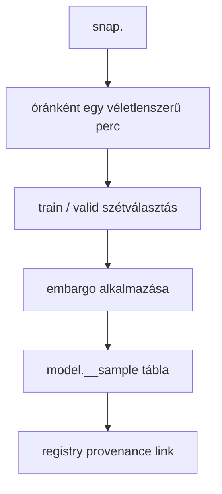
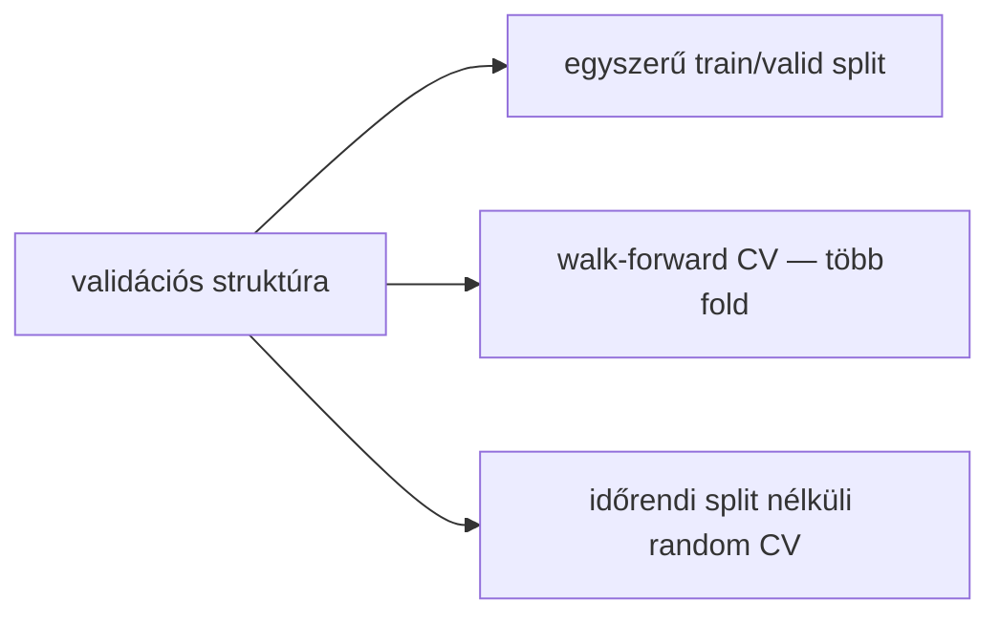
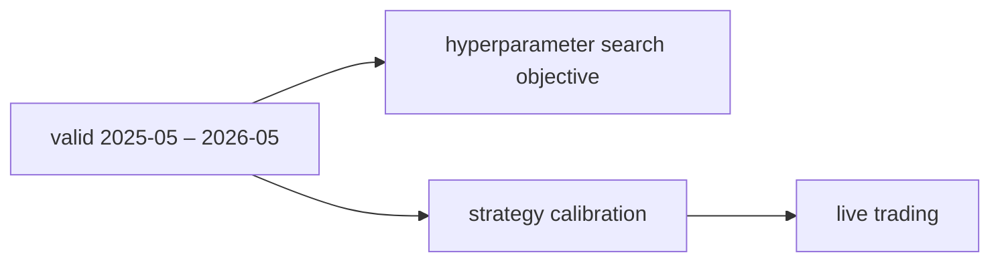
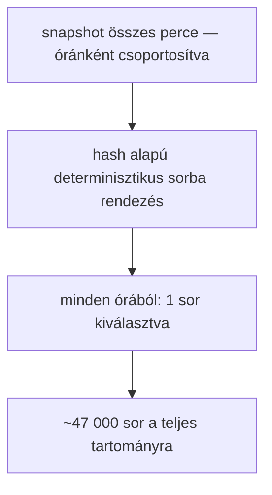
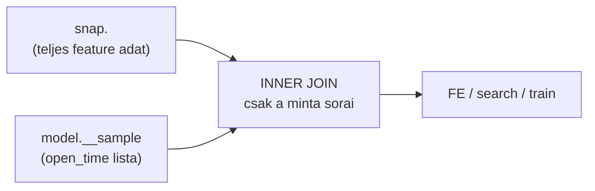

# 5400 - Train/Valid Split Sampling

A sampling lépés feladata, hogy egy immutable snapshotból kis, reprodukálható,
modell-specifikus mintát készítsen — és pontosan definiálja azt az időbeli
szerződést, amelyen a hyperparameter search és a modell tanul.

Ez a dokumentum az **aktív megközelítést** írja le: egyszerű train/valid split,
walk-forward CV nélkül. A korábbi walk-forward megközelítés archívban:
→ `5010_sampling_yearly.md`

---

## Overview



**Időbeli elrendezés:**

```
2021-01                              2025-04  2025-05            2026-05
  │                                       │        │                  │
  │◄──────────── TRAIN (51 hónap) ───────►│        │◄── VALID (12 hó)─►│
  │                                       │        │                  │
  ├─ embargo (240 perc)            purge ─┤        │  (nincs embargo) │
     feature lookback          (60 perc)
     teljességi garancia       target ablak
```

---

## Üzleti és módszertani háttér

### Miért kritikus ez a lépés?

A sampling az a pont, ahol eldől, hogy a modell milyen időbeli szerződés szerint
látja a piacot. Ha a mintavétel rossz, a search és a training már egy hamis
világban dolgozik — még ha minden más lépés helyes is.

Három dolognak kell egyszerre teljesülnie:
- A minta a snapshotból jön → reprodukálható és nem mozog a live adattal együtt.
- A train és a valid időben nem keveredik → nincs jövőbeli adatszivárgás.
- A valid a lehető legfrissebb periódust fedi → a kiválasztott paraméterek
  a jelenlegi piaci karakterhez igazodnak.

### Miért egyszerű split és nem walk-forward CV?



| Megközelítés | Előny | Hátrány | Státusz |
|---|---|---|---|
| **Egyszerű train/valid split** | Átlátható, nincs fold-logika, a valid a legfrissebb periódus | A search közvetlenül a valid seten optimalizál | **Aktív** |
| Walk-forward CV (4 fold) | Több validációs ablak → robusztusabb becslés | Korábbi implementációban jövőbeli szivárgás volt (epic_038 finding); bonyolultabb | Kivezetett |
| Random CV időrendi szabály nélkül | Egyszerű, ismert | Idősoron súlyos adatszivárgás, production-tól eltérő validáció | Elvetett |

**A walk-forward kivezetés oka:** az epic_038 sampling audit során derült ki, hogy
a `_fold_split_walk_forward` függvényben a train mask nem tartalmazott felső
időhatárt. Ennek következtében minden fold train-je látta az összes többi fold
valid periódusát is — vagyis jövőbeli adaton tanult. A hiba javítható lenne, de
az egyszerű split a jelenlegi projekt céljaihoz jobban illeszkedik: nem több
időszak robusztusságát vizsgáljuk, hanem a legfrissebb piaci rezsimre keressük
a legjobb paramétereket.

### Miért ez a train/valid határvonal?

**Train vége: 2025-04-30**
**Valid kezdete: 2025-05-01**

A valid pontosan az a 12 hónapos ablak, amelyet a strategy calibráció is használ
majd. Ez szándékos összhang: a hyperparameter search ugyanazon a perióduson
optimalizál, amelyen a belépési küszöbök és a kalibrációs görbék is épülnek.
Az élő kereskedés is a legfrissebb piaci karaktert feltételezi — a 2025-2026-os
valid ezt képezi le.



A train 2021-01-tól indul: elegendő historikus adatot biztosít ahhoz, hogy a
modell különböző volatilitási és trendrezsimeket is lásson, miközben a teljes
tanítási periódus egységes és folytonos.

### Miért óránkénti véletlenszerű mintavétel?

Az 1 perces OHLCV és a rá épülő feature-ök erősen autokorreláltak. Ha minden
percet beengednénk a searchbe, a modell sok majdnem azonos helyzetet látna, a
validációs metrikák torzítottak lennének, és a search lassabb volna.

Az óránkénti egy véletlenszerű perc erősen csökkenti ezt a redundanciát,
miközben megtartja az intraday időszerkezetet.



**Szabály:** ugyanaz a snapshot + ugyanaz a seed bitazonos mintát ad. A
kiválasztás tartalom- és időbélyeg-alapú, nem input-sorrend-függő.

### Embargo — mikor kell és mikor nem?

Az embargo a minta azon részét jelöli, amelyet ki kell zárni annak érdekében,
hogy a train és a valid között ne legyen adatszivárgás, és hogy minden tanítási
sor érvényes feature-ökkel rendelkezzen.

```
        Train periódus                    Valid periódus
┌────────────────────────────────────┐  ┌─────────────────────┐
│  ░░░│                         │░░░│  │                     │
│  ↑  │      tanítási sorok     │ ↑ │  │  validációs sorok   │
│  A  │                         │ B │  │  (nincs embargo)    │
└─────┴─────────────────────────┴───┘  └─────────────────────┘
  A = feature lookback embargo        B = target purge
      (~240 perc, train eleje)            (60 perc, train vége)
```

**A — Train eleje: feature lookback embargo (~240 perc)**

A snapshot legelső percei mögött nincs elegendő historikus adat a hosszabb
feature-ök kiszámításához. Ezeket a sorokat ki kell zárni a mintából, különben
a tanítás hiányos vagy hamis feature-értékeken alapul.

Ez nem adatszivárgás elleni védekezés, hanem adatminőségi szűrés.

**B — Train vége: target purge (60 perc)**

A `fw60` target az adott percet követő 60 perc legmagasabb (long) vagy
legalacsonyabb (short) árát méri. A train utolsó 60 percének target értéke
tehát már a valid periódus price action-jéből számítódik. Ha ezek a sorok bent
maradnak a trainben, a modell olyan célváltozót lát, amelyet a valid periódus
adat befolyásolt — ez szivárgás.

**Megoldás:** a train utolsó 60 percét kizárjuk a mintából.

**C — Valid eleje: nincs embargo szükséges**

A valid első sorainak feature-jei visszanéznek a train periódusra — ez helyes
és elvárt viselkedés. A feature-ök mindig historikus adatot néznek; a valid
sorok feature-számítása nem jelent szivárgást, mert nem jövőbeli, hanem múltbeli
adatot használ.

---

## Paraméter alapértékek és indoklásuk

| Paraméter | Alapérték | Indoklás |
|---|---|---|
| `train_start` | `2021-01-01` | Elegendő historikus adattartomány; különböző piaci rezsimek képviselve |
| `train_end` | `2025-04-30` | A valid (kalibráció) 2025-05-től indul; egységes határvonal |
| `valid_start` | `2025-05-01` | Legfrissebb 12 hónapos ablak; egybeesik a strategy calibráció időszakával |
| `valid_end` | `2026-05-31` | A jelenleg elérhető adat vége |
| `seed` | `42` | Determinisztikus mintavétel; reprodukálható minta |
| `feature_lookback_embargo_minutes` | `240` | Konzervatív puffer a leghosszabb feature lookback ablak felett |
| `target_purge_minutes` | `60` | Pontosan a `fw60` target horizon; train utolsó 60 perce kizárva |
| `sampling_unit` | óránként 1 véletlenszerű perc | Autocorreláció csökkentése, intraday szerkezet megőrzése |
| target a sample-ben | modell-specifikus egy oszlop | Long és short modellek külön tanulnak; a sample is külön target oszlopot tartalmaz |

---

## Ismert kockázatok és korlátok

| Kockázat | Tünet | Mitigáció |
|---|---|---|
| Valid set overfitting a search során | A kiválasztott paraméterek a 2025-2026 periódusra túloptimalizáltak | Korlátozott trial-szám (100); patience-alapú early stopping; train/valid metrika párhuzamos vizualizációja |
| Régimváltás a valid periódusban | A valid 12 hónap nem homogén piaci karakter | A strategy calibráció és a live trading is ugyanezt az időszakot használja — a kockázat szimmetrikus |
| Purge mérete változik ha fw változik | Ha a target horizon megváltozik, a 60 perces purge elavul | A purge mindig a target horizon-nal szinkronizált konfigurációs érték |
| Snapshotcsere ugyanahhoz a modellhez | Azonos model_id mögött más adatverzió | Registry link és manifest provenance kötelező |
| Feature lookback bővülése | Ha új, hosszabb feature kerül be, a 240 perces embargo kevés | Embargo mérete a config-ban állítható; feature engineering audit kötelező |

---

## Snap-native scope mint modell-szintű szerződés

A `model.__sample` tábla nem egyszerű adatritkítás. **Ez a tábla definiálja a
modell fejlesztési scope-ját**: minden downstream lépésnek (feature engineering,
search, train) pontosan ezekre a sorokra kell épülnie.



**Az INNER JOIN kötelező** — ha bármely downstream lépés időablakos szűréssel
dolgozna (MIN/MAX open_time alapján), az olyan perceket is beengedne, amelyeket
a sampling szándékosan kihagyott. Ez megbontaná a sampling → search → train
lánc integritását.

---

## Validációs checklist

- [ ] A minta forrása `snap.<snapshot_id>`, nem a mutable live tábla.
- [ ] A train és valid határvonal pontosan 2025-04-30 / 2025-05-01.
- [ ] Az első 240 perc ki van zárva a train mintából (feature lookback embargo).
- [ ] A train utolsó 60 perce ki van zárva (target purge).
- [ ] A valid elején nincs külön embargo alkalmazva.
- [ ] Ugyanaz a snapshot + seed újrafuttatva bitazonos mintát ad.
- [ ] A downstream lépések (FE, search, train) INNER JOIN-on mennek a sample táblával.
- [ ] A minta registry-ben visszaköthető a snapshothoz és a modellhez.
