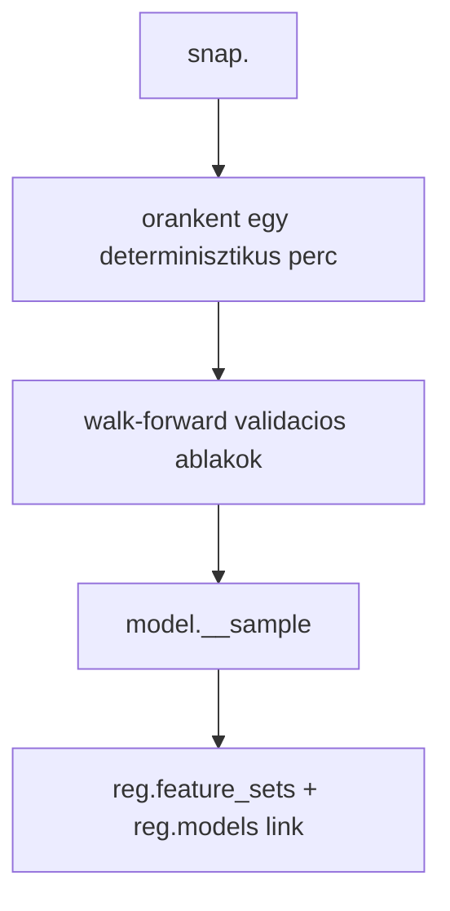
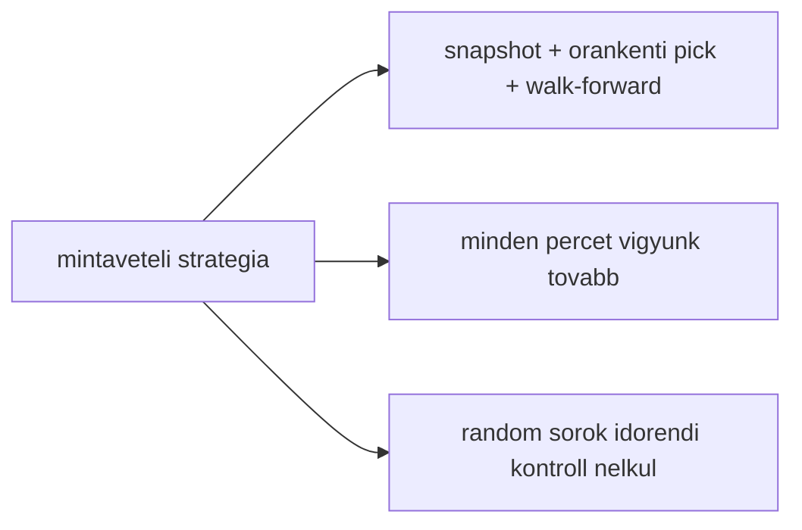
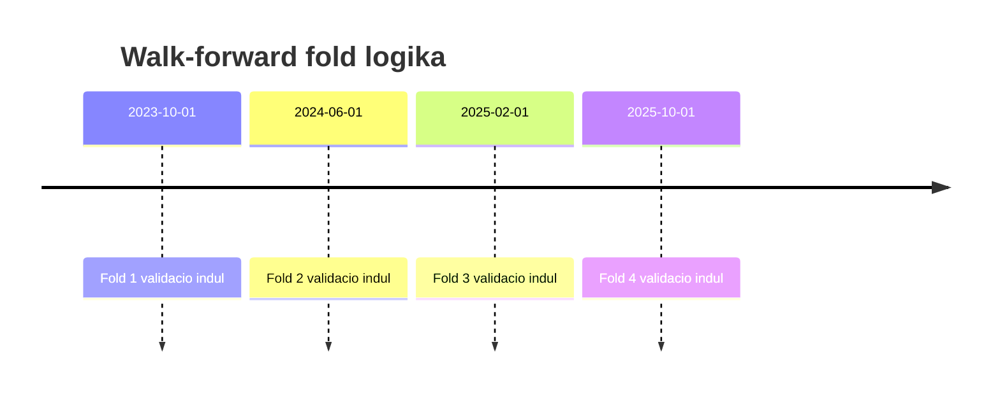
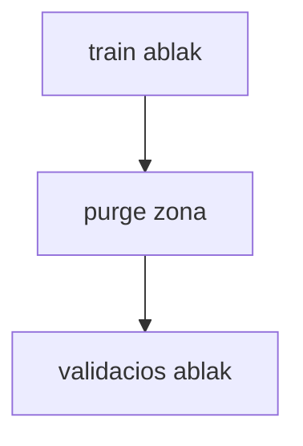

# 5400 - Snapshot-native Walk-forward Sampling

Az aktiv sampling modul feladata, hogy egy immutable snapshotbol kis,
reprodukálható, modell-specifikus mintát készítsen. A kimenet nem feature-másolat,
hanem egy `model.__sample` tábla, amely csak az `open_time`, a target oszlop és a
`fold_id` értékeket hordozza.

## Overview





## Uzleti es modszertani hatter

### Miért kritikus ez a lépés?

A sampling itt nem egyszeru adatritkitas. Ezen a ponton dol el, hogy a modell
milyen idobeli szerzodes szerint latja a piacot, es hogy a validacios score
tenyleg production-szeru-e. Ha a mintavetel rossz, a search es a training mar
egy hamis vilagban dolgozik.

Kulonosen fontos, hogy a sampling a snapshotbol induljon. Ha a mintat a live
forrasbol vagy egy kozben modosulo tablabol allitanank elo, ugyanaz a `model_id`
kesobb mar nem ugyanazt az adatvaltozatot jelentene.

### Miért ezt a megközelítést?

| Megközelítés | Előny | Hátrány | Státusz |
|--------------|-------|---------|---------|
| Snapshot-native, orankenti determinisztikus pick + walk-forward foldok | Reprodukalhato, idorendi validacio, kis minta, jol kovetett provenance | Bonyolultabb, mint egy nyers teljes-tablas minta | Valasztott |
| Minden perc tovabbvitele | Maximalis adatsuruseg | Erős autokorreláció, lassabb search, fold-drift | Elvetett |
| Random sorok idorendi szabaly nelkul | Gyors es egyszeru | Idosoros szivargas, productiontol eltero validacio | Elvetett |
| Legacy yearly random-week sampling | Egyszerubb kutatasi baseline | Nem tukrozi mar az aktiv fold-szerzodest | Legacy |

### Orankenti determinisztikus mintaválasztás: miért kell és hogyan működik?

Az 1 perces OHLCV es a ra epulo feature-k erosen autokorrelaltak. Ha minden percet
beengednénk a searchbe, a modell sok majdnem azonos helyzetet latna, es a validacios
metrikak tul optimistak lennenek. Az orankenti egy kiválasztott perc erősen csökkenti
ezt a redundanciát, miközben megtartja az intraday idoszerkezetet.

```mermaid
flowchart TD
  MIN[orankenti teljes perc-halmazon]
  HASH[hash(open_time, seed)]
  PICK[ROW_NUMBER per ora = 1]
  KEEP[egy sor / kulonbozo ora]

  MIN --> HASH --> PICK --> KEEP
```

**Szabály:** ugyanaz a snapshot + ugyanaz a seed bitazonos mintat kell adjon.
Ezert a kiválasztás tartalom- es idobelyeg-alapu, nem input-sorrend-fuggo.

### Walk-forward fold-szerződés: miért kell és hogyan működik?

Az aktiv foldlogika explicit train/valid idoszakokat general. A validacios ablakok
idoben kovetik egymast, a train pedig mindig korabbi idoszakra tamaszkodik.





**Szabály:** a sample tabla csak `fold_id`-t tarol. A purge nem materializalt
szegmens, hanem a search idejen alkalmazott kizarasi szabaly.

### Paraméter alapértékek és indoklásuk

| Paraméter | Alapérték | Indoklás |
|-----------|-----------|----------|
| `seed` | `42 + year` | Determinisztikus, de anchor-evenként eltérő orankenti mintát ad |
| `train_months` | `9` | Eleg hosszu train ahhoz, hogy rezsimet lasson, de ne mossa el teljesen a frissebb mintazatokat |
| `valid_months` | `3` vagy modellconfig szerint nagyobb | Elkülönült validációs ablak; a projekt aktív championjeiben configból jövő eltérés is lehet |
| `shift_months` | `3` vagy `valid_months` | Non-overlap vagy ritkább, de tiszta előretolás; a config szabja meg a fold-sűrűséget |
| `n_folds` | `4` | Kezelhető trial-költség és több rezsimablak egyensúlya |
| `purge_minutes` | `240` | Konzervativ puffer a target horizon es a hosszu feature lookback folott |
| target a sample-ben | modell-specifikus egy target | A long es short modellek kulon tanulnak, ezert a sample is kulon targettel keszul |

### Ismert kockázatok és korlátok

| Kockázat | Tünet | Mitigáció |
|----------|-------|-----------|
| Túl ritka minta | Kevesebb sor, instabilabb trial-eredmény | A sample csak search/training gyorsitas, nem a teljes snapshot eldobasa |
| Fold-paraméter drift | A dokumentacio es a config mas foldhosszakat allit | A kod az igazsagforras; a docban mindig config-vezérelt szabályként kell leírni |
| Purge túl kicsi | Train-valid határon optimista score | Konzervatív 240 perces alapérték, ellenőrzött fold-szabály |
| Purge túl nagy | Feleslegesen csökken a train adat | Modelszintu config-felulvizsgalat, ha a feature lookback szukebb |
| Snapshotcsere ugyanahhoz a modellhez | Azonos modellazonositó mögött más adatverzió | Registry link és manifest provenance kötelező |

### A snap-native scope mint modell-szintű szerződés: I1, I2, I5

A sampling lépés kimenetele — a `model.__sample` tábla — nem egyszerű adatritkítás.
**Ez a tábla definiálja a modell fejlesztési scope-ját**: minden downstream lépésnek
(FE, search, train) pontosan ezekre a sorokra kell épülnie.

#### A vs B: sorpontos scope vs. időablakos szűkítés

Az óránkénti determinisztikus mintavétel egy nem-kontingens idősorт produkál: az egymást
követő sample-sorok között akár 59 perces rés is lehet (az óra többi percét szándékosan
kihagyjuk). Ebből fakad a kritikus döntés arról, hogyan használják a downstream lépések
a sample-t:

| Megközelítés | Mit értene az FE / search / train | Státusz |
|---|---|---|
| **A — snap ⋈ model.__sample INNER JOIN** | Pontosan azokat a sorokat, amelyek a mintában vannak | **Választott** |
| **B — MIN/MAX(open_time) időablak** | Az adott intervallum összes percét, a ki nem választott perceket is | Elvetett |

**A döntés oka:** ha B-t alkalmaznánk, az FE, a search és a train olyan perceket is
látna, amelyeket a sampling szándékosan kihagyott. Ez megbontaná a sample → FE →
search → train lánc integritását: a hyperparameter-döntés és a final fit más adat-elosztáson
születne meg, mint amit a sampling definiált.

#### I1, I2, I5 invariáns — sampling nézőpontból

| Invariáns | Kapcsolódás a samplinghoz | Módszertani következmény |
|---|---|---|
| **I1** (FE rowcount) | A FE input materializáció INNER JOIN-on megy → sorpontos match | A sampling az, ami meghatározza az "elvárt" rowcountot: `COUNT(model.__sample)`. Ha I1 sérül, az FE más adatot elemez, mint amire a modell tanul. |
| **I2** (search/train rowcount) | Search és train szintén `snap ⋈ model.__sample` path-on futnak | Ha a search vagy train eltér a sample rowcounttól, a hyperparameter-döntés és a final fit más adaton születik meg, mint amit a sampling definiált. |
| **I5** (fold_id) | A sampling írja a `fold_id` INT8 oszlopot a `model.__sample`-be | Nélküle a search nem tudja szeparálni a train és valid sorokat → időbeli szivárgás kockázata a CV során. |

A módszertani rationale teljes összefoglalója:
→ [5000_modelling.md](5000_modelling.md) "Sample-scope döntés és pipeline invariánsok" szekció.

### Validációs checklist

- [ ] A sample forrása `snap.<snapshot_id>`, nem a mutable live tábla.
- [ ] A `model.__sample` tábla csak `open_time`, target és `fold_id` mezőket tartalmaz.
- [ ] Ugyanaz a snapshot és seed újrafuttatva ugyanazt a mintát adja.
- [ ] A fold-ablakok időrendiek, és a validáció nem előzi meg a train adatot.
- [ ] A purge nincs beleégetve a sample táblába, hanem a search idején alkalmazódik.
- [ ] A sample ugyanarra a snapshotra mutat, mint a későbbi train és predict lépés.
