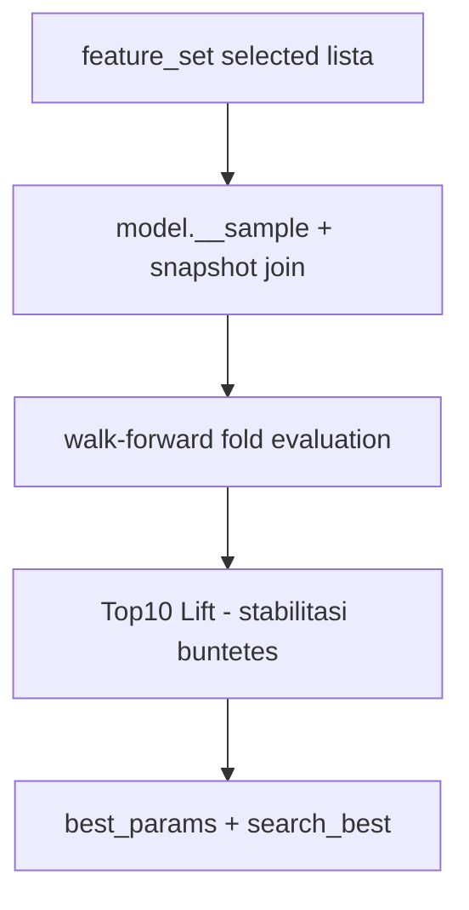
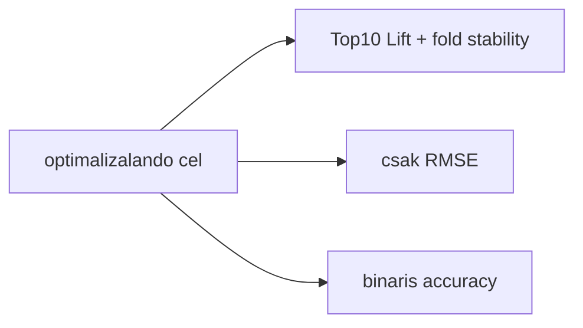
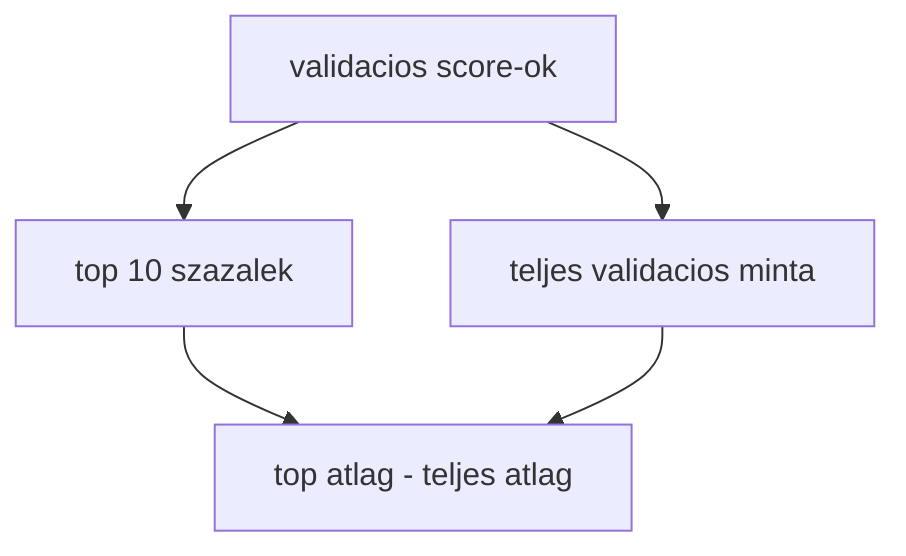
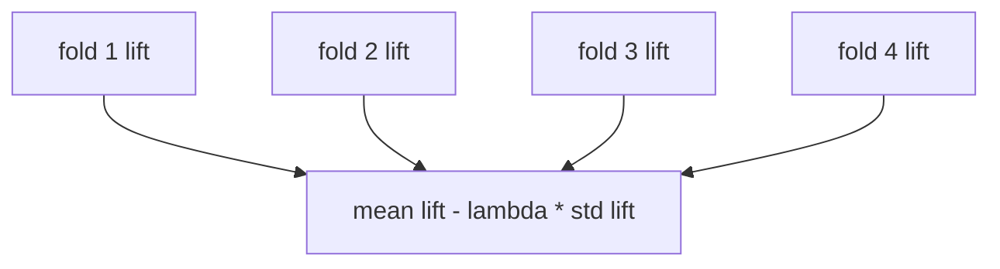

# 5500 - Hyperparameter Search

A hyperparameter search celja nem az altalanos regresszios hiba minimalizalasa,
hanem annak megkeresese, hogy melyik LightGBM parameterter kozeliti legjobban a
kereskedheto opportunity-k rangsorát az aktiv fold-szerzodesen.

## Overview

## Uzleti es modszertani hatter

### Miért kritikus ez a lépés?

A modell akkor hasznos a strategy számára, ha a legjobb opportunity-ket a score
rang elejére teszi. A puszta regressziós pontosság önmagában nem mondja meg, hogy
a top jelzések tényleg a legérdekesebb percekhez tartoznak-e. Ezért a search
közvetlenül a hasznos rangsort optimalizálja, és nem egy általános ML tankönyvi
célt.

### Miért ezt a megközelítést?

| Megközelítés | Előny | Hátrány | Státusz |
|--------------|-------|---------|---------|
| Top10 Lift + fold stability penalty | Kozvetlenul a kereskedheto top opportunity-kre optimalizal | Nem klasszikus, tobb magyarazatot igenyel | Valasztott |
| Csak RMSE | Ismert es egyszeru | Jo atlaghibat adhat gyenge top-rangsor mellett is | Elvetett |
| Csak Spearman | Rank-fokuszu | Nem mondja meg, hogy a top zóna gazdaságilag mennyivel jobb | Elvetett |
| Bináris accuracy | Könnyen kommunikálható | Nem illeszkedik a folytonos MFE targethez | Elvetett |

### Top10 Lift objective: miért kell és hogyan működik?

Az objective a legfelső score-decile realizált targetátlagát veti össze a teljes
validációs minta átlagával. Itt az a kérdés, hogy a modell a legjobb perceket
felfelé tudja-e emelni, nem az, hogy minden percet egyformán pontosan becsül-e.

**Szabály:** a keresés elsődleges kimenete nem egy univerzális "legpontosabb"
modell, hanem a legjobb rangsoroló modell az aktiv validacios szerzodes szerint.

### Fold-stabilitás: miért kell és hogyan működik?

Egy olyan modell, amely csak egy foldban jó, de másik háromban szétesik, a live
üzemben gyenge jelölt. Emiatt a search nemcsak a foldok átlagát nézi, hanem
bünteti a foldok közötti szórást is.

**Szabály:** a jobb modell nemcsak magasabb liftet, hanem időben kevésbé szeszélyes
viselkedést is mutat.

### Paraméter alapértékek és indoklásuk

| Paraméter | Alapérték | Indoklás |
|-----------|-----------|----------|
| search engine | Optuna TPE | Jó kompromisszum a strukturált keresés és a kezelhető költség között |
| `objective` | `regression` | A target folytonos MFE, nem osztálycímke |
| `n_estimators` | `3000` kereséskor | Elég nagy felső korlát az early stoppinghoz |
| `early_stopping` | `100` | Védi a trialokat a felesleges túlfuttatástól |
| stage `smoke` | kevés trial, kevesebb fold | Pipeline sanity check, nem végső keresés |
| stage `explore` | szélesebb keresés | Régiófeltérképezés az első komoly kereséshez |
| stage `refine` | szűkebb, rövidebb keresés | Korábbi jó régiók pontosítása |
| `LIFT_LAMBDA` | `0.5` | A stabilitást érdemben bünteti, de nem nyomja el teljesen a liftet |

### Ismert kockázatok és korlátok

| Kockázat | Tünet | Mitigáció |
|----------|-------|-----------|
| Objective túl specializált | Jó Top10 Lift, de gyenge általános hiba | RMSE és MAE auditként továbbra is riportálva vannak |
| Túl kevés trial | Inga-szerű, zajos optimum | Explore és refine szétválasztása |
| Feature drift | Ugyanaz a search más feature-listán fut | `feature_set.json` kötelező input, provenance rögzítés |
| Folddrága keresés | Lassú ciklusidő | Kicsi sample, stage-ek, resume és dedup |
| Overfitting a search objective-re | Szép search score, gyenge stratégia | A strategy domain külön kalibrál és optimalizál, nem közvetlenül a search score-ra épít |

### Validációs checklist

- [ ] A search ugyanazt a selected feature-listát használja, amelyet a feature engineering kiadott.
- [ ] A CV a modell sampling-configjából származó walk-forward szerződést követi.
- [ ] A purge a foldhatárokon ténylegesen érvényesül.
- [ ] A best trial mellett foldonkénti lift és audit metrika is elérhető.
- [ ] A `best_params` és a `search_best` ugyanahhoz a keresési futáshoz tartozik.
- [ ] A search output visszaköthető a modellhez a registryben.
