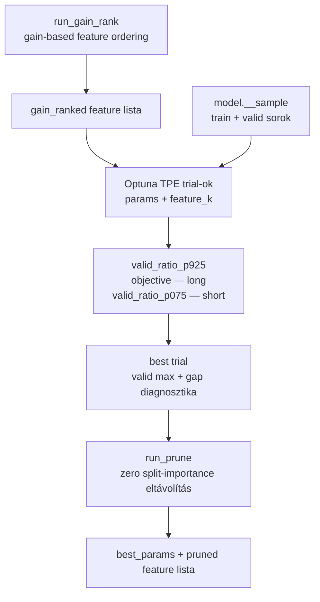
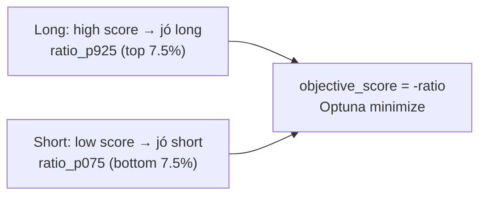

# 5500 - Hyperparameter Search

A hyperparameter search célja nem az általános regressziós hiba minimalizálása,
hanem annak megkeresése, hogy melyik LightGBM paraméter- és feature-kombináció
közelíti legjobban a kereskedelemképes opportunity-k rangsorát az aktív valid perióduson.

Az aktív megközelítés: **joint feature + hyperparameter search** — a feature-szám
(`feature_k`) is Optuna paraméter, nem fix. A feature-sorrend gain fontossági
rangsorolásból ered (`run_gain_rank()`).

---

## Overview



**Időbeli szerkezet a search alatt:**

```
2021-01                              2025-04  2025-05            2026-05
  │                                       │        │                  │
  │◄──────────── TRAIN (51 hónap) ───────►│        │◄── VALID (12 hó)─►│
  │                                       │        │                  │
  │  (tanítás: nem optimized, audit)       │        │  (objective here) │
```

---

## Üzleti és módszertani háttér

### Miért joint search?

A hagyományos hyperparameter search fix feature listán keresi a legjobb LightGBM
konfigurációt. A probléma: a LightGBM-nek nincs L1-szerű mechanizmus, amely a
feature-számlálást direkten büntetné. A `reg_alpha` és `reg_lambda` a levélértékeket
regularizálják, nem a feature-számot.

**Megoldás:** `feature_k` Optuna integer paraméterként. A gain-fontosság szerint
sorba rendezett feature lista (`gain_ranked`) első `feature_k` tagját használja
minden trial — így az optimizer egyszerre keres optimális paramétereket és optimális
feature-számot.

```mermaid
flowchart LR
  RANK[gain_ranked lista\n131 feature, gain-fontosság szerint]
  K[feature_k = Optuna param\nlog-scale, 3–131]
  SLICE[gain_ranked[:feature_k]\n= trial feature lista]
  TRIAL[LightGBM trial\noptimized params + slice]

  RANK --> SLICE
  K --> SLICE
  SLICE --> TRIAL
```

### Miért ezt a megközelítést?

| Megközelítés | Előny | Hátrány | Státusz |
|---|---|---|---|
| **Joint search (feature_k + params)** | Feature-szám és params egyszerre optimalizált; gain-rank jó prior a feature-sorrendhez | ~2× trial-idő feature_k=57-nél, mint K=5-nél | ✅ Aktív |
| Fix feature lista (131 feature) | Egyszerűbb | Nincs mechanizmus kevesebb feature felé; overfit a search-ben magas | Baseline / research |
| Gap penalty (λ>0) | Közel nulla train-valid gap | Elveszi a modell komplexitását → discriminative power csökken | Kutatási opció — nem éles |
| Walk-forward CV | Több ablak → robusztusabb | Implementációs hiba (`_fold_split_walk_forward`); bonyolult | ❌ Kivezetett |
| Csak RMSE | Egyszerű | Gyenge top-decile rangsor | ❌ Elvetett |

### Gain rank: miért ez a feature-sorrend?

A `run_gain_rank()` egy LightGBM fit-et futtat `colsample_bytree=1.0`-val (minden
feature látható), és a gain fontosság szerint rangsorolja a feature-öket csökkenő
sorrendbe. Ez jobb prior mint a random sorrend, mert:

1. **Az Optuna log-scale `feature_k`-t** kap → kis K-nál sűrűn mintavételez → a
   legtöbb próba a legfontosabb feature-öket foglalja magában.
2. A gain fontosság modell-specifikus: a rangsor az aktuális target-re és
   sample-scope-ra kalibrált.
3. A prune lépés utólag eltávolítja az elért K-n belüli nulla-split feature-öket.

### Search objective: direction-specifikus ratio

Az objective a modell rangsorolási képességét méri, nem az átlagos hibát:

**Long irány** (`long_mfe_fw60 > 0`):
```
valid_ratio_p925 = mean(y_true | score ≥ p92.5) / mean(y_true)
```
A top 7.5% pontszámú bar átlagos MFE-je osztva az összes bar átlagával.
Ratio > 1 azt jelenti, hogy a legjobb pontszámú barok valóban jobb long MFE-t adnak.

**Short irány** (`short_mfe_fw60 < 0`):
```
valid_ratio_p075 = mean(y_true | score ≤ p7.5) / mean(y_true)
```
A bottom 7.5% pontszámú bar átlagos MFE-je osztva az összes bar átlagával.
Mivel mindkét szám negatív, ratio > 1 azt jelenti, hogy a legalacsonyabb
pontszámú barok szignifikánsan nagyobb (negatívabb) short MFE-t adnak — ezek
a legjobb short belépési pontok. A strategy `(1 - score_pct_short) ≥ cutoff`
invertált percentilként használja, ami konzisztens a low-score = good-short logikával.



### Prune lépés: zero-split feature-ök eltávolítása

A best-params-szal fitelt modellnél néhány feature (a `feature_k`-on belül) lehet,
hogy egyáltalán nem kap split-et — ilyenkor ténylegesen nem használt. A `run_prune()`
ezeket eltávolítja, és a végső `pruned_joint` feature listát a training lépés veszi át.

### Paraméter alapértékek és indoklásuk

| Paraméter | Alapérték | Indoklás |
|---|---|---|
| search engine | Optuna TPE | Strukturált keresés, prior trial-okból tanul |
| `objective` | `quantile`, `alpha=0.925` | Aszimmetrikus loss: 9.25× érzékenyebb a top-tail barok alulbecslésére |
| `n_estimators` | `3000` (search) | Felső korlát; early stopping határozza meg a tényleges mélységet |
| `early_stopping_rounds` | `100` | Védi a trial-okat a felesleges túlfuttatástól |
| feature_selection | `"joint"` | Joint mode az alapértelmezett; fix mode csak explicit megadásnál |
| `feature_k` | Optuna integer, log-scale 3–131 | Log-scale favorizálja a kis K-t; 3 az abszolút minimum |
| max trial | `100` | Felső korlát; valid set overfitting elleni védelem |
| search objective | `valid_ratio_p925` (long) / `valid_ratio_p075` (short) | Közvetlenül a strategy céljával összhangban |
| `gap_penalty` | `0.0` | Az éles pipeline nem használ gap penalty-t; kutatási opció |

### Best trial selection

Az Optuna `objective_score = -penalized` értéket minimalizál. A `_select_best_trial`
az objective_score alapján rendezi a trial-okat (lower = better), és a top-5 közül
azt választja, amelyiknél a train-valid gap minimális (gap diagnosztika, nem hard filter).

### Ismert kockázatok és korlátok

| Kockázat | Tünet | Mitigáció |
|---|---|---|
| Valid set overfitting | Szép search score, gyenge out-of-sample stratégia | Max 100 trial; gain-rank prior a feature-sorrendhez |
| K=5 fázis (gap penalty nélkül) | Optimalizátor megtalálja az alacsony-K megoldást | Ne adj gap penalty-t — a gain-rank prior és a nagy K-tér az optimizer elé kerül |
| Feature drift | A gain_rank más rezsimben más sorrendet ad | Periodikus re-run; ha a best K jelentősen változik, modell re-train |
| Snapshotváltás | Más adatverzió ugyanahhoz a model_id-hoz | Registry link kötelező minden search futásnál |

### Validációs checklist

- [ ] `run_gain_rank()` lefutott, `feature_set.json["gain_ranked"]` létezik.
- [ ] `feature_selection="joint"`, `direction` a modell irányával konzisztens.
- [ ] A valid periódus 2025-05-01 – 2026-05-31 (sampling config-gal összhangban).
- [ ] A search objective: long → `valid_ratio_p925`; short → `valid_ratio_p075`.
- [ ] `run_prune()` lefutott, `pruned_joint` (vagy `pruned_<tag>`) létezik a feature_set-ben.
- [ ] A `best_params` és `search_best` artifact ugyanahhoz a search tag-hez tartozik.
- [ ] A training lépés a `pruned_joint` feature listát és a megfelelő `search_tag`-et használja.
