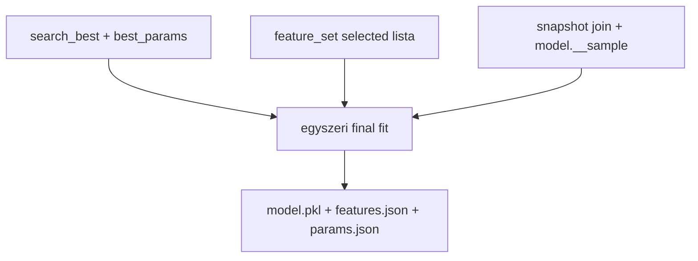
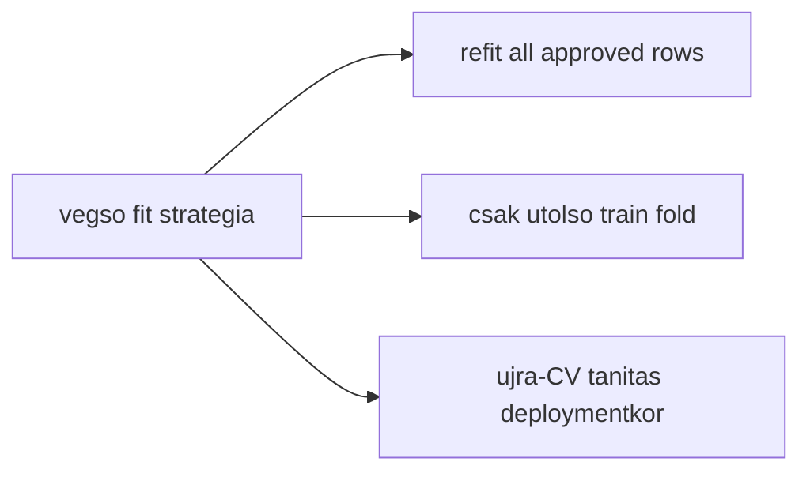
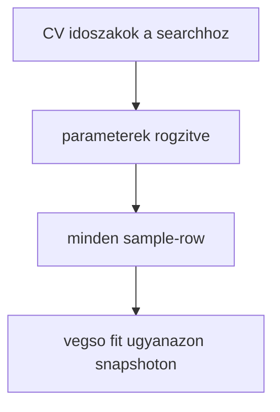
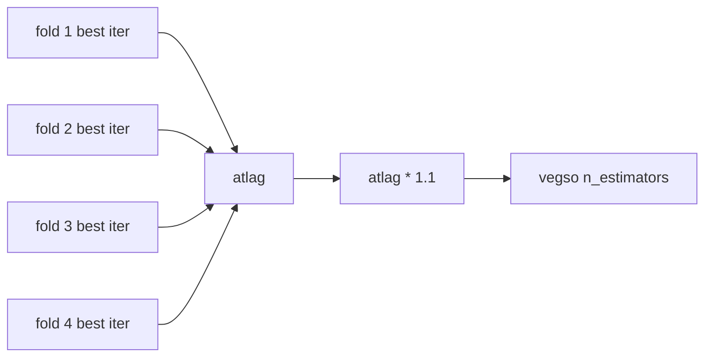

# 5600 - Final Model Training

A training lepes a search utan egyetlen vegso modellt illeszt. Itt mar nincs uj
CV-kereses: a cel az, hogy a kiválasztott parametrizációt a teljes jóváhagyott
mintán refitáljuk, és egy stabil artifact-szerződést adjunk tovább.

## Overview

## Uzleti es modszertani hatter

### Miért kritikus ez a lépés?

A search eredménye önmagában még nem deployolható modell. A trading és a strategy
szempontjából egyetlen, konkrét, újrafelhasználható artifact kell. A training lépés
teszi a keresést működő modellé, és ezen a ponton dől el, hogy mi kerül be a
`model.pkl`-be, milyen feature-listával, milyen becsült famélységgel és hány fával.

### Miért ezt a megközelítést?

| Megközelítés | Előny | Hátrány | Státusz |
|--------------|-------|---------|---------|
| Search utáni egyszeri refit az összes jóváhagyott sample-row-n | Maximalizálja a felhasznált információt a végső artifactban | A training külön lépés, nem "egy gombos" a searchsel | Valasztott |
| Csak egy kiválasztott fold train részén tanítás | Egyszerűbb | Feleslegesen adatot dob el a végső modellből | Elvetett |
| Search és train összeolvasztása | Rövidebb pipeline | Nehezebb provenance, nehezebb hibaelemzés | Elvetett |
| Minden predikció előtt újratanítás | Mindig friss | Operációsan instabil és drága | Elvetett |

### Refit-all logika: miért kell és hogyan működik?

A final fit a sample összes sorát felhasználja, beleértve a `fold_id = 0`
train-only sorokat és a validációs foldokhoz tartozó sorokat is. Ez azért védhető,
mert a hyperparameter-döntés már korábban megszületett; a train lépés nem új
modellt választ, hanem a kiválasztott szerződést illeszti újra.

**Szabály:** a final fit nem használható arra, hogy utólag új hiperparaméter- vagy
feature-döntést igazoljunk.

### I2 invariáns a training lépésben: miért kritikus a sorpontos match?

A training lépés adatbetöltője — csakúgy mint a search — a `snap ⋈ model.__sample` INNER
JOIN path-on olvas. Az I2 invariáns szerint ennek pontosan annyi sort kell adnia, mint
amennyi a `model.__sample`-ben van.

| Kérdés | Válasz |
|--------|--------|
| Mi történik, ha a train sorainak száma eltér a sample-étől? | A final modell más adat-eloszláson tanul, mint amire a hyperparameter-döntés született. A search eredménye nem transzferálható az eltérő scope-ra. |
| Mi a különbség az I1 és I2 között? | I1 az FE input materializációjára vonatkozik. I2 a search és train lépés közvetlen adatbetöltőjére. Mindkettőt az INNER JOIN teljesíti, de az invariáns két egymástól független ponton érvényesítendő. |
| Mikor sérülhet I2? | Ha a `model.__sample` vagy a `snap."<snapshot_id>"` tartalma módosulna a training előtt. Ezért az I3 invariáns (snapshot immutability) az I2 teljesülésének előfeltétele. |

A training lépés tehát az I2 invariáns érvényességéhez az I3 invariánson keresztül is támaszkodik:
ha a snapshot immutable és az INNER JOIN determinisztikus, a rowcount konzerváció garantált.

Részletes módszertani háttér: → [5000_modelling.md](5000_modelling.md) "Sample-scope döntés és pipeline invariánsok" szekció.

### N_estimators átvétel a keresésből: miért kell és hogyan működik?

A training nem vakon a keresési felső korlátot használja. A foldok best iteration
értékeiből egy átlagos, enyhén felfelé pufferelt végső `n_estimators` készül.

**Szabály:** a final modell mérete a keresésből származó információt használja,
de nem egyetlen fold véletlen optimumát másolja át.

### Paraméter alapértékek és indoklásuk

| Paraméter | Alapérték | Indoklás |
|-----------|-----------|----------|
| trainer | `lightgbm_regression` | Illeszkedik a folytonos MFE targethez |
| final `n_estimators` | fold-best iterációk átlaga * `1.1` | Kiegyensúlyozott kompromisszum a foldok között, enyhe biztonsági ráhagyással |
| random state | `42` | Reprodukálható final fit |
| input feature-lista | `feature_set.json["selected"]` | A training nem talál ki új feature-listát |
| input adat | snapshot join + model sample | Ugyanaz a jóváhagyott adatbázis-szerződés folytatódik |

### Ismert kockázatok és korlátok

| Kockázat | Tünet | Mitigáció |
|----------|-------|-----------|
| Search/train mismatch | A training más feature-listát vagy más snapshotot használ | Manifest és registry provenance kötelező |
| Túlzott bizalom a refit-allban | A végső modell túl optimista elvárásokat kap | A validációs döntés továbbra is a search foldjain születik |
| Best iteration instabil | Egy-két fold szélsőségesen eltér | Átlagolás és puffer, nem egy fold másolása |
| Artifact hiányosság | Nincs egyértelműen visszafejthető modell-input | `model.pkl`, `features.json`, `params.json`, manifest együtt kötelező |

### Validációs checklist

- [ ] A training a searchből származó `best_params`-ot használja.
- [ ] A training a feature engineering által kiadott `selected` listával fut.
- [ ] A végső modell ugyanarra a snapshotra mutat, mint a sample és a search.
- [ ] A final artifactok teljesek: `model.pkl`, `features.json`, `params.json`.
- [ ] A manifest provenance mezői tartalmazzák a snapshot és feature-set kötést.
- [ ] A training lépés nem írja felül a search logikáját új döntésekkel.
