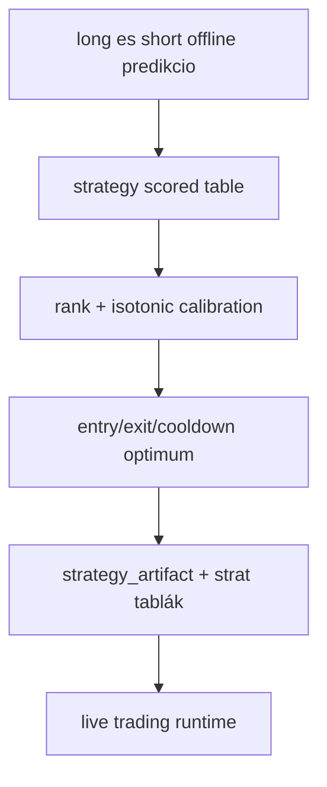

# 6000 - Strategy

A strategy domain a ket vegso modell nyers score-jat alakítja at olyan
dontesi szerzodessé, amelyet a trading runtime mar vegre tud hajtani. Ez nem
uj modell-tanitas, hanem score-ertelmezes, kalibracio es szabalykereses.

## Domain attekintes

## Domain-level rationale

A strategy reteg valaszolja meg azt a kerdest, hogy a ket regresszios modell score-ja
hogyan fordithato at egyetlen kereskedesi dontesse. A modell score onmagaban nem
kereskedesi jelzes: csak akkor lesz belole hasznalhato input, ha rankolt,
osszehasonlithato es szabalyokkal ellatott contractta alakul.

## Alfejezetek

| Fajl | Szerep | Statusz |
|------|--------|---------|
| [6100_strategy_calibration.md](6100_strategy_calibration.md) | Score -> percentile, bucket es isotonic interpretacio | aktiv |
| [6200_strategy_optimization.md](6200_strategy_optimization.md) | Rank-first entry/exit/cooldown parameterkereses | aktiv |
| [6300_strategy_grid_search.md](6300_strategy_grid_search.md) | Execution-aware grid search — determinisztikus TP/SL keresés valódi P&L objektívvel | aktiv |

## Kereszt-domain elvek

- A strategy domain ket modell kozos ertelmezo retege, nem egy harmadik modell.
- A primary nyelv a rangsor es a bucket-expectancy, nem a raw score.
- A kalibracio es az optimalizacio kulon feladat. Ami ertelmez, nem ugyanaz, mint
  ami dontesi kuszoboket keres.
- A live runtime csak mar kesz artifactot hajt vegre. Nem kalibral ujra.

## Kritikus gyenge pontok

- A jelenlegi strategy metrikak same-window modban keszulnek, tehat nem fuggetlen
  bizonyito ereju holdout eredmenyek.
- A rank-first megkozelites robusztusabb, mint a raw score threshold, de a
  kalibracios idoszak rezsimvaltas esetén gyorsan elavulhat.
- A ket irany aszimmetriajat kulon kell kezelni; a long es short score nem
  feltetlenul azonos minosegu azonos percentilen.
