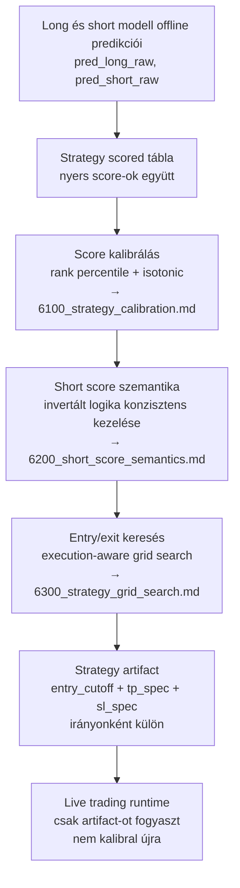
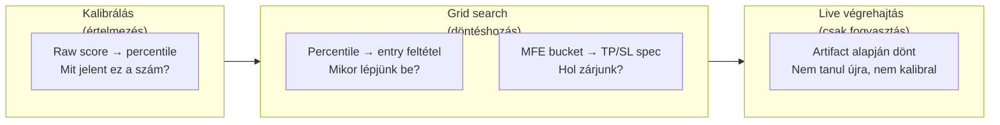
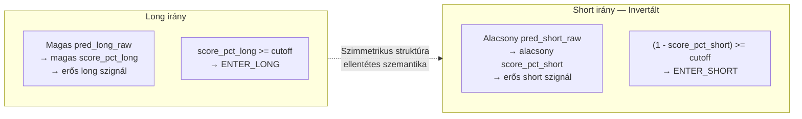
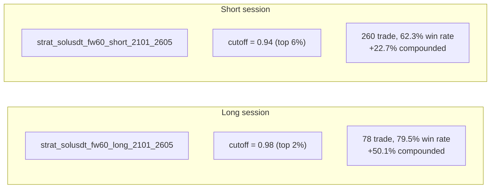

# 6000 — Strategy Áttekintés

## Overview

A strategy domain a két végső modell nyers score-ját alakítja át olyan döntési szerződéssé, amelyet a trading runtime már végre tud hajtani. Ez nem új modell-tanítás, hanem score-értelmezés, kalibrálás és szabálykeresés.

---

## A három lépés szétválasztása

### Miért három önálló lépés?

A három szint szétválasztása kritikus:

- A **kalibrálás** értelmezi a score-t — offline, a kalibrációs periódus adatain fut
- A **grid search** keresi a legjobb decision rule-t — offline, realizált P&L alapján
- A **live runtime** csak a kész artifact-ot fogyasztja — nem hoz új döntést

Ha a live runtime kalibrálna vagy optimalizálna, az overfitting és operációs instabilitás kockázatát vinné be a rendszerbe.

### Long és short szimmetria — de szemantikai inverzióval

A long és short irány teljesen szimmetrikus struktúrájú: mindkettőnek van raw score-ja, percentile kalibrációja, bucket statisztikája, entry cutoff-ja és TP/SL spec-je. A tartalom azonban szemantikailag ellentétes:

Az invertált logika részletes magyarázata: → `6200_short_score_semantics.md`

---

## Domain-szintű elvek

### A rank-first elsődlegessége

Az elsődleges döntési nyelv a percentile és a bucket-expectancy, nem a raw score. A raw score skálája modellfüggő és rezsimfüggő — ugyanaz a numerikus érték két különböző időszakban más helyi erősséget jelenthet. A percentilis minden session-re azonos 0–1 skálán hozza ki az erősséget.

### Offline kalibrálás — live változatlanság

A kalibrációs artifact (rank lookup, isotonic görbék, bucket statisztikák) offline épül, és a live runtime változatlanul használja. Ez garantálja, hogy a live kereskedés determinisztikus és auditálható.

### Dual-session architektúra

A long és short session egymástól teljesen független: külön kalibrálás, külön grid search, külön artifact. Ez lehetővé teszi, hogy az egyik irány újra-optimalizálásakor a másikat ne kelljen érinteni.

---

## Alfejezetek

| Fájl | Szerep |
|------|--------|
| `6100_strategy_calibration.md` | Score → percentile, bucket és isotonic interpretáció |
| `6200_short_score_semantics.md` | Invertált short logika teljes módszertani indoklása |
| `6300_strategy_grid_search.md` | Execution-aware grid search — determinisztikus TP/SL keresés realizált P&L objektívvel |

---

## Ismert kritikus gyenge pontok

| Gyenge pont | Tünet | Mitigáció |
|---|---|---|
| Same-window backtesting | A kalibrációs és keresési periódus részben átfed | Kalibrációs és keresési ablak explicit szétválasztása |
| Rezsimváltás elavítja a kalibrációt | A rank lookup percentilis-értékei más minőséget képviselnek | Rendszeres re-kalibrálás, különösen rezsimváltás után |
| Long és short score aszimmetria | Azonos cutoff más minőséget jelent a két irányban | Dual-session architektúra — irányonként független cutoff |
| Live TP/SL hiány | A backtest intrabar TP/SL-t szimulál, a live csak timeout-ot implementál | Explicit dokumentálás; live implementálás külön epic feladata |
