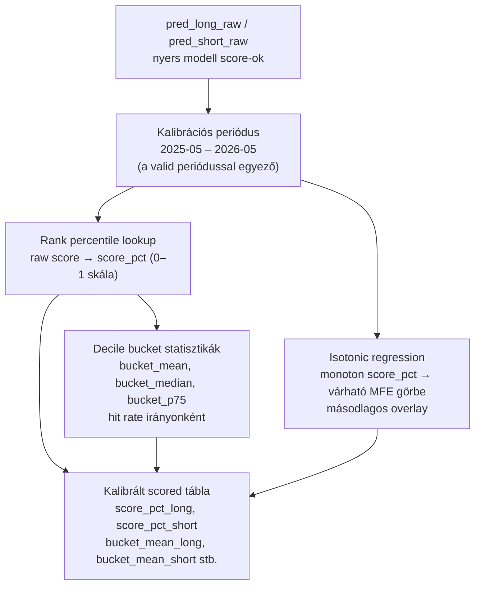
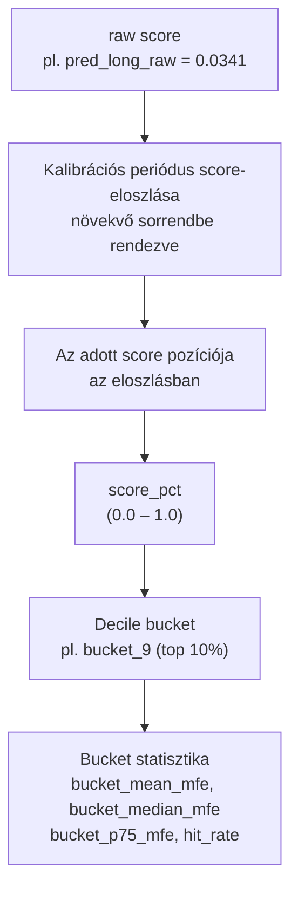
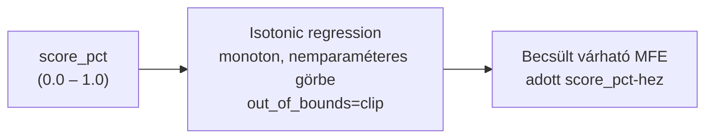
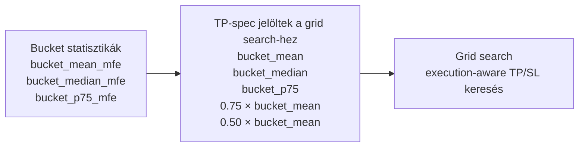
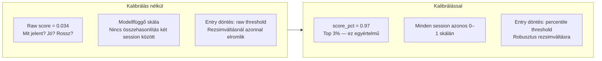
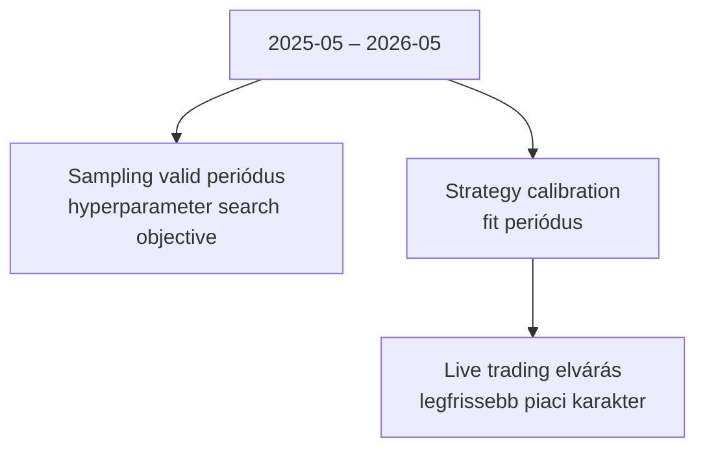

# 6100 — Strategy Calibration

## Overview

A strategy calibration feladata, hogy a két modell nyers score-ját közösen értelmezhető, összehasonlítható skálára tegye. A kimenet: percentile lookup, bucket-statisztika és egy másodlagos isotonic interpretációs réteg.

A kalibrált tábla és a lookup artifact a grid search bemenete (→ `6300_strategy_grid_search.md`) és a live runtime fogyasztja (→ `6000_strategy.md`).

---

## A kalibrálás két rétege

### 1. réteg — Percentile rank lookup (elsődleges)

A lookup az adott score helyét mutatja a kalibrációs időszak eloszlásában. A percentilis minden session-re azonos 0–1 skálán jelzi az erősséget — ellentétben a raw score-ral, amelynek abszolút értéke modellfüggő és rezsimfüggő.

**Miért rank lookup és nem z-score normalizálás?**

| Megközelítés | Előny | Hátrány | Státusz |
|---|---|---|---|
| Rank percentile lookup | Robusztus; nem érzékeny outlier-ekre; bucket-expectancy közvetlen | Külön lookup artifact kell | ✅ Elsődleges |
| Z-score normalizálás | Könnyen számolható | Outlier-érzékeny; nem ad közvetlen bucket-expectancy jelentést | ❌ Elvetett |
| Raw score threshold | Egyszerű | Modellfüggő és rezsimfüggő skála | ❌ Elvetett |

### 2. réteg — Isotonic regression (másodlagos)

Az isotonic réteg másodlagos interpretációs eszköz: segít abban, hogy a score_pct-t egy monoton, várható MFE-jellegű skálán is lássuk. A rendszer nem erre építi az elsődleges belépési szabályt.

**Miért isotonic és nem lineáris regresszió?**

Az isotonic regresszió nemparaméteres monoton görbeillesztés — nincs feltétel a görbe alakjára, csak a monotonicitásra. A score-MFE összefüggés tipikusan nemlineáris (a felső percentilekben meredekebb, a közepes tartományban laposabb), ezért az isotonic illeszkedés pontosabb, mint bármely paraméteres forma.

**Szabály:** Az isotonic hasznos sizing-hez vagy auditra (az elvárható MFE becslésére), de nem helyettesíti a rank-first döntési logikát.

---

## Bucket statisztikák mint TP-spec forrás

A bucket statisztikák nem csak leíró jellegűek — ezek képezik a grid search TP-spec bemeneti rácspont-jait.

A bucket_mean a várható MFE átlaga a top-decile barokra; a bucket_p75 a 75. percentilis — ez konzervatívabb TP célpont. A 0.75× és 0.50× szorzók még konzervatívabb, gyorsabb realizálást céloznak.

---

## Üzleti és módszertani háttér

### Miért kritikus ez a lépés?

### Kalibrációs periódus és a valid periódus egyezése

A kalibrációs periódus (2025-05–2026-05) szándékosan egyezik a sampling valid periódusával és a hyperparameter search valid időszakával. Ez háromrétű összhangot biztosít:

### Paraméter alapértékek és indoklásuk

| Paraméter | Alapérték | Indoklás |
|---|---|---|
| Bucket count | `10` | Decilis felbontás; elegendő statisztikai mintaszám minden bucketben, de elég finom |
| Kalibrálás iránya | Külön long, külön short | A két score-eloszlás eltérő; összemosásuk torz percentiliseket adna |
| Interpoláció | Folytonos percentile leképzés | Nem csak merev bucket-határt ad; simább döntési teret biztosít |
| Isotonic `out_of_bounds` | `clip` | Live-ban is védett; extrapoláció helyett clamping |
| Fit periódus | Kalibrációs ablak explicit rögzítve | Auditálhatóság; újrakalibráláskor frissítendő |

### Ismert kockázatok és korlátok

| Kockázat | Tünet | Mitigáció |
|---|---|---|
| Rezsimváltás | Ugyanaz a percentile különböző időszakokban más minőséget jelent | Rendszeres újrakalibrálás friss strategy session-nel |
| Kevés kalibrációs adat | Zajos bucket-statisztikák; a p75 instabil | Elég hosszú kalibrációs ablak fenntartása (>6 hónap) |
| Túlzott isotonic-bizalom | A rendszer abszolút MFE-becslésnek hiszi a score-t | Rank-first elsődlegessége rögzített; isotonic csak kiegészítő |
| Long/short összemosás | Helytelen irány-összehasonlítás | Külön lookup és isotonic minden irányra |
| Kalibrációs és keresési periódus átfedése | A grid search a kalibrált adatokon fut → overfitting kockázat | Explicit szétválasztás; kalibrációs ablak != keresési ablak |

### Validációs checklist

- [ ] A calibration külön long és short lookupot készít
- [ ] A kalibrált tábla tartalmaz score_pct és bucket mezőket mindkét irányra
- [ ] A bucketekhez realized mean MFE, median MFE, p75 MFE és hit rate tartozik
- [ ] Az isotonic csak másodlagos rétegként szerepel — nem az elsődleges entry döntés alapja
- [ ] A lookup artifact a live runtime által változatlanul újra felhasználható
- [ ] A kalibrációs időszak explicit rögzítve van a strategy session metaadatában
- [ ] Isotonic és rank lookup újrakalibráláskor egyszerre futnak le
