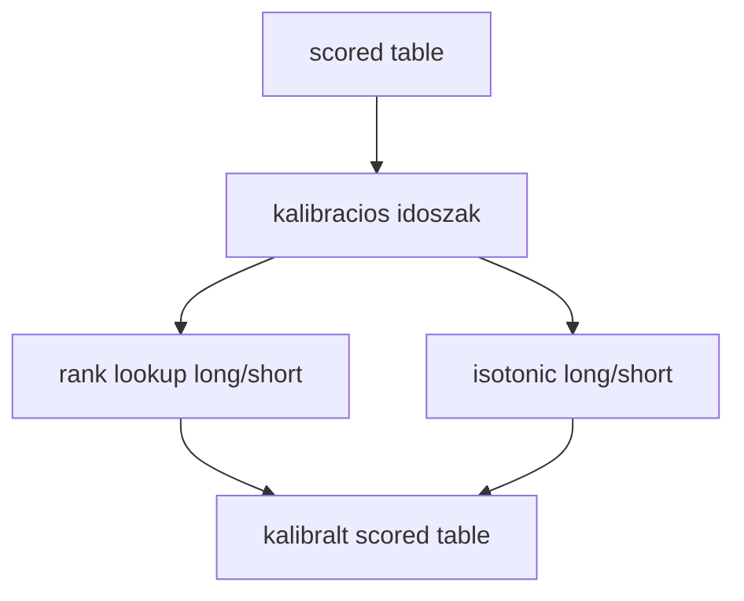
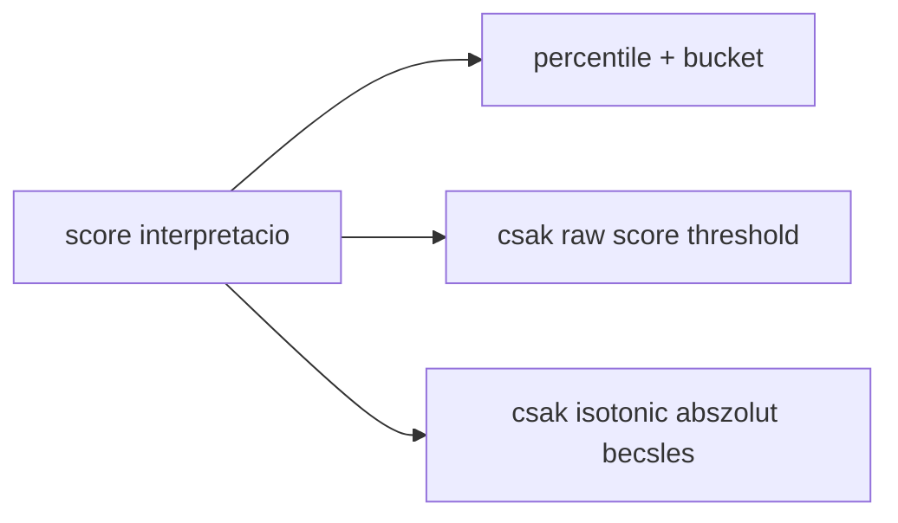
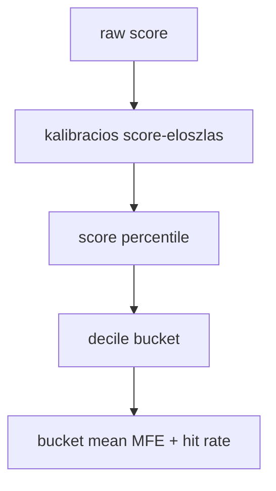
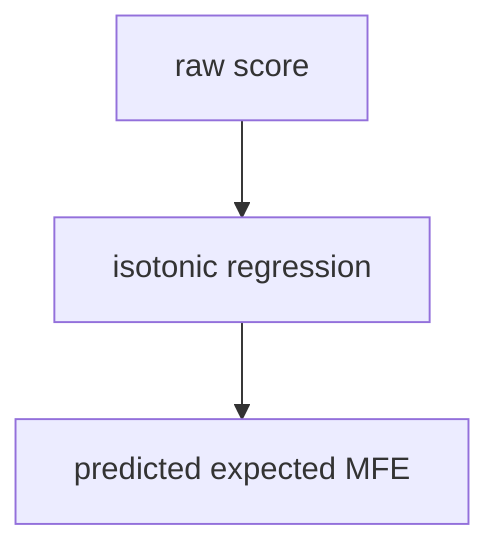

# 6100 - Strategy Calibration

A strategy calibration feladata, hogy a ket modell nyers score-jat kozosen
ertelmezheto skálára tegye. A kimenet percentile lookup, bucket-statisztika es
egy masodlagos isotonic interpretacio.

## Overview

## Uzleti es modszertani hatter

### Miért kritikus ez a lépés?

A long és short score nyers skálája modellfüggő. Ugyanaz a numerikus score két
irányban vagy két idoszakban teljesen más helyi erősséget jelenthet. A calibration
teszi lehetővé, hogy a strategy ne nyers számokat, hanem relatív helyzetet és
hozzá tartozó várható kimenetet lásson.

### Miért ezt a megközelítést?

| Megközelítés | Előny | Hátrány | Státusz |
|--------------|-------|---------|---------|
| Percentile + bucket + bucket expectancy | Robusztus, konnyen hasonlítható és jól illik a rank-first döntéshez | Külön lookup artifact kell hozzá | Valasztott |
| Csak raw score threshold | Egyszerű | Modell- és rezsimfüggő skála | Elvetett |
| Csak isotonic kalibráció | Ad abszolut MFE-becslést | Túl sokat feltételez a level-pontosságról | Kiegészítő, nem elsődleges |
| Z-score normalizálás | Könnyen számolható | Nem ad közvetlen bucket-expectancy jelentést | Elvetett |

### Percentile rank lookup: miért kell és hogyan működik?

A lookup az adott score helyét mutatja a kalibrációs időszak eloszlásában, majd
ehhez decilis-bucketet és bucket-szintű realized statisztikát rendel.

**Szabály:** az entry döntés alapnyelve a percentile és a bucket-expectancy, nem
a nyers score.

### Isotonic overlay: miért kell és hogyan működik?

Az isotonic réteg másodlagos interpretációs eszköz. Segít abban, hogy a score-t
egy monoton, várható MFE-jellegű skálán is lássuk, de a rendszer nem erre építi
az elsődleges belépési szabályt.

**Szabály:** isotonic hasznalhato sizingre vagy auditra, de nem helyettesíti a
rank-first logikát.

### Paraméter alapértékek és indoklásuk

| Paraméter | Alapérték | Indoklás |
|-----------|-----------|----------|
| bucket count | `10` | Decilis felbontás, jól érthető és stabil kompromisszum |
| kalibráció irányonként | külön long, külön short | A két score-eloszlás nem feltétlenül szimmetrikus |
| interpolation | folytonos percentile leképzés | Nem csak merev bucket-határt ad, hanem simább döntési teret |
| isotonic | `out_of_bounds=clip` | Live-ban is védett monotón extrapoláció kell |

### Ismert kockázatok és korlátok

| Kockázat | Tünet | Mitigáció |
|----------|-------|-----------|
| Rezsimváltás | Ugyanaz a percentile később más minőséget jelent | Gyakori újrakalibrálás friss strategy sessionnel |
| Kevés kalibrációs adat | Zajos bucket-statisztikák | Elég hosszú kalibrációs ablak fenntartása |
| Túlzott isotonic-bizalom | A rendszer abszolut MFE-becslésnek hiszi a score-t | Rank-first elsődlegesség rögzítése |
| Long/short összemosás | Helytelen irány-összehasonlítás | Külön lookup minden irányra |

### Validációs checklist

- [ ] A calibration külön long és short lookupot készít.
- [ ] A kalibrált tábla tartalmaz percentile és bucket mezőket mindkét irányra.
- [ ] A bucketekhez realized mean MFE és hit rate is tartozik.
- [ ] Az isotonic csak kiegészítő rétegként szerepel a szerződésben.
- [ ] A lookup artifactot a live runtime változatlanul újra tudja használni.
- [ ] A kalibrációs időszak explicit rögzítve van a strategy sessionben.
