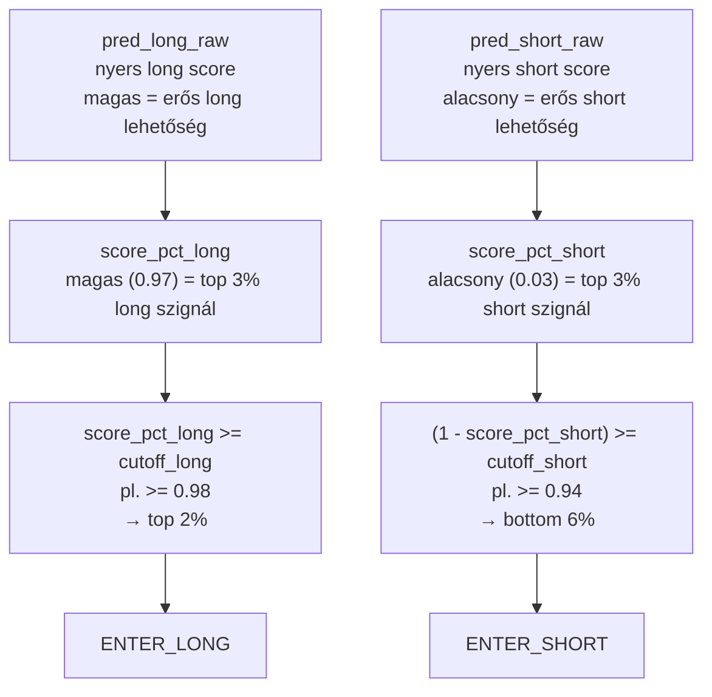
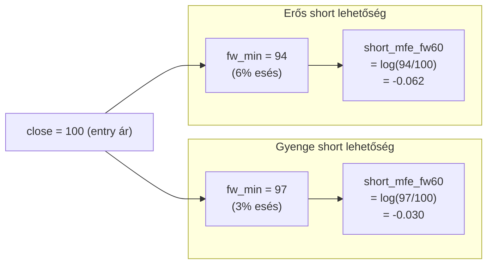
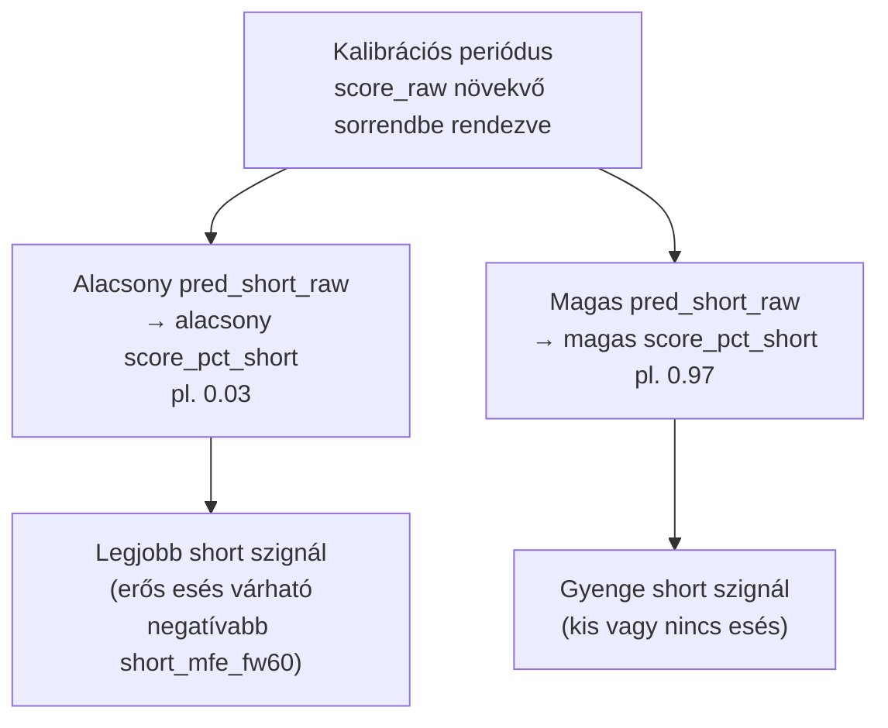
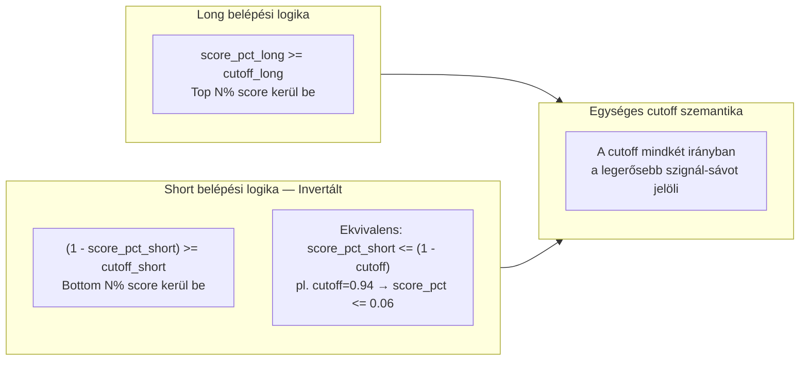
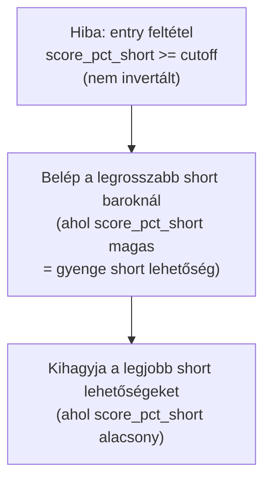
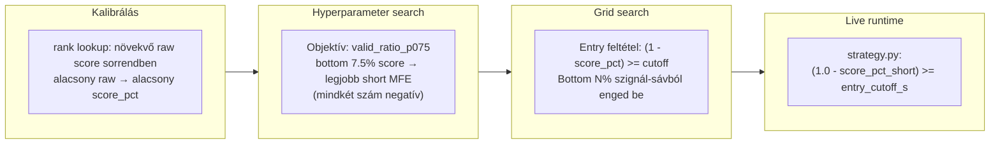

# 6200 — Short Score Szemantika

## Overview

A short modell score-ja, percentilis rangsorolása és belépési logikája ellentétes intuíciót követ a long oldallal szemben. Ez a dokumentum az inverziós logika teljes módszertani indoklását adja — a raw targettől a belépési döntésig.

Az inverziós logika három rétegű. Ha bármelyik réteg összetévesztett, a live service rossz irányba kereskedik.

---

## A három inverziós réteg

### 1. réteg — Target definíció: miért negatív a short_mfe_fw60?

A short MFE (`log(fw_min / close)`) **mindig negatív**, ha az ár esett. Minél erősebben esett, annál nagyobb az abszolút értéke — és annál jobb volt a short lehetőség. Ez nem adathiba, hanem a log-return konvenció természetes következménye.

**Következmény a modellre:** A short modell alacsonyabb (negatívabb) nyers score-t ad a jobb short lehetőségekre. Ez megfordítja az intuíciót a long irányhoz képest, ahol a magasabb score jelenti a jobb lehetőséget.

### 2. réteg — Rank szemantika: miért alacsony score_pct_short a legjobb?

A rank lookup a kalibrációs periódusban a `pred_short_raw` **növekvő** sorrendjéhez rendel 0–1 értékeket. Mivel az alacsonyabb raw score jelzi a jobb short lehetőséget, az alacsony `score_pct_short` = a legjobb short szignál.

**Ez az inverz a long logikához képest:** long-nál magas `score_pct_long` = jobb long.

### 3. réteg — Entry feltétel: miért `(1 - score_pct_short) >= cutoff`?

Az `(1 - score_pct_short) >= cutoff_short` forma tartja fenn a szimmetriát: mindkét oldalon ugyanaz a `cutoff` paraméter jelenti a "legalább ilyen erős szignált engedünk be" korlátot. Ez az egységes cutoff szemantika teszi a két irány összehasonlíthatóvá.

**Konkrét példa:** `entry_cutoff_short = 0.94`
- Feltétel: `(1 - score_pct_short) >= 0.94`
- Ekvivalens: `score_pct_short <= 0.06`
- Eredmény: csak a bottom 6% score-ú barokra lép be

---

## Üzleti és módszertani háttér

### Miért kritikus ez a lépés?

A short score szemantikájának félreértése közvetlen trading hibát okoz:

### Miért nem invertáljuk a raw score-t közvetlenül?

Felmerülő kérdés: miért nem szorozzuk `-1`-gyel a `pred_short_raw`-t, és ezután long-analóg "magas = jó" logikával kezeljük?

| Megközelítés | Előny | Hátrány | Státusz |
|---|---|---|---|
| **Invertált percentilis `(1 - score_pct)`** | Konzisztens rank lookup artifact; isotonic is változatlan | Inverziós logikát explicit dokumentálni kell | ✅ Választott |
| Raw score `× -1` invertálás | Intuitívabb long-analóg kezelés | Külön rank lookup kell; isotonic fitting is változik | ❌ Elvetett |
| Különálló short modell ascending targettel | Intuitív | Eltérő training target = eltérő modell architektúra kell | ❌ Elvetett |

A percentilis rank lookup (`rank_lookup_short`) a `pred_short_raw` **növekvő** sorrendjéhez épül fel — ha a raw score-t invertálnánk, a lookup tábla inkompatibilissé válna. Az `(1 - score_pct_short)` inverziós forma megtartja az artifact konzisztenciát.

### Konzisztens alkalmazás a pipeline-ban

Az inverziós logika három helyen jelenik meg, és mindhárom helyen konzisztensen kell alkalmazni:

### Paraméter alapértékek és indoklásuk

| Paraméter | Alapérték | Indoklás |
|---|---|---|
| `entry_cutoff_short` | `0.94` (top 6%) | Grid search optimum: 260 trade, 62.3% win rate |
| `entry_cutoff_long` | `0.98` (top 2%) | Külön long session optimuma; short cutoff-tól független |
| Rank lookup periódus | Kalibrációs periódus | Offline fit; live runtime változatlanul fogyasztja |
| `score_pct_short` clip | `[0.0, 1.0]` | Extrapoláció helyett clamping; live-ban is biztonságos |

### Ismert kockázatok és korlátok

| Kockázat | Tünet | Mitigáció |
|---|---|---|
| Dokumentációs félreértés az inverzióról | Tévesen `score_pct_short >= cutoff` kerül a kódba | Ezt a dokumentumot minden strategy-érintő code review-ban referenciálni kell |
| Kalibrációs periódus drift | A rank lookup elavul; `score_pct_short` nem tükrözi az aktuális rezsimet | Rendszeres re-kalibrálás, különösen rezsimváltás után |
| Long_priority konflit | Ha mindkét szignál tüzel, a long nyer — a shortot kizárhatja magas volatilitásban | Szándékos (strategy.py); dokumentált viselkedés |
| Isotonic és rank lookup inkonzisztencia | Ha a rank lookup újra fut, az isotonic is újraépítendő | `fit_calibration()` egyszerre futtatja mindkettőt |

### Validációs checklist

- [ ] `strategy.py` belépési feltétel: `(1.0 - score_pct_short) >= entry_cutoff_s` — nem `score_pct_short >= cutoff`
- [ ] `rank_lookup_short` a kalibrációs periódus `pred_short_raw` alapján épül (növekvő sorrend)
- [ ] `short_mfe_fw60` negatív értékei megfelelőek — nem adathiba
- [ ] A grid search dokumentációja az `entry_cutoff_short = 0.94` értéket rögzíti
- [ ] A live `trading.json` a helyes strategy session ID-re mutat
- [ ] A hyperparameter search short objective (`valid_ratio_p075`) konzisztens a bottom 7.5% logikával
- [ ] Minden strategy-érintő implementációs változásnál: ez a dokumentum referenciálva
