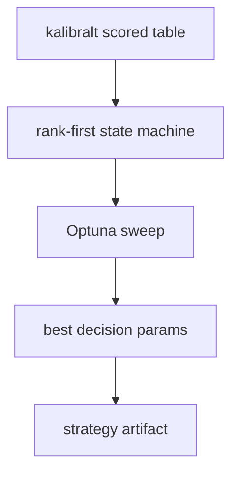
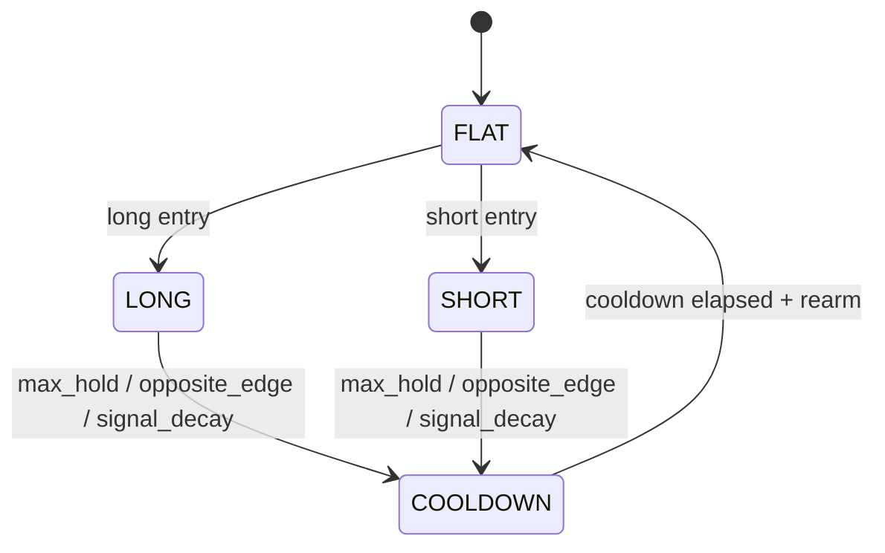
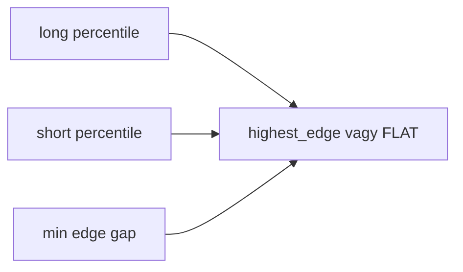
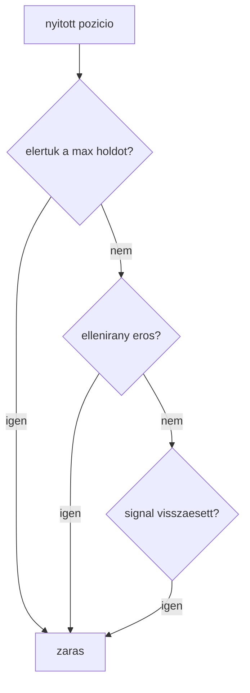

# 6200 - Strategy Optimization

A strategy optimization a kalibralt score-teret fordítja at konkrét entry, exit,
hold és cooldown szabályokká. A keresés itt már nem modellparamétert, hanem
kereskedési szerződést optimalizál.

## Overview

## Uzleti es modszertani hatter

### Miért kritikus ez a lépés?

A kalibráció még csak annyit mond meg, hogy a score mennyire erős. A tradinghez
azonban explicit döntési szabály kell: mikor lépünk be, meddig tartjuk, hogyan
kezeljük a long-short konfliktust, és mikor engedjük újra felfegyverezni a rendszert.
Ha ez nincs explicit formalizálva, a live futtatás és az offline értékelés szétcsúszik.

### Miért ezt a megközelítést?

| Megközelítés | Előny | Hátrány | Státusz |
|--------------|-------|---------|---------|
| Rank-first state machine + Optuna sweep | Osszehangolja az offline es live dontesi logikat | Külön optimalizációs réteg kell hozzá | Valasztott |
| Kézi thresholdok | Egyszerű | Önkényes és nehezen auditálható | Elvetett |
| Csak long vagy csak short szabály | Könnyebb | Nem kezeli a két modell egyidejű jelzéseit | Elvetett |
| Nyers score alapján azonnali trade | Kevés logika | Instabil, rezsimfüggő és rosszul skálázható | Elvetett |

### Konfliktuskezelés: miért kell és hogyan működik?

Két modell mellett nem elég külön thresholdot nézni. El kell dönteni, hogy ha
mindkettő jelez, akkor melyik irány a domináns, vagy inkább egyik sem elég tiszta.

**Szabály:** ha a két oldal közötti edge-különbség nem elég nagy, a helyes döntés
lehet a `FLAT`, nem kötelező trade.

### Exit contract: miért kell és hogyan működik?

Az optimalizáció nemcsak belépési küszöböt keres, hanem teljes tartási szerződést:
`max_hold`, `signal_decay`, `opposite_edge`, `cooldown` és `rearm`.

**Szabály:** az offline optimizernek és a live runtime-nak ugyanazt az állapotgépet
kell használnia, különben a mért eredmény nem ugyanazt a rendszert írja le.

### Paraméter alapértékek és indoklásuk

| Paraméter | Alapérték | Indoklás |
|-----------|-----------|----------|
| `long_entry_pct` / `short_entry_pct` | keresett, magas tartományból indul | A top zóna érdekes, nem a medián score |
| `min_edge_gap` | keresett | Konfliktushelyzetben ne legyen túl könnyű belépni |
| `max_hold_minutes` | keresett, a horizonhoz igazodó sáv | A target fw60 logikájához kell illeszkednie |
| `min_hold_minutes` | keresett | Védi a rendszert az azonnali ki-be zajtól |
| `cooldown_minutes` | keresett | Csökkenti az egymás utáni túltraidelést |
| `rearm_pct` | keresett | A jelnek előbb vissza kell hűlnie új belépés előtt |
| optimizer | Optuna TPE | Jó kompromisszum a nemlineáris döntési térre |

### Ismert kockázatok és korlátok

| Kockázat | Tünet | Mitigáció |
|----------|-------|-----------|
| Same-window optimalizáció | A riportolt stratégiai metrika túl szép lehet | A dokumentációban explicit jelölni kell, hogy nem független holdout |
| Kevés trade | Tetszetős expectancy, gyenge mintaszám | Minimum tradeszűrő az objective-ben |
| Túl sok döntési szabadság | Instabil optimum, zajra illeszkedés | Egyszerű state machine és korlátozott paramétertér |
| Offline/live eltérés | A runtime másképp lép be vagy ki | Közös artifact contract és közös decision params |

### Validációs checklist

- [ ] A strategy optimizer kalibrált score-teret kap, nem nyers modellsort.
- [ ] A konfliktuskezelés explicit szabálya része az artifactnak.
- [ ] Az exit-ok között szerepel a max hold, opposite edge és signal decay.
- [ ] Van minimum trade-szűrés, hogy a túl ritka optimumok kiesjenek.
- [ ] A létrejövő `strategy_artifact.json` a live runtime számára közvetlenül használható.
- [ ] A riport egyértelműen jelzi, hogy same-window vagy független kiértékelésről beszélünk.
