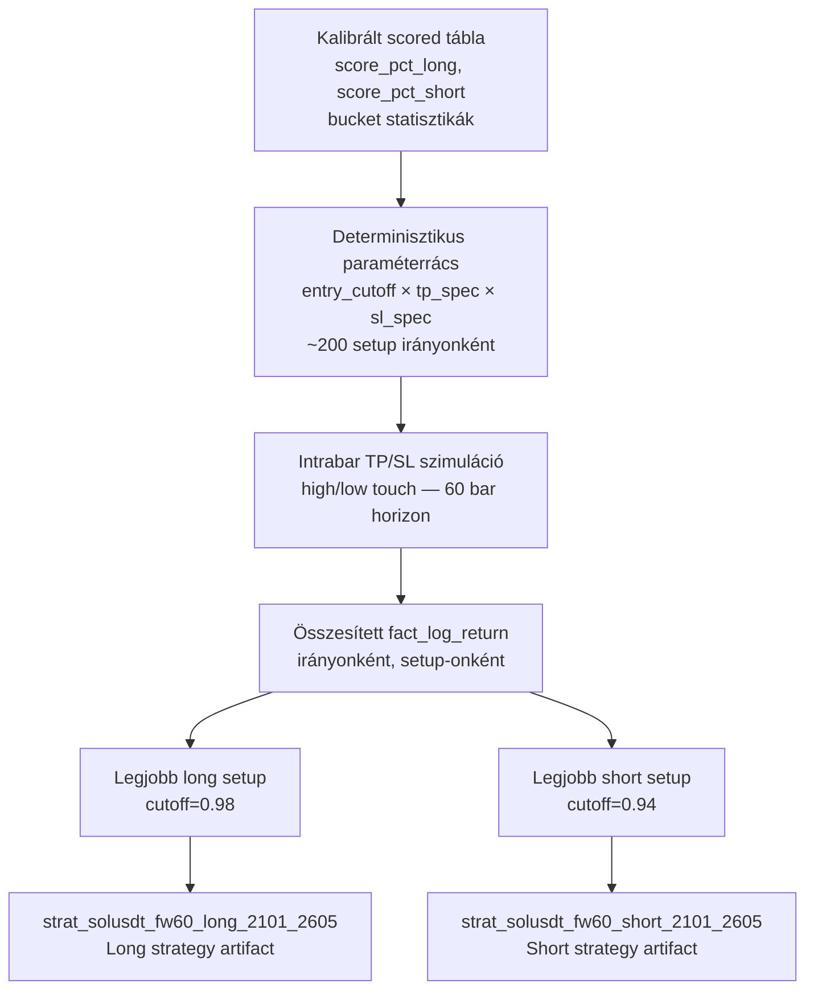
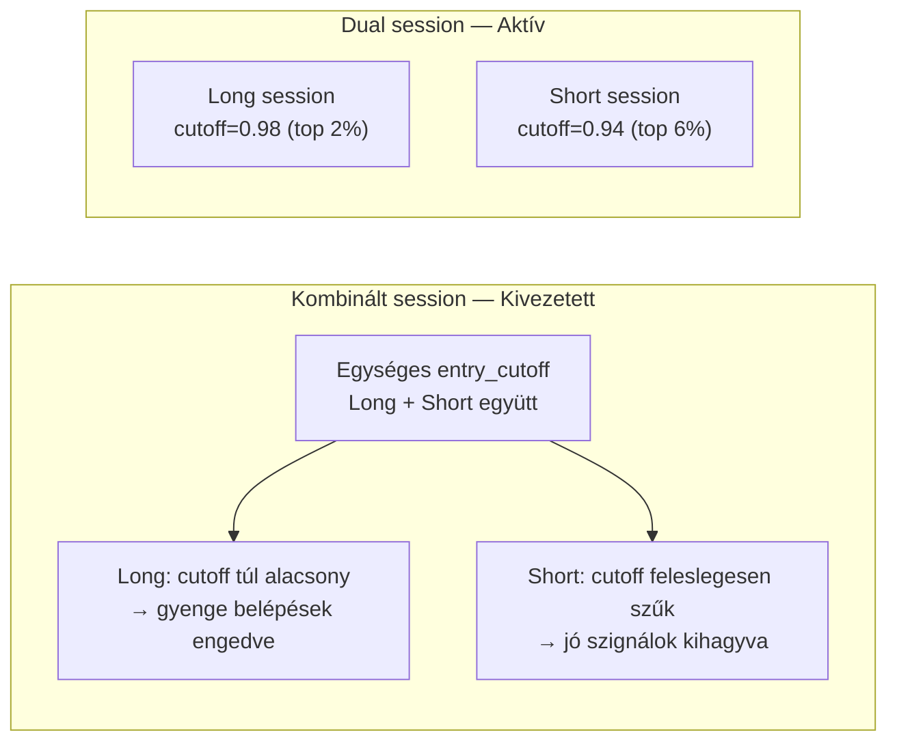
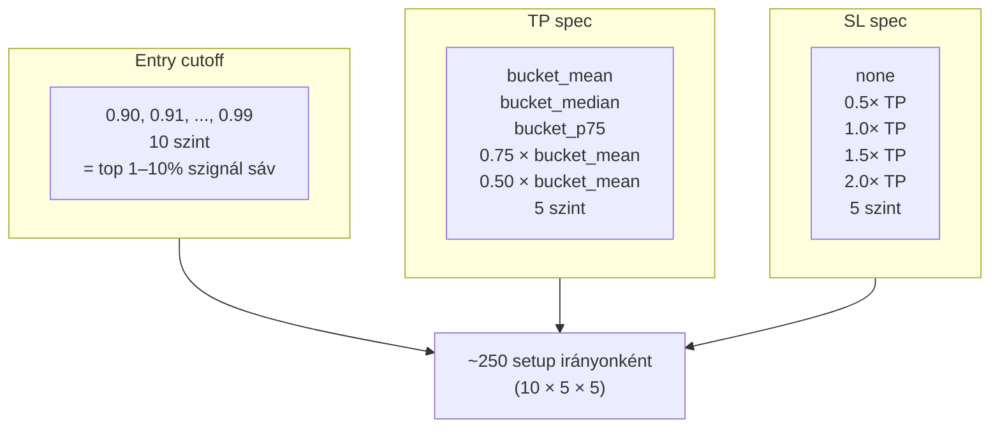
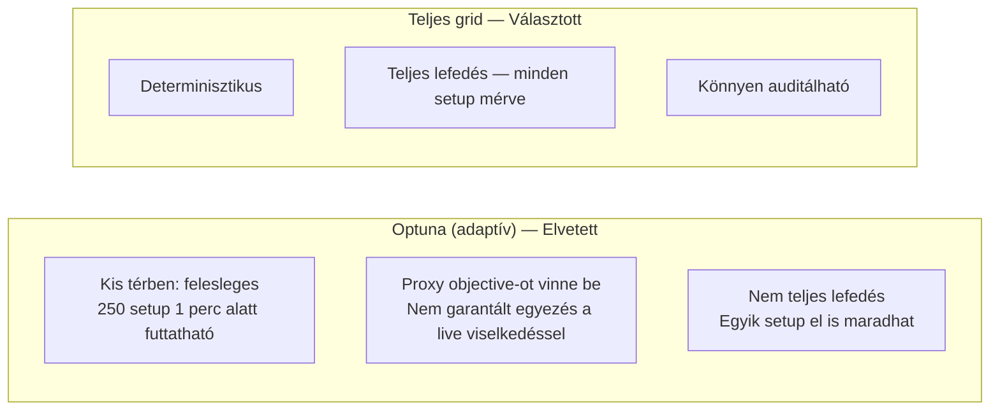
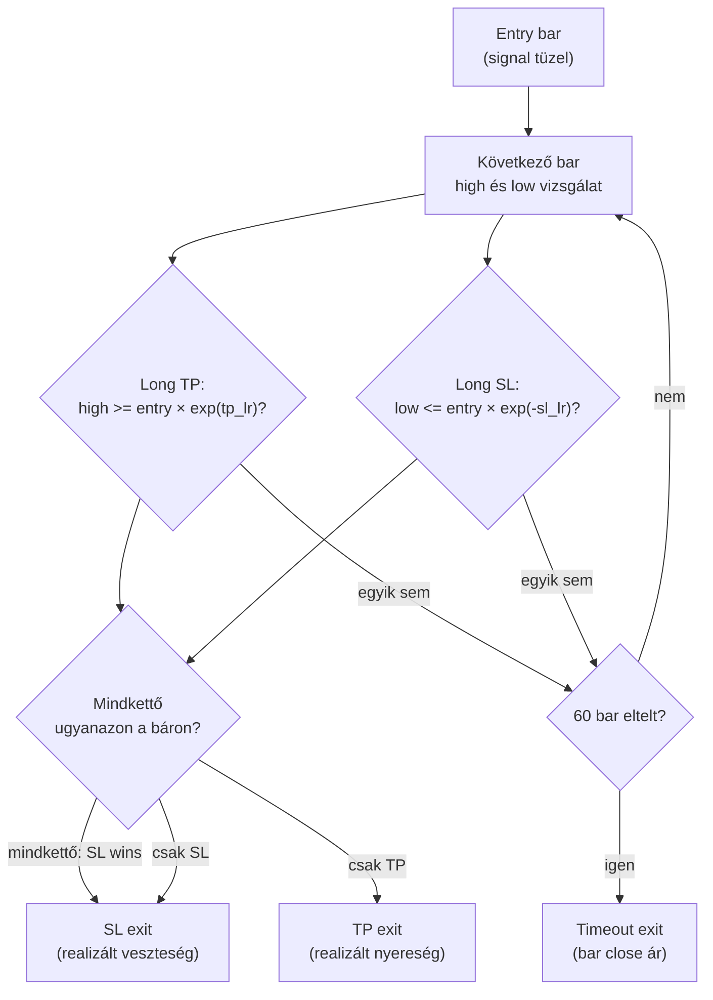
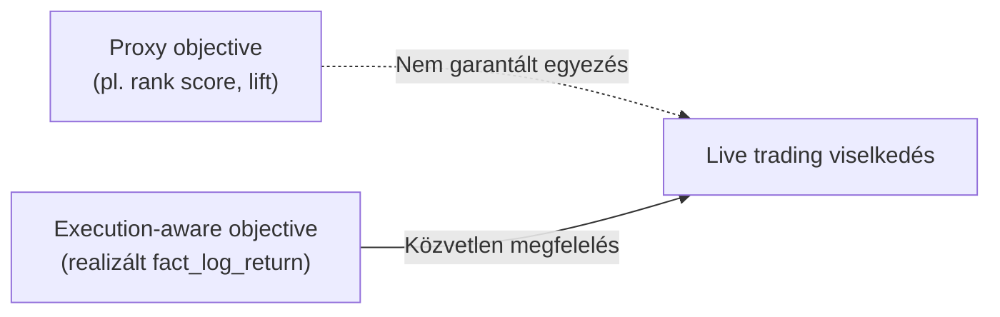

# 6300 — Execution-Aware Strategy Grid Search

## Overview

Az execution-aware grid search a kalibrált score-teret **realizált loghozam alapján** értékeli ki — nem proxy mutatókon, hanem explicit intrabar végrehajtási modellen mérve. A keresés azt optimalizálja, hogy a tényleges belépési és kilépési szabálykészlet mit termelne trade-szinten.

---

## Dual-Session Architektúra

### A jelenlegi két önálló session

| Session | Irány | Entry cutoff | Trade-szám | Win rate | Compounded |
|---------|-------|-------------|-----------|----------|------------|
| `strat_solusdt_fw60_long_2101_2605` | Long | 0.98 (top 2%) | 78 | 79.5% | +50.1% |
| `strat_solusdt_fw60_short_2101_2605` | Short | 0.94 (top 6%) | 260 | 62.3% | +22.7% |

### Miért két önálló session?

A long és short modell score-eloszlása eltér. A long side csak az extrém magas percentilnél ad megbízható szignált (top 2%), a short side viszont szélesebb sávban is jövedelmező (top 6%). Egyetlen shared `entry_cutoff` esetén az egyik irány szükségszerűen szuboptimálisan hangolt.

| Kritérium | Kombinált session | Dual session |
|---|---|---|
| Long cutoff optimalizálás | Kompromisszumos | Független (cutoff=0.98) |
| Short cutoff optimalizálás | Kompromisszumos | Független (cutoff=0.94) |
| Audit — melyik irány rontott? | Összemosott | Irányonként elkülönített |
| Re-optimalizálás (csak long) | Mindkét irányt érinti | Csak a long session cserélhető |

**Szabály:** Kombinált session shared cutoff-fal nem megengedett. Ha új periódusra kell re-optimalizálni, mindkét irányt külön kell lefuttatni és külön artifact-ba menteni.

---

## A Keresési Tér

### Paraméterrács

### Miért ez a keresési tér?

- **entry_cutoff 0.90–0.99:** Elég finom rács a top-sáv vizsgálatához, de még teljesen bejárható. A 0.90 alatti cutoff-ok túl sok gyenge szignált engednének be.
- **tp_specs bucket alapon:** A TP célpont közvetlenül a kalibrált bucket-statisztikákból ered — ez horgonyozza a TP-t a valós piaci MFE eloszláshoz. A szorzók (0.75×, 0.50×) konzervatív realizálást céloznak.
- **sl_specs TP-arányban:** A stop szélessége TP-arányban értelmezhető kockázati tengelyt ad — a "SL = 1.0× TP" például 1:1 risk-reward-ot jelent.

### Miért teljes grid és nem Optuna?

A paramétertér tudatosan kicsi és előre zárt. A teljes grid futtatás reprodukálható és auditálható — bármikor meg lehet mondani, hogy az összes lehetséges setup közül melyik volt a legjobb és miért.

---

## Az Intrabar Végrehajtási Modell

### TP és SL aktiválási logika

**Short irány:** Tükrözve — TP aktiválódik ha `low <= entry × exp(-tp_lr)`, SL ha `high >= entry × exp(sl_lr)`.

### Same-bar conflict rule: SL wins

Ha egy báron belül mind a TP, mind az SL szint érintett, a szimulációban az SL az érvényes exit.

**Indoklás:** Az intrabar sorrend (high vagy low volt-e előbb) ismeretlen OHLC adatból. Két opció:

| Döntés | Következmény |
|---|---|
| TP wins | Optimista bias — a valóságban az SL is aktiválódhatott előbb |
| **SL wins** | **Konzervatív bias — underestimálja a live PnL-t, nem felülbecsüli** |

A konzervatív döntés biztosítja, hogy a backtest nem fest szebb képet a valóságnál.

### Timeout és re-entry

- **Timeout:** 60 bar elteltével (ha sem TP, sem SL nem aktiválódott): close áron zárás
- **Re-entry:** Következő bar után azonnal lehetséges — nincs cooldown periódus

### Live vs. backtest különbség

| Elem | Backtest / Grid Search | Live Service |
|---|---|---|
| TP aktiválás | high/low touch (intrabar) | Nincs — timeout-only |
| SL aktiválás | low/high touch (intrabar) | Nincs — timeout-only |
| Same-bar rule | SL wins | Nem alkalmazható |
| Timeout | 60 bar (szimulált) | 60 perc (valós idő) |

A live intrabar bracket order monitoring külön epic feladata — jelenleg nincs implementálva.

---

## Üzleti és módszertani háttér

### Miért kritikus ez a lépés?

A strategy pipeline ezen a ponton fordítja le a kalibrált score-teret konkrét döntési szerződéssé — azt az egyetlen contract-ot, amelyet a live trading réteg változtatás nélkül használ. Ha az objective nem az, amit a live kereskedés mér, a laborban jónak tűnő setup élőben elvérzhet.

### Miért ezt a megközelítést?

| Megközelítés | Előny | Hátrány | Státusz |
|---|---|---|---|
| Teljes grid + realizált PnL objective | Determinisztikus, teljes lefedés, auditálható | Külön végrehajtási modellt kell fenntartani | ✅ Választott |
| TPE / Optuna proxy objective-val | Kevesebb kiértékelés nagy terekben | Kis térben felesleges; proxy elvi eltérést visz be | ❌ Elvetett |
| Kézi cutoff és TP/SL választás | Gyors emberi iteráció | Nem reprodukálható, könnyen torzított | ❌ Elvetett |
| Osztályozási/rank-metrikán optimalizálás | Egyszerűbb | Nem azonos a kereskedési eredménnyel | ❌ Elvetett |

### Paraméter alapértékek és indoklásuk

| Paraméter | Alapérték | Indoklás |
|---|---|---|
| `entry_cutoffs` | 0.90–0.99, 10 szint | Elég finom rács; teljes lefedés lehetséges |
| `tp_specs` | mean / median / p75 + 2 szorzó | Bucket-információra több realizációs agresszivitás |
| `sl_specs` | none, 0.5×, 1.0×, 1.5×, 2.0× TP | Jól értelmezhető kockázati tengely |
| `max_hold_bars` | 60 | Összhangban a fw60 target horizonnal |
| Same-bar szabály | SL wins | Konzervatív bias; ismeretlen intrabar sorrend |
| Kalibrálás / keresés szétválasztása | Külön időszak | Csökkenti az overfittinget a setup-választásban |
| Session architektúra | Dual session (irányonként) | Irányonként független cutoff optimalizálás |

### Ismert kockázatok és korlátok

| Kockázat | Tünet | Mitigáció |
|---|---|---|
| Ugyanazon rezsim túlfittelése | A setup új időszakon gyorsan romlik | Kalibrációs és keresési periódus szétválasztása; out-of-sample ellenőrzés |
| Kevés trade nagyon magas cutoffnál | Jó aggregate return, gyenge statisztikai megbízhatóság | Minimum trade-count figyelése a döntésnél |
| Same-bar szabály torzító hatása | Bizonyos setupok túl büntetettnek tűnnek | Konzervatív bias elfogadása; live-ban az intrabar sorrend nem ismert |
| Elavuló bucket-statisztikák | A TP-szintek már nem a jelenlegi rezsimet tükrözik | Rendszeres újrakalibrálás |
| Stop nélküli setup nagy drawdown-nal | Jó összhozam, rossz kockázati profil | Post-search kockázati review; elfogadási küszöbök |

### Validációs checklist

- [ ] A keresési periódus nem fedi át a kalibrációs periódust
- [ ] A grid search minden definiált cutoff × TP-spec × SL-spec kombinációt végigvizsgál
- [ ] A rangsor alapja a realizált `fact_log_return`, nem proxy metrika
- [ ] A same-bar konfliktus kezelése explicit és konzervatív (SL wins)
- [ ] A short irány belépési logikája invertált percentilis-szemantikát használ: `(1 - score_pct_short) >= cutoff`
- [ ] A kiválasztott setup trade-száma elégséges az aggregate metrika értelmezéséhez
- [ ] A grid search irányonként külön fut: long és short session önálló cutoff-fal
- [ ] A két session neve és cutoff értéke rögzítve van az artifact manifest-ben
- [ ] Nincs kombinált session shared cutoff-fal (kivezetett architektúra)
