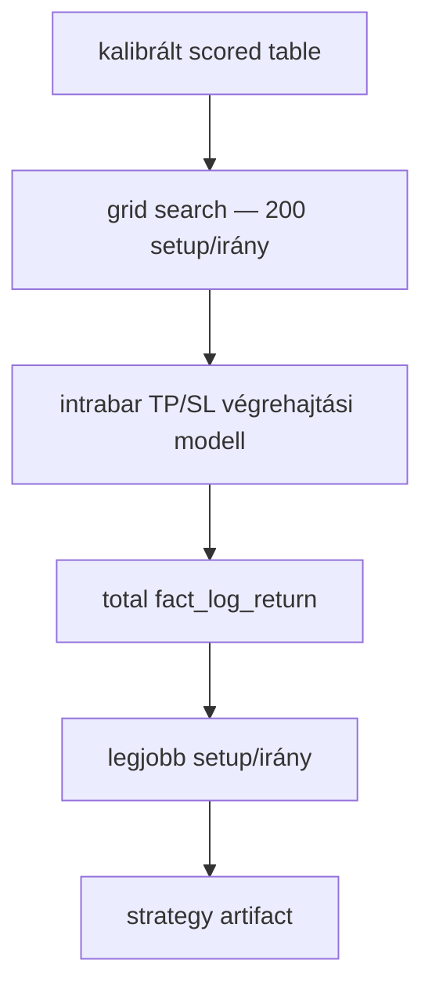
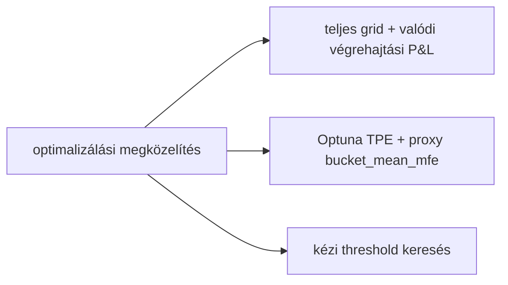
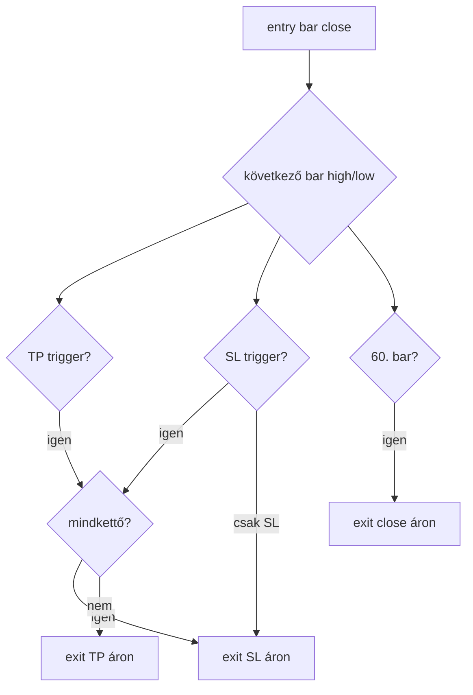
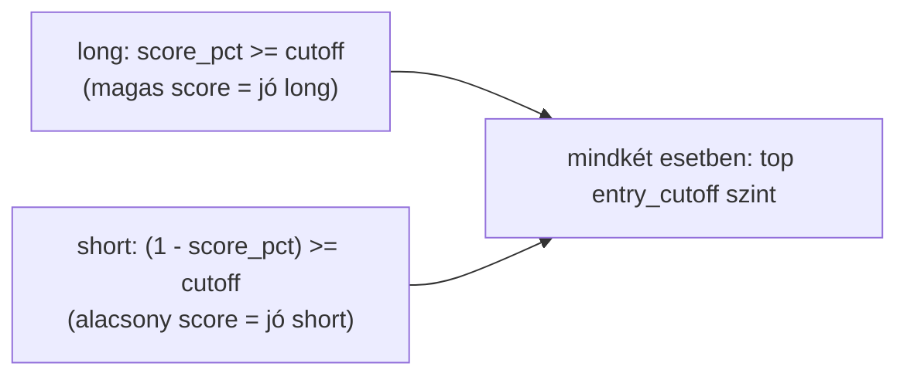

# 6300 - Execution-Aware Grid Search

A grid search az entry/exit paraméterek teljes, determinisztikus átvizsgálása egy
valódi végrehajtási modellen mért P&L objektív szerint. Ez váltja fel a korábbi
Optuna TPE-alapú, proxy-objektívű keresést.

## Overview





## Üzleti és módszertani háttér

### Miért váltottunk Optuna TPE-ről grid search-re?

| Szempont | Optuna TPE | Grid search | Döntés |
|----------|------------|-------------|--------|
| Determinizmus | Sztochasztikus mintavétel, futásról futásra eltér | Mindig ugyanaz az eredmény azonos adaton | Grid search |
| Lefedettség | Néhány trial a 200 lehetséges setup-ból | Teljes lefedés, nincs kihagyott kombináció | Grid search |
| Objektív | Proxy: `bucket_mean_mfe` (várható MFE közelítés) | Tényleges végrehajtási P&L: `fact_log_return` | Grid search |
| Reprodukálhatóság | Seed-függő, nehezen auditálható | Bármikor újrafuttatható, azonos kimenet | Grid search |
| Keresési tér mérete | Nagy tereken indokolt | Kis téren (200 setup) felesleges overhead | Grid search |

**Kulcsérv:** ha a keresési tér teljesen lefedható, a TPE mintavételi hibája csak ront.
A 200 setup/irány egyszerre futtatható, és a legjobb pontot nem kell közelíteni.

### Miért kritikus az objektív csere?

A `bucket_mean_mfe` azt becsüli, milyen messzire mehet az ár a pozíció nyitása után.
Ez proxy: nem veszi figyelembe, hogy az exit mikor és milyen áron történik valójában.

A `fact_log_return` ezzel szemben a tényleges végrehajtást szimulálva adja meg minden
trade log-returnját: figyelembe veszi a TP/SL triggerelést, a same-bar konfliktust,
a timeout zárást és a re-entry szabályt. Ami a proxy szerint jónak látszik, a valódi
végrehajtásban veszteséges lehet — és fordítva.

**Szabály:** a grid search kizárólag `fact_log_return` alapján rangsorol. A
`bucket_mean_mfe` csak a kalibrációhoz marad meg (TP spec számításához — lásd lent).

## Végrehajtási modell (intrabar TP/SL)

Ez az "execution-aware" jelleg lényege: a backtest nem csak a bar close árát nézi,
hanem az adott bar high és low értékét is, hogy eldöntse, triggerelt-e a TP vagy az SL.

### Long irány

- **TP trigger:** `high[t+1 .. t+60] >= entry_close × exp(tp_lr)` — ha az ár eléri vagy
  átlépi a TP szintet, az exit TP áron történik.
- **SL trigger:** `low[t+1 .. t+60] <= entry_close × exp(-sl_lr)` — ha az ár eléri vagy
  leüti az SL szintet, az exit SL áron történik.

### Short irány

- **TP trigger:** `low[t+1 .. t+60] <= entry_close × exp(-tp_lr)` — az ár leesik a TP szintre.
- **SL trigger:** `high[t+1 .. t+60] >= entry_close × exp(sl_lr)` — az ár feléri az SL szintet.

### Same-bar konfliktus

Ha ugyanazon a bárán mind a TP, mind az SL trigger teljesül (a high eléri a TP-t és
a low leüti az SL-t), a rendszer **SL-t feltételez**. Ez konzervatív megközelítés:
ismeretlen sorrendű mozgásnál a kedvezőtlenebb esetet tételezi fel.

### 60-bar timeout

Ha a pozíció 60 bar után sem zárt TP-vel vagy SL-lel, a 60. bar close áron zár.
Ez a maximum tartási horizont, összhangban a `fw60` target definícióval.

### Re-entry

Az exit lezárulása utáni következő bartól újabb entry lehetséges. Nincs kötelező
cooldown: az entry feltétel teljesülése önmagában elegendő az újbóli belépéshez.



## Short irány invertált ranking

A short MFE target definíciója: `short_mfe_fw60 = log(fw_min / close[t])`.

Ha az ár esett a következő 60 barban, `fw_min < close[t]`, tehát a log-arány
negatív. Ez azt jelenti, hogy egy profitable short lehetőség **alacsony target értéket**
kap. A modell emiatt alacsony score-t ad a legjobb short lehetőségekre.

Ebből következik az invertált percentile logika:

- `score_pct_short` alacsony (pl. 0.05) = top 5% short lehetőség
- `score_pct_short` magas (pl. 0.95) = gyenge short lehetőség

**Entry feltétel shorthoz:**

```
(1 - score_pct_short) >= entry_cutoff
```

Ez konzisztens a long logikával: long esetén `score_pct_long >= entry_cutoff`.
Mindkét irányban az entry_cutoff jelöli ki azt a sávot, ahol a legerősebb
lehetőségek találhatók. A short esetén az invertálás csak azt kompenzálja, hogy
a score és a profitabilitás fordított irányban mozog.



## Keresési tér

A grid search 200 setup-ot vizsgál meg irányonként (400 összesen).

### Entry cutoff — 8 érték

| Cutoff | Jelentés |
|--------|----------|
| 0.90 | top 10% lehetőség |
| 0.92 | top 8% |
| 0.94 | top 6% |
| 0.95 | top 5% |
| 0.96 | top 4% |
| 0.97 | top 3% |
| 0.98 | top 2% |
| 0.99 | top 1% |

### TP spec — 5 lehetőség

A TP szintet a kalibrációs periódus bucket-statisztikáiból számoljuk. A "bucket"
az adott score percentile decile-je; az ebben lévő barok realizált MFE-jének
statisztikái adják a TP referenciát.

| TP spec | Leírás |
|---------|--------|
| `bucket_mean_mfe` | az adott score decile átlagos realizált MFE-je |
| `bucket_median_mfe` | az adott score decile medián realizált MFE-je |
| `bucket_p75_mfe` | az adott score decile 75. percentilis MFE-je |
| `0.75 × bucket_mean_mfe` | átlagos MFE 75%-a — konzervatívabb TP |
| `0.50 × bucket_mean_mfe` | átlagos MFE 50%-a — agresszív TP (hamarabb vesz profitot) |

### SL spec — 5 lehetőség

| SL spec | Leírás |
|---------|--------|
| `none` | nincs stop-loss, csak TP és timeout zár |
| `0.5 × TP` | SL az alkalmazott TP felénél |
| `1.0 × TP` | szimmetrikus SL: SL = TP távolság |
| `1.5 × TP` | SL szélesebb mint TP |
| `2.0 × TP` | SL kétszer akkora mint TP |

**Megjegyzés:** ha a TP spec `none` lenne, az SL spec is `none` — de TP spec mindig
megadott, az SL spec az opcionális paraméter.

## Kalibráció vs. keresési periódus

A két periódus szétválasztása overfitting ellen véd.

| Periódus | Szerepe | Időszak |
|----------|---------|---------|
| Kalibrációs periódus | `rank_lookup` és `isotonic` modell illesztése; bucket statisztikák számítása | 2021–2025 |
| Keresési periódus | Grid search futtatása; `fact_log_return` összesítése | 2025–2026-05 |

A TP spec (bucket_mean_mfe, stb.) értékeit a **kalibrációs periódusból** számoljuk,
majd ezeket a konstansokat alkalmazzuk a **keresési periódusban** a TP szintként.
Így a keresési periódus nem látja a saját bucket-statisztikáit — azok a kalibrációs
ablakból érkeznek.

```mermaid
flowchart TD
  CAL_PERIOD[kalibrációs periódus]
  SEARCH_PERIOD[keresési periódus]
  BUCKET_STATS[bucket mean/median/p75 MFE per decile]
  TP_LEVEL[TP szint = f(bucket_stats, cutoff)]
  TRADES[trade szimulálás]
  LR[fact_log_return összeg]

  CAL_PERIOD --> BUCKET_STATS --> TP_LEVEL
  SEARCH_PERIOD --> TRADES
  TP_LEVEL --> TRADES --> LR
```

## Eredmények értelmezése

### Elsődleges metrikák

| Metrika | Definíció | Mire való |
|---------|-----------|-----------|
| `total_fact_log_return` | az összes trade log-returnjének összege a keresési periódusban | az objektív, amit a grid search maximalizál |
| `compounded_return_pct` | `(exp(total_lr) - 1) × 100` | a teljes periódus összetett hozama százalékban |
| `win_rate` | TP exitek száma / összes exit (TP + SL + timeout) | a kereskedési irány "találati aránya" |
| `trade_count` | a keresési periódusban keletkező trade-ek száma | alacsony count esetén a metrikák kevésbé megbízhatóak |

**Fontos:** a `compounded_return_pct` a teljes keresési periódus kumulált hozama,
nem évesített szám. Periódushossztól független összehasonlításhoz a
`total_fact_log_return` a helyes metrika.

### Eredmények rangsorolása

A grid search kimenetele egy táblázat minden setup × irány kombinációra. A rangsor
alapja a `total_fact_log_return`. A kiválasztott setup az a kombináció, amely a
legtöbb valódi P&L-t termelte a keresési periódusban.

### Referencia eredmény (2025–2026-05 keresési periódus)

| Irány | Cutoff | TP spec | SL spec | Trade-szám | Win rate | Összetett hozam |
|-------|--------|---------|---------|------------|----------|-----------------|
| long | 0.97 | 0.75 × bucket_mean | none | 319 | 63.3% | 49.3% |

Ez a 16 hónapos keresési periódus alatt elért legjobb setup a long irányban.
A `none` SL spec azt jelenti, hogy a rendszer SL nélkül, kizárólag TP-re és
60-bar timeoutra támaszkodik ennél a setup-nál.

### Ismert kockázatok és korlátok

| Kockázat | Tünet | Mitigáció |
|----------|-------|-----------|
| Same-window overfitting | A keresési periódus statisztikái optimistábbak lehetnek, mint a jövőbeli teljesítmény | Periódus szétválasztás (kalibráció ≠ keresés), trade count minimum figyelése |
| Kevés trade magas cutoff-nál | 0.99 cutoff esetén csak néhány trade kerülhet a mintába | Minimum trade-szűrés a rangsorból való kizáráshoz |
| `none` SL instabilitás | Nagy drawdown egyetlen rossz trade esetén | Manuális post-hoc SL szintszűrés az elfogadott setupoknál |
| Bucket drift | A kalibrációs periódus bucket-statisztikái elavulhatnak rezsimváltáskor | Rendszeres újrakalibrálás új kalibrációs ablakkal |

### Validációs checklist

- [ ] A grid search a kalibrált `score_pct_long` és `score_pct_short` mezőket használja, nem a nyers score-t.
- [ ] A bucket statisztikák kizárólag a kalibrációs periódusból származnak.
- [ ] A keresési periódus nem fedi át a kalibrációs periódust.
- [ ] A same-bar konfliktus SL-nyerő szabálya érvényesül a szimulációban.
- [ ] A `compounded_return_pct` nem évesített értékként van feltüntetve a riportban.
- [ ] A legjobb setup trade_count értéke meghaladja a minimum küszöböt.
- [ ] A short irány entry feltétele `(1 - score_pct_short) >= entry_cutoff` formában kerül alkalmazásra.

## Kód-referencia

A grid search implementációjának részletei:

- `_doc_/database_and_code_doc/` — a stratégia kód-referencia zóna dokumentumai
- A végrehajtási modell (intrabar TP/SL) és a keresési tér paraméterei a stratégia
  kód-referencia oldalain találhatók
