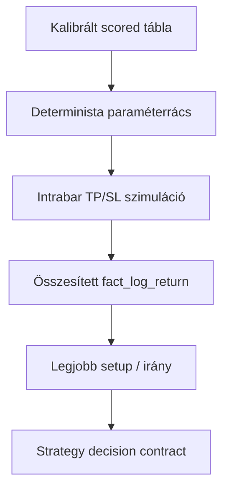
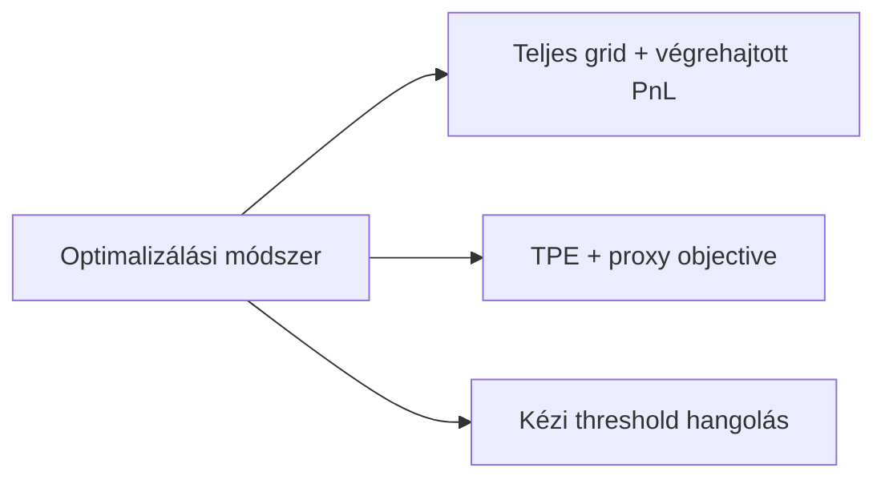
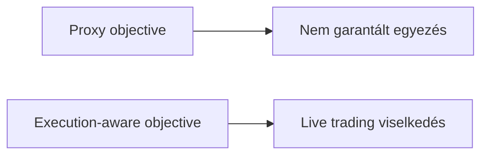
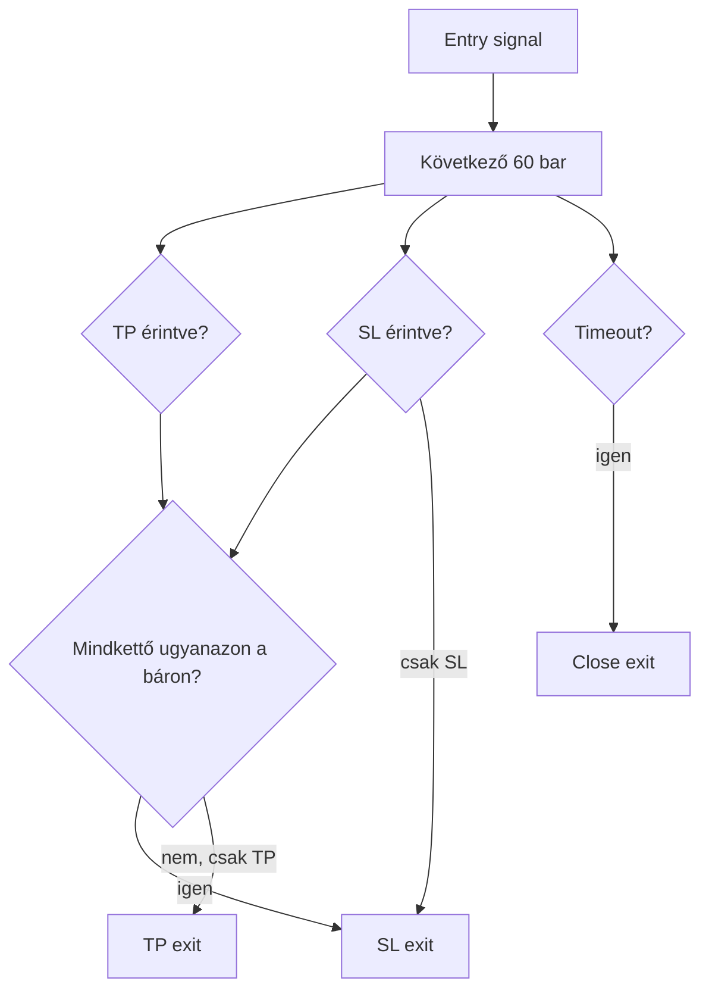
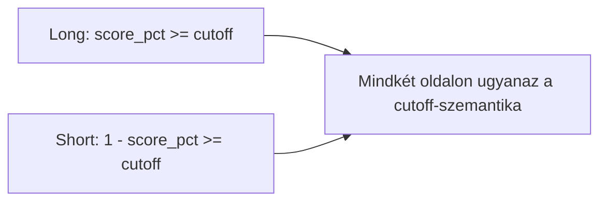

# 6300 - Execution-Aware Grid Search

Az execution-aware grid search célja, hogy a stratégia belépési és kilépési paramétereit ne proxy mutatókon, hanem egy explicit végrehajtási modellen mért realizált loghozam alapján válassza ki. A döntés így nem azt optimalizálja, hogy egy score átlagosan milyen "ígéretes", hanem azt, hogy a tényleges szabálykészlet mit termelne trade-szinten.

## Overview

## Üzleti és módszertani háttér

### Miért kritikus ez a lépés?

A strategy pipeline ezen a ponton fordítja le a kalibrált score-teret konkrét belépési és kilépési szabállyá. Ha itt rossz az objective vagy a keresési logika, akkor a kiválasztott setup laborban jónak tűnhet, de live környezetben már más döntési szerződést hajt végre.

Ez a lépés adja meg azt az egyetlen decision contractot, amelyet a live trading réteg később változtatás nélkül használ. Emiatt itt nem elég "jó közelítést" találni: auditálhatóan meg kell tudni mondani, hogy a választott setup miért éppen ez lett.

### Miért ezt a megközelítést?

| Megközelítés | Előny | Hátrány | Státusz |
|--------------|-------|---------|---------|
| Teljes grid search kis, zárt keresési téren és realizált PnL objective-on | Determinisztikus, teljes lefedést ad, könnyen auditálható | Külön végrehajtási modellt kell fenntartani | Választott |
| TPE / Optuna proxy objective-val | Kevesebb kiértékelés nagy terekben | Kis térben felesleges, és a proxy elvi eltérést visz be | Elvetett |
| Kézi cutoff és TP/SL választás | Gyors emberi iteráció | Nem reprodukálható és könnyen torzított | Elvetett |
| Pusztán osztályozási vagy rank-metrikára optimalizálás | Egyszerűbb modell-összevetés | Nem azonos a kereskedési eredménnyel | Elvetett |

### Miért kell végrehajtás-alapú objective és hogyan működik?

A score önmagában még nem trade-eredmény. A realizált eredményt az dönti el, hogy belépés után mikor aktiválódik a TP vagy az SL, mi történik ugyanazon a báron, és mi a maximális tartási horizont.

**Szabály:** a stratégia-rangsor kizárólag realizált `fact_log_return` alapján történik, nem score-minőség vagy proxy MFE alapján.

### Miért kell irányonként egységes, de shortnál invertált belépési logika és hogyan működik?

A long score esetén a magasabb percentilis jelenti az erősebb lehetőséget. A short oldalon viszont a profitábilis helyzet a target definíció miatt alacsonyabb score-percentilishez kötődik, ezért a belépési feltételnek ezt explicit módon invertálnia kell.

**Szabály:** a cutoff jelentése mindkét irányban ugyanaz: csak a legerősebb score-sávból engedünk belépést.

### Paraméter alapértékek és indoklásuk

| Paraméter | Alapérték | Indoklás |
|-----------|-----------|----------|
| `entry_cutoffs` | `0.90`-`0.99` nyolc lépcsőben | Elég finom rács a top-sáv vizsgálatához, de még teljesen bejárható |
| `tp_specs` | mean / median / p75 és két konzervatív mean-szorzó | Ugyanarra a bucket-információra több realizációs agresszivitást enged |
| `sl_specs` | `none`, `0.5x`, `1.0x`, `1.5x`, `2.0x` TP-arány | A stop szélessége jól értelmezhető kockázati tengelyt ad |
| `max_hold_bars` | `60` | Összhangban marad a `fw60` target-horizonnal és a live tartási szabállyal |
| same-bar szabály | `SL wins` | Konzervatív döntés ismeretlen intrabar sorrend esetén |
| kalibrációs periódus | külön a keresési periódustól | Csökkenti a setup-választásba épülő overfittinget |

### Ismert kockázatok és korlátok

| Kockázat | Tünet | Mitigáció |
|----------|-------|-----------|
| Ugyanazon rezsim túlfittelése | A kiválasztott setup új időszakon gyorsan romlik | Kalibrációs és keresési periódus szétválasztása, későbbi out-of-sample ellenőrzés |
| Kevés trade nagyon magas cutoffnál | Jó aggregate return, de gyenge statisztikai megbízhatóság | Minimum trade-count figyelése a döntésnél |
| Same-bar szabály torzító hatása | Bizonyos setupok túl büntetettek lehetnek | Konzervatív bias elfogadása, mert live-ban az intrabar sorrend nem ismert |
| Elavuló bucket-statisztikák | A TP-szintek már nem a jelenlegi rezsimet tükrözik | Rendszeres újrakalibrálás |
| Stop nélküli setup túl nagy drawdownnal | Jó összhozam, de rossz kockázati profil | Post-search kockázati review és elfogadási küszöbök |

### Validációs checklist

- [ ] A keresési periódus nem fedi át a kalibrációs periódust.
- [ ] A grid search minden definiált cutoff, TP-spec és SL-spec kombinációt végigvizsgál.
- [ ] A rangsor alapja a realizált `fact_log_return`, nem proxy metrika.
- [ ] A same-bar konfliktus kezelése explicit és konzervatív.
- [ ] A short irány belépési logikája invertált percentilis-szemantikát használ.
- [ ] A kiválasztott setup trade-száma elégséges ahhoz, hogy az aggregate metrika értelmezhető legyen.

## Végrehajtási modell részletei

### Intrabar TP/SL értelmezés

- Long esetben a TP a jövőbeli high, az SL a jövőbeli low alapján aktiválódik.
- Short esetben ugyanez tükrözve történik.
- Ha egyik sem aktiválódik a horizont végéig, a pozíció timeouttal zár.

### Keresési tér logikája

Azért vállalható a teljes grid, mert a paramétertér tudatosan kicsi és előre zárt. Itt a teljes lefedés többet ér, mint egy adaptív kereső heurisztika, mert a döntési kockázat nem a számítási költségből, hanem a félreoptimalizált objective-ból jön.

### Kalibráció és keresés szerepszétválasztása

A kalibrációs ablak feladata a score-percentilis és bucket-statisztika előállítása. A keresési ablak feladata kizárólag annak megmérése, hogy ezekre támaszkodva melyik setup termel a legjobb realizált eredményt. A két szerep összemosása felfújná a keresési eredményt.
