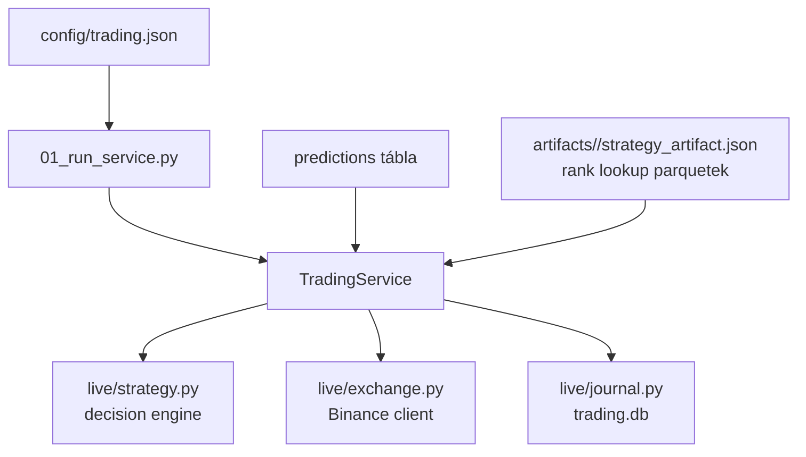

# 7000 - Trading

A `src/trading/` modul a strategy artifact live alkalmazó rétege: percenként
friss adatot szinkronizál, a nyers predikciókat percentilissé alakítja, majd
pozíciót nyit/zár és a teljes futást `trading.db`-be naplózza.

---

## Overview

---

## Felelősség

- Live loop futtatása a `strategy_session_id` alapján.
- Raw predikciók rank-percentile transzformációja a strategy artifact lookupjai szerint.
- Entry/exit/cooldown döntések végrehajtása.
- Folyamatos journal írás `trading_runs`, `trading_signals`, `trading_positions`,
  `trading_orders`, `trading_errors` táblákba.

## Nem feladata

- Strategy kalibráció vagy Optuna optimalizáció.
- Modelltanítás vagy score kalibráció újrafit.
- UI megjelenítés.

## Fejezetek

| Szám | Fájl | Tartalom | Szint |
|------|------|----------|-------|
| 7100 | [7100_live_trading.md](7100_live_trading.md) | Runtime metodológia és almodul-térkép | X100 |
| 7110 | [7110_run_service.md](../database_and_code_doc/7110_run_service.md) | `01_run_service.py` CLI entrypoint | X110 |
| 7120 | [7120_trading_service.md](../database_and_code_doc/7120_trading_service.md) | `live/service.py` fő loop | X110 |
| 7130 | [7130_trading_journal.md](../database_and_code_doc/7130_trading_journal.md) | `live/journal.py` trading DB contract | X110 |
| 7140 | [7140_trading_exchange.md](../database_and_code_doc/7140_trading_exchange.md) | `live/exchange.py` Binance kliens | X110 |
| 7150 | [7150_trading_state_strategy.md](../database_and_code_doc/7150_trading_state_strategy.md) | `live/state.py` és `live/strategy.py` döntési mag | X110 |
