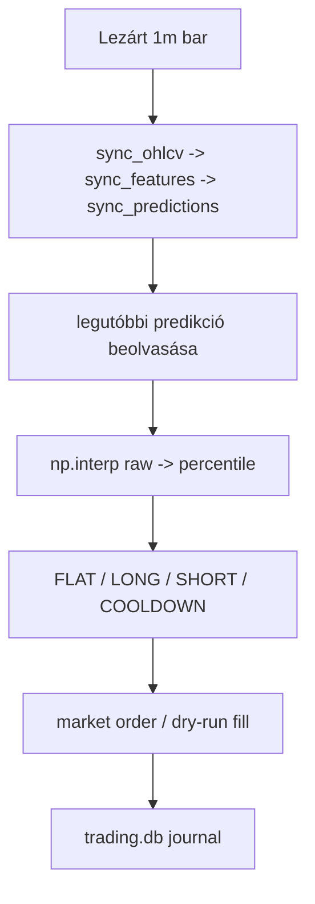
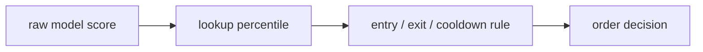
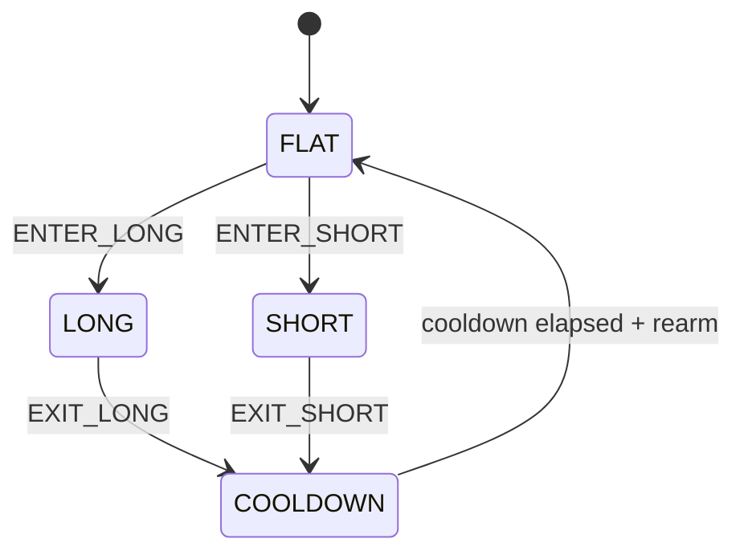

# 7100 - Live Trading Runtime

A live trading réteg a `src/strategy/` által előállított artifactot hajtja végre
valós időben. A kód nem thresholdokat keres, hanem a mentett decision contractot
és lookup táblákat alkalmazza ugyanazzal az állapotgéppel minden percben.

---

## Overview

A runtime két fix inputra támaszkodik:

- adatoldal: `predictions` tábla;
- strategy oldal: `strategy_artifact.json` + `rank_lookup_long/short.parquet`.

---

## Üzleti és módszertani háttér

### Miért külön modul?

A live execution nem keveredhet az offline strategy kalibrációval. A `trading`
réteg feladata kizárólag az, hogy a már kiválasztott decision contractot
determinista módon alkalmazza.

### Miért percentile-alapú döntés fut live-ban?

- A nyers modellscore skálája időben instabil lehet.
- A live és offline viselkedés csak akkor marad összehasonlítható, ha ugyanaz a
  percentile- és edge-logika fut mindkét helyen.

### Fő runtime szerződés

| Elem | Forrás | Runtime használat |
|------|--------|-------------------|
| `strategy_session_id` | `config/trading.json` | strategy artifact kiválasztása |
| `decision_params` | `strategy_artifact.json` | entry, hold, cooldown szabályok |
| `rank_lookup_long/short` | artifact parquet | `np.interp` percentile számítás |
| `mode` | CLI vagy config | `dry_run` vagy `live` order placement |

### Állapotgép

### Kockázatok és korlátok

| Kockázat | Jelenség |
|----------|----------|
| Artifact és live config eltérés | más session fut, mint amit a dashboard mutat |
| Lookup és predikció oszlop eltérés | percentilis számítás hibás vagy `nan` |
| Journal séma-staleness | régi oszlopnevek miatt félreérthető riportok |
| UI-ból és CLI-ből induló service | párhuzamos futás vagy félrevezető állapot |

---

## Almodulok

- Service indítás és leállítás.
- Percenkénti futási ciklus: sync, legfrissebb predikció beolvasása, döntés, végrehajtás.
- Trading journal és állapotnaplózás.
- Exchange kapcsolat dry-run és live módban.
- Állapotgép és döntési logika.
