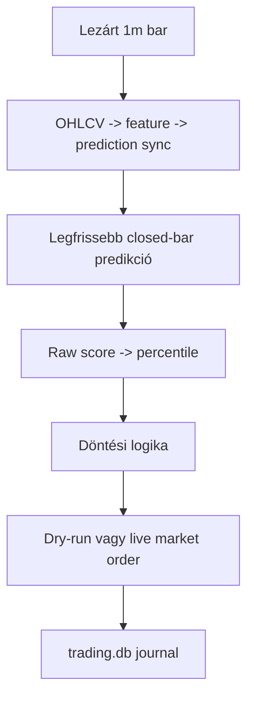
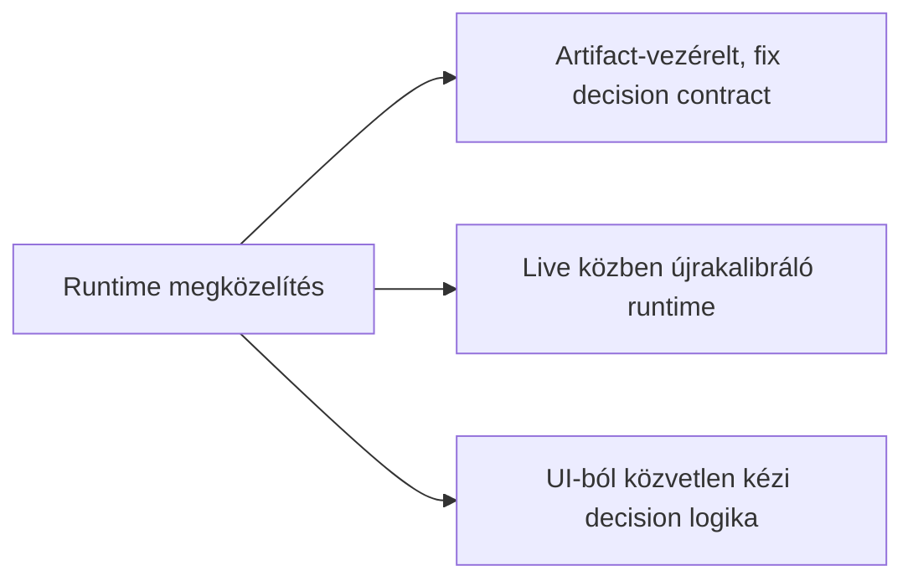
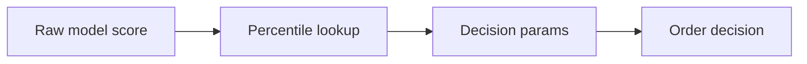
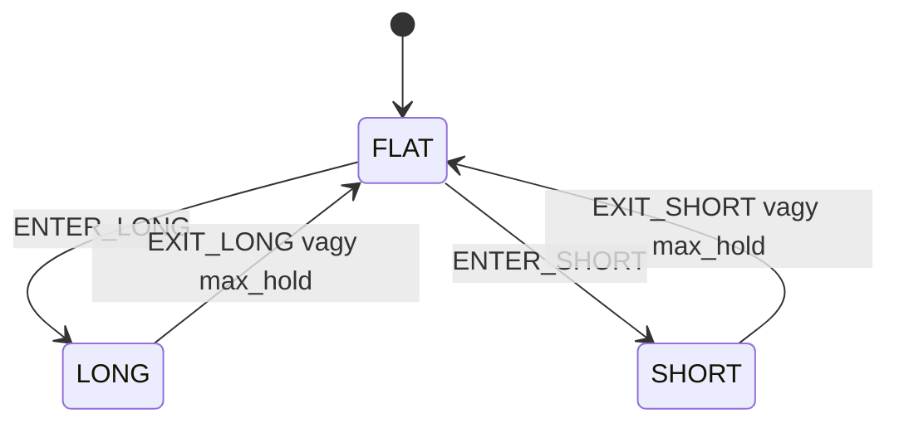

# 7100 - Live Trading Runtime

A live trading runtime feladata az, hogy a már kiválasztott stratégiai döntési szerződést percenként, determinisztikusan és újrahangolás nélkül hajtsa végre. Ez a réteg nem optimalizál és nem tanul újra: az offline pipeline eredményét fordítja át valós idejű pozíciókezeléssé.

## Overview

## Üzleti és módszertani háttér

### Miért kritikus ez a lépés?

Itt dől el, hogy az offline modellezési és stratégiai döntések tényleg ugyanabban a formában jelennek-e meg live környezetben is. Ha a runtime eltér az offline szerződéstől, akkor a backtest, a kalibráció és a valós végrehajtás között megszakad az auditálhatóság.

Ez a réteg egyben operációs biztonsági határ is. A futó service-nek egyszerre kell szinkronban tartania az adatfrissítést, a döntéskiértékelést, az order-végrehajtást és a journalingot úgy, hogy közben ne kezdjen önálló heurisztikákat alkalmazni.

### Miért ezt a megközelítést?

| Megközelítés | Előny | Hátrány | Státusz |
|--------------|-------|---------|---------|
| Előre gyártott artifact + lookup táblák + fix decision params futtatása | Live és offline viselkedés összehasonlítható, auditálható | A módosítás új strategy sessiont igényel | Választott |
| Live közbeni threshold- vagy score-újrakalibrálás | Gyorsan reagálhatna driftre | Megszünteti a backtesttel való egyértelmű egyezést | Elvetett |
| Nyers predikció közvetlen használata percentilis helyett | Kevesebb artifact | A nyers score skálája időben instabil lehet | Elvetett |
| Kézi UI-beavatkozással vezérelt döntéshozás | Operátori kontroll | Nem reprodukálható és nehezen auditálható | Elvetett |

### Miért kell percentilis-alapú live döntés és hogyan működik?

A nyers modellscore skálája időben eltolódhat még akkor is, ha a rangsor információtartalma megmarad. A runtime ezért nem közvetlenül a nyers score-ra küszöböl, hanem a kalibráció során rögzített rank lookup táblák alapján percentilisre fordítja azt.

**Szabály:** a live belépési feltétel ugyanazt a percentilis-szemantikát használja, mint az offline stratégia.

### Miért kell egyszerű, háromállapotú runtime és hogyan működik?

A jelenlegi live döntési logika szándékosan egyszerű: `FLAT -> LONG/SHORT -> FLAT`. Nincs külön cooldown állapotgép a runtime-ban; a kilépés utáni újrabelépés kérdését maga a belépési szabály és a maximális tartási idő kezeli.

**Szabály:** a live state machine nem lehet összetettebb, mint amit az offline strategy contract ténylegesen lefed.

### Paraméter alapértékek és indoklásuk

| Paraméter | Alapérték | Indoklás |
|-----------|-----------|----------|
| `strategy_session_id` | aktuális aktív strategy session | Egyértelműen kijelöli, melyik artifact-csomag fut live-ban |
| score-transzformáció | rank lookup alapú percentilis | Stabilabb jelentést ad, mint a nyers score küszöbölése |
| `entry_cutoff` | artifactból betöltött érték | A live réteg nem talál ki új thresholdot |
| `max_hold_minutes` | tipikusan `60` | Összhangban marad a stratégiai horizonntal |
| order típus | market jellegű végrehajtás | A service célja a determinisztikus végrehajtás, nem egy külön execution-algorithm |
| `mode` | `dry_run` vagy `live` | Ugyanaz a döntési logika futtatható valós order nélkül is |

### Ismert kockázatok és korlátok

| Kockázat | Tünet | Mitigáció |
|----------|-------|-----------|
| Artifact és config eltérés | Más session fut, mint amit az operátor vár | Session-azonosító explicit betöltése és journaling |
| Predikciós oszlop vagy lookup mismatch | Hibás percentilis vagy `NaN` decision input | Stabil oszlopnevek és artifact-integritás ellenőrzése |
| Párhuzamos service-indítás | Dupla order-kísérlet vagy félrevezető UI-állapot | Singleton runner és futásállapot-ellenőrzés |
| Sync hiba vagy késés | Kimaradó vagy későn érkező döntési ciklus | Hibalogolás, ciklusonkénti error-kezelés |
| Egyszerű state machine korlátja | Bizonyos összetettebb kockázatkezelési minták nem modellezhetők | Tudatos scope-határ: a runtime a jelenlegi strategy contractot hajtja végre |

### Validációs checklist

- [ ] A runtime ugyanazt a strategy session artifactot tölti be, amelyet az offline pipeline jóváhagyott.
- [ ] A nyers predikciók percentilisre fordítása a rögzített rank lookup táblákból történik.
- [ ] A live belépési logika nem tartalmaz runtime közben újrakalibrált küszöböket.
- [ ] A state machine ténylegesen `FLAT`, `LONG`, `SHORT` állapotokra épül.
- [ ] A journaling minden ciklusban rögzíti a döntést és a végrehajtási eseményeket.
- [ ] Dry-run és live módban ugyanaz a decision logika fut, csak a végrehajtási oldal különbözik.

## Fő runtime szerződés

| Elem | Forrás | Runtime szerep |
|------|--------|----------------|
| Predikciós input | frissített `predictions` tábla | closed-bar long/short score olvasása |
| Lookup input | rank lookup parquetek | raw score -> percentile leképezés |
| Decision params | strategy artifact | belépési cutoff és tartási szabályok |
| Mód | trading config | dry-run vagy live order-végrehajtás |
| Journal | `trading.db` | futás, signal, pozíció és order audit |
