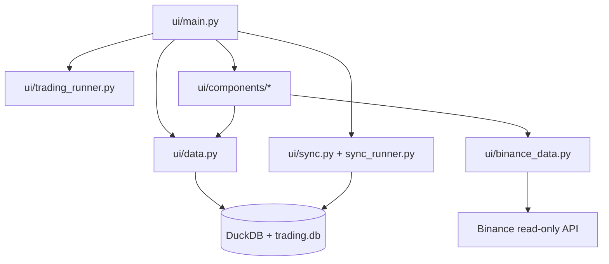

# 8000 - UI

A `src/ui/` modul a ChronoQuant Streamlit dashboardja. Olvas a predikciós és
journal adatforrásokból, vezérli a háttérszinkront és a trading service-t, majd
vizuális kártyákon és chartokon jeleníti meg az állapotot.

---

## Overview

---

## Felelősség

- Streamlit oldal összeállítása és állapotkezelése.
- Predikciós, trade és journal adatok olvasása.
- Background sync és background trading indítása/leállítása.
- Chartok, logok és trade kártyák kirajzolása.

## Nem feladata

- Modelltanítás vagy strategy kalibráció.
- Közvetlen DuckDB üzleti adatmanipuláció.
- Live order placement közvetlen hívása a komponensekből.

## Fejezetek

| Szám | Fájl | Tartalom | Szint |
|------|------|----------|-------|
| 8100 | [8100_dashboard.md](8100_dashboard.md) | dashboard metodológia és almodulok | X100 |
| 8110 | [8110_ui_main.md](../database_and_code_doc/8110_ui_main.md) | `ui/main.py` főoldal | X110 |
| 8120 | [8120_ui_data.md](../database_and_code_doc/8120_ui_data.md) | `ui/data.py` read-access layer | X110 |
| 8130 | [8130_ui_sync.md](../database_and_code_doc/8130_ui_sync.md) | `ui/sync.py` és `sync_runner.py` | X110 |
| 8140 | [8140_ui_runners.md](../database_and_code_doc/8140_ui_runners.md) | `trading_runner.py` és `dashboard_logging.py` | X110 |
| 8150 | [8150_ui_components.md](../database_and_code_doc/8150_ui_components.md) | `components/*` és `binance_data.py` | X110 |
