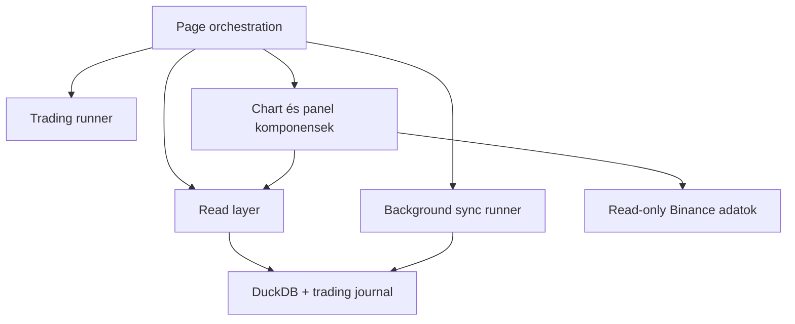
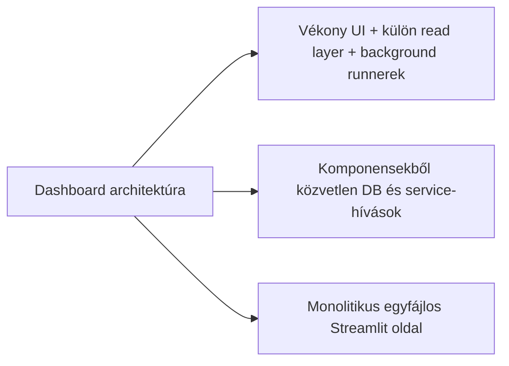
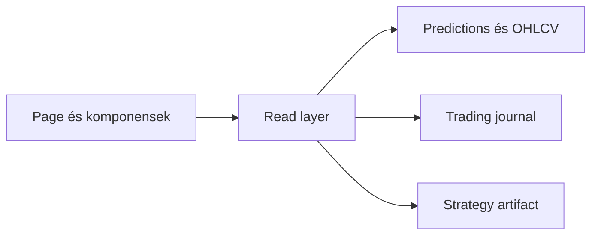
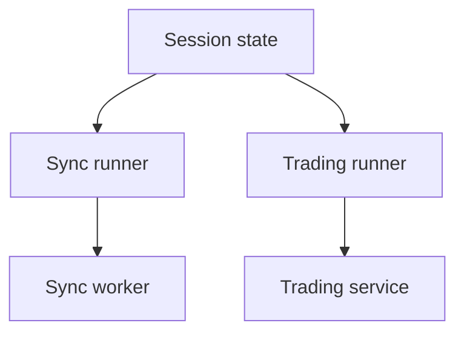

# 8100 - Dashboard

A dashboard célja, hogy ugyanabból a rendszerből egyszerre adjon operátori átláthatóságot és biztonságos vezérlési pontot. Nem elemző notebook és nem admin backoffice: a live állapot gyors, olvasható és korlátozottan vezérelhető nézete.

## Overview

## Üzleti és módszertani háttér

### Miért kritikus ez a lépés?

A dashboard az a pont, ahol az operátor először látja együtt a predikciós állapotot, a futó syncet, a trading service státuszát és a közelmúltbeli trade-eket. Ha ez a réteg pontatlan vagy túl szorosan össze van kötve a backenddel, akkor egyszerre sérül a megfigyelhetőség és a biztonságos kezelhetőség.

Ez különösen fontos Streamlit környezetben, mert a rerender-ciklus könnyen elrejti a háttérben futó szálak és singleton service-ek valós állapotát. A dashboard metodológiájának ezért az explicit állapotkezelés és a felelősségek szétválasztása köré kell épülnie.

### Miért ezt a megközelítést?

| Megközelítés | Előny | Hátrány | Státusz |
|--------------|-------|---------|---------|
| Vékony page-layer, külön read-layer és külön background runner-ek | Csökkenti a UI-kód terhelését, jobban túléli a rerendert és lock-helyzeteket | Több modult kell összehangolni | Választott |
| Komponensekből közvetlen SQL és service-hívás | Gyors prototipizálás | Szétcsúszó lekérdezési logika, gyengébb hibakezelés | Elvetett |
| Egyetlen monolitikus Streamlit oldal minden felelősséggel | Kevés fájl | Nehéz karbantartani és tesztelni | Elvetett |
| Dashboardból közvetlen order placement logika | Rövid vezérlési út | Túl nagy UI-felelősség és operációs kockázat | Elvetett |

### Miért kell külön read-layer és hogyan működik?

A dashboard komponenseinek nem az a feladata, hogy önállóan tudják, melyik tábla, melyik artifact vagy melyik fallback útvonal az aktuális igazságforrás. A read-layer egységesíti ezt a hozzáférést, és egy stabilabb, magasabb szintű adatmodellt ad a page és a komponensek felé.

**Szabály:** komponens ne hordozzon saját SQL- vagy artifact-feloldási logikát, ha ugyanaz a kérdés a read-layeren keresztül egy helyen megoldható.

### Miért kell külön sync- és trading-runner és hogyan működik?

Streamlit alatt a page újrarenderelődik, ezért a háttérfolyamatok életciklusa nem tárolható megbízhatóan lokális változókban. A sync- és trading-runner réteg ennek megfelelően explicit állapotobjektummal, háttérszállal és singleton szemantikával választja le a hosszabb életű műveleteket a vizuális renderelésről.

**Szabály:** a dashboard indíthat és állíthat folyamatot, de nem válhat maga a futó folyamat állapotának elsődleges tárolójává.

### Paraméter alapértékek és indoklásuk

| Paraméter | Alapérték | Indoklás |
|-----------|-----------|----------|
| auto sync polling | rövid, másodperc-alapú fragment frissítés | A perces piac mellett gyors státuszvisszajelzés kell, de teljes oldalrerender nem szükséges |
| sync delay | néhány másodperces zárt-bar utáni várakozás | Csökkenti annak esélyét, hogy a dashboard még nem teljesen lezárt adatot kérjen le |
| chart fókusz | rövid intraday ablakok | Operátori nézetben a közeli múlt fontosabb, mint a teljes történelem |
| trading mód választás | `dry_run` és `live` | Ugyanaz a felület használható validációra és éles futtatásra |
| lock esetén fallback | cache vagy utolsó ismert állapot | Az UI maradjon olvasható átmeneti DB-lock mellett is |

### Ismert kockázatok és korlátok

| Kockázat | Tünet | Mitigáció |
|----------|-------|-----------|
| Session-state és háttérfolyamat drift | A képernyő nem pontosan azt mutatja, ami fut | Runner szintű állapotkezelés és explicit státuszlekérdezés |
| DB lock olvasás közben | A chart vagy panel átmenetileg nem frissül | Fallback cache és read-only lekérdezési stratégia |
| Artifact és live service eltérés | A vizuális küszöbök más setupot sugallnak, mint ami fut | Strategy artifact központi feloldása |
| Túl sok inline UI-logika | Nehézkes újrahasznosítás és tesztelés | Komponensek és formatterek külön tartása |
| Dashboard túl nagy operációs hatáskörrel | Véletlenül backend-felelősséggé válik | Vezérlési funkciók korlátozása start/stop és read-only nézetekre |

### Validációs checklist

- [ ] A dashboard nem közvetlenül a komponensekből ír adatbázisba vagy place-el ordereket.
- [ ] A predikciós, journal- és artifact-adatokat a közös read-layer szolgálja ki.
- [ ] A háttérsync és a trading service állapota újrarender után is visszaolvasható.
- [ ] Lock-helyzet esetén a felület degradálódik, de nem omlik össze.
- [ ] A live és dry-run mód közti különbség a végrehajtásban jelenik meg, nem a megfigyelési logikában.
- [ ] A dashboardból látható állapot megfelel a futó artifactnak és a trading confignak.

## Almodulok

- Page orchestration és layout: a dashboard vizuális és interakciós gerince.
- Read-layer: predikció, pozíció, equity, strategy artifact és journal nézet egységes kiszolgálása.
- Sync runner: per-asset háttérszinkron és időzítés.
- Trading runner: singleton trading service indítás és státuszlekérdezés.
- Komponensek: chart, trade panel, log panel és formázási segédréteg.
