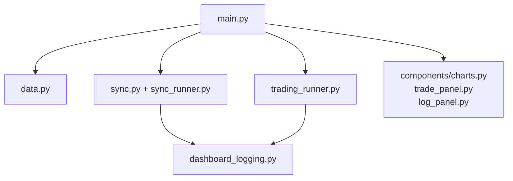
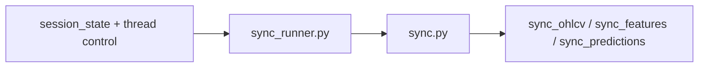

# 8100 - Dashboard

A UI domain egy perces adatfolyamra optimalizált Streamlit dashboard. A page
entrypoint a központi orchestration, a háttérszinkron és a trading runner külön
segédmodulokban élnek, a tényleges megjelenítés pedig komponensekbe van kiszedve.

---

## Overview

---

## Üzleti és módszertani háttér

### Miért külön read-layer van a UI alatt?

- A page és a komponensek ne írjanak közvetlen SQL-t.
- A `data.py` egységesíti a DB, strategy artifact és trading journal olvasást.
- A dashboard így jobban túléli a sémaváltozásokat és a lockolt DB-helyzeteket.

### Miért van külön `sync.py` és `sync_runner.py`?

- `sync.py` a tényleges sync művelet és per-asset lock.
- `sync_runner.py` a Streamlit-session oldali thread és időzítés logika.

### Miért külön trading runner?

A Streamlit rerender ciklusai miatt a service példány nem élhet sima lokális
változóban. A `trading_runner.py` module-szintű singletonként tartja a service-t.

### Kockázatok

| Kockázat | Jelenség |
|----------|----------|
| Session-state és háttérthread drift | a UI más állapotot mutat, mint ami ténylegesen fut |
| Trading DB lock | chart/panel read fallback cache-ből tölt |
| Artifact és config mismatch | chart threshold és live service eltérhet |
| Erősen inline HTML/CSS UI | nehezebb tesztelni és újrahasznosítani |

---

## Almodulok

### [8110_ui_main.md](../database_and_code_doc/8110_ui_main.md)

Az oldal skeletonje, sidebar, chart és panel layout.

### [8120_ui_data.md](../database_and_code_doc/8120_ui_data.md)

DB, strategy artifact, journal és summary olvasás.

### [8130_ui_sync.md](../database_and_code_doc/8130_ui_sync.md)

Perces adatfrissítés, lock és auto-sync state kezelés.

### [8140_ui_runners.md](../database_and_code_doc/8140_ui_runners.md)

Trading service singleton kezelés és dashboard logfájl.

### [8150_ui_components.md](../database_and_code_doc/8150_ui_components.md)

Chartok, trade panel, log panel, formázás és Binance trade read.
