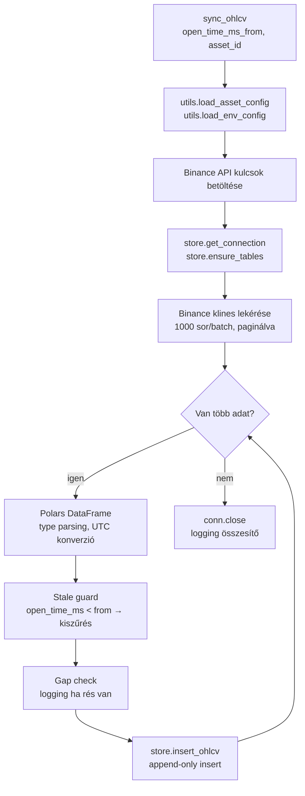
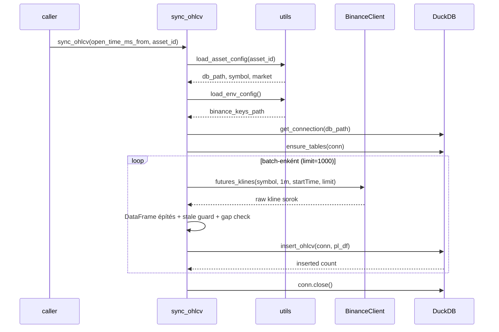
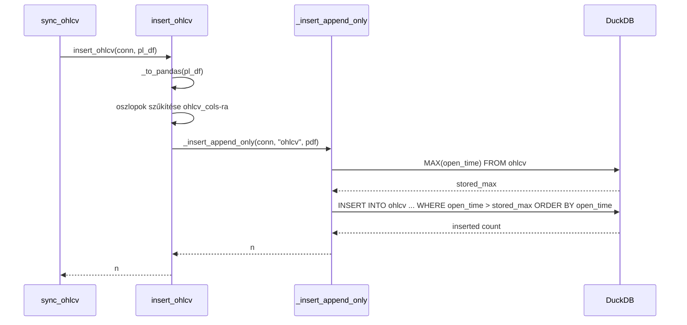

# sync_ohlcv — OHLCV szinkronizáció

Binance kline adatok lekérése és append-only beírása a DuckDB `ohlcv` táblába.

---

## Áttekintés



A szinkronizáció **kumulatív**: csak az utolsó tárolt `open_time` utáni sorok kerülnek beírásra. Újrafuttatás biztonságos — nincs duplikáció.

---

## Függvények

### sync_ohlcv(open_time_ms_from, asset_id)

Lekéri a Binance-től az összes 1 perces gyertyát `open_time_ms_from`-tól napjainkig, és beírja a DuckDB `ohlcv` táblába.

| Paraméter | Típus | Leírás |
|-----------|-------|--------|
| `open_time_ms_from` | `int` | Kezdő időpont, epoch ms (UTC). Tipikusan: `stored_max_open_time + 60 000`. |
| `asset_id` | `str \| None` | Asset kulcs a `config/assets.json`-ból. `None` esetén a default (`solusdt`) kerül használatra. |

Visszatérési érték: `None`. A beírt sorok száma a logba kerül.



---

## Belső logika részletei

### Paginálás

Binance maximum 1000 sort ad vissza hívásonként. A ciklus addig fut, amíg az utolsó batch kisebb mint 1000, vagy az utolsó sor `open_time_ms + 60 000 ms` nem halad előre. Minden batch-nél `start_ms = last_open_ms + 60_000`.

### Stale guard

```python
stale = pl_df.filter(pl.col("open_time_ms") < open_time_ms_from)
```

Ha a Binance visszaad olyan sort, amelynek `open_time_ms` kisebb mint a kért kezdőpont, az kiszűrésre kerül, és WARNING log keletkezik. Ez a jel arra utal, hogy a Binance néha ismét visszaadja az utolsó zárt gyertyát.

### Nyitott gyertya kizárása

```python
.filter(pl.col("close_time_ms") < server_ms)
```

Olyan sorok, amelyeknek `close_time_ms >= server_ms` (azaz még nem zárt gyertya), nem kerülnek beírásra.

### Gap detection

Ha az első batch első sora `open_time_ms > open_time_ms_from`, WARNING log keletkezik. Ez adathiányt jelezhet a Binance-oldalon (ritka).

### Keletkező DataFrame oszlopok (DuckDB-be kerülő)

| Oszlop | Forrás Binance mezőből | Megjegyzés |
|--------|------------------------|------------|
| `open_time` | `open_time` (ms) | `utils.ms_to_utc_str()` konvertálja UTC string-re |
| `open` | `open` | Float64 |
| `high` | `high` | Float64 |
| `low` | `low` | Float64 |
| `close` | `close` | Float64 |
| `volume` | `volume` | Float64 |
| `quote_volume` | `quote_volume` | Float64 |
| `trades` | `trades` | Float64 → DuckDB BIGINT |
| `taker_buy_base` | `taker_buy_base` | Float64 |
| `taker_buy_quote` | `taker_buy_quote` | Float64 |

A `close_time`, `ignore` Binance mezők **nem** kerülnek beírásra.

---

## Store függőségek (`src/store/duckdb_store.py`)

| Függvény | Mikor hívódik | Mit csinál |
|----------|---------------|------------|
| `get_connection(db_path)` | sync induláskor egyszer | Megnyitja a DuckDB fájlt olvasás-írásra. A mappát létrehozza ha nem létezik. |
| `ensure_tables(conn)` | sync induláskor egyszer | Létrehozza az `ohlcv`, `target`, `predictions` táblákat ha még nem léteznek. |
| `insert_ohlcv(conn, df)` | batch-enként | Pandas-ra konvertálja a Polars DF-et, majd `_insert_append_only`-t hív az `ohlcv` táblára. |

### insert_ohlcv belső működése



Az `_insert_append_only` az `open_time` szerint rendezve írja be az adatokat, hogy a DuckDB zonemap statisztikái szorosak maradjanak a range query-knél.

---

## Utils függőségek (`src/utils.py`)

| Függvény | Mit ad vissza |
|----------|---------------|
| `utils.load_asset_config(asset_id)` | `db_path`, `symbol`, `market` — a `config/assets.json`-ból |
| `utils.load_env_config()` | `binance_keys_path` — a Binance API kulcs fájl elérési útja |
| `utils.ms_to_utc_str(ms)` | Epoch milliszekundumból `YYYY-MM-DD HH:MM:SS` UTC string |

---

## Belépési pont (scripts)

Az operatív belépési pont: `scripts/sync_ohlcv.py` — ez hívja meg a `sync_ohlcv()` függvényt a tárolt maximum `open_time` + 1 perc argumentummal.

Lásd még: [`_docs/store/ohlcv_schema.md`](../store/ohlcv_schema.md) — az `ohlcv` tábla sémája és kapcsolatai.
