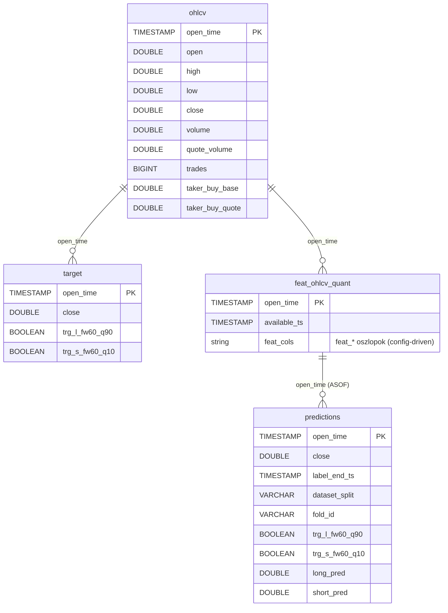

# ohlcv tábla — Schema

Az `ohlcv` tábla tárolja a Binance-ről szinkronizált nyers 1 perces OHLCV gyertyákat.

---

## Áttekintés — DuckDB táblák kapcsolata



Minden tábla `open_time` TIMESTAMP típusú primary key-en alapul. Az összes timestamp **UTC**, `YYYY-MM-DD HH:MM:SS` formátumban tárolva.

---

## ohlcv tábla

**Cél:** Nyers, változatlan Binance kline adatok tárolása. Ez a pipeline alapja — minden downstream tábla (`target`, `feat_ohlcv_quant`, `predictions`) ebből épül fel.

**Fájl:** `database/solusdt/solusdt.duckdb`

**Beírási mód:** append-only, nincs upsert, nincs törlés. A sorok idempotensek — az `insert_ohlcv` csak az aktuális `MAX(open_time)`-nál újabb sorokat ír be.

| Oszlop | Típus | Leírás |
|--------|-------|--------|
| `open_time` | `TIMESTAMP` (PK) | Gyertya nyitásának időpontja, UTC. Minden sor egyedi. |
| `open` | `DOUBLE` | Nyitóár USDT-ben |
| `high` | `DOUBLE` | Legmagasabb ár az 1 perces ablakban |
| `low` | `DOUBLE` | Legalacsonyabb ár az 1 perces ablakban |
| `close` | `DOUBLE` | Záróár USDT-ben |
| `volume` | `DOUBLE` | Forgalom base asset-ben (SOL) |
| `quote_volume` | `DOUBLE` | Forgalom quote asset-ben (USDT) |
| `trades` | `BIGINT` | Kötések száma az 1 perces ablakban |
| `taker_buy_base` | `DOUBLE` | Taker vevő forgalom base asset-ben (SOL) |
| `taker_buy_quote` | `DOUBLE` | Taker vevő forgalom quote asset-ben (USDT) |

### Tábla létrehozása

Az `ensure_tables(conn)` hívja a DuckDB-n:

```sql
CREATE TABLE IF NOT EXISTS ohlcv (
    open_time       TIMESTAMP PRIMARY KEY,
    open            DOUBLE,
    high            DOUBLE,
    low             DOUBLE,
    close           DOUBLE,
    volume          DOUBLE,
    quote_volume    DOUBLE,
    trades          BIGINT,
    taker_buy_base  DOUBLE,
    taker_buy_quote DOUBLE
)
```

### Mi NEM kerül be

A Binance kline API 12 mezőt ad vissza. Az `ohlcv` táblába **nem** kerül be:
- `close_time` — a gyertya zárásakor már az `open_time + 59 999 ms` lenne, redundáns
- `ignore` — Binance deprecated mező, üres string

---

## Kapcsolódó store függvények

### Írás

| Függvény | Hol definiált | Leírás |
|----------|---------------|--------|
| `ensure_tables(conn)` | `store/duckdb_store.py` | Létrehozza az `ohlcv` táblát (és a többi táblát) ha nem létezik |
| `insert_ohlcv(conn, df)` | `store/duckdb_store.py` | Append-only beírás az `ohlcv` táblába; csak a `MAX(open_time)`-nál újabb sorok kerülnek be |

### Olvasás

| Függvény | Hol definiált | Leírás |
|----------|---------------|--------|
| `query_range(db_path, "ohlcv", start, end)` | `store/duckdb_query.py` | Tartományos lekérdezés, pandas DataFrame-ként |
| `query_range_pl(db_path, "ohlcv", start, end)` | `store/duckdb_query.py` | Ugyanaz, Polars DataFrame-ként (zero-copy DuckDB-ből) |
| `ohlcv_row_count(db_path)` | `store/duckdb_query.py` | Teljes sorszám |
| `ohlcv_latest_open_time(db_path)` | `store/duckdb_query.py` | Legutolsó `open_time` string-ként (`YYYY-MM-DD HH:MM:SS`) |
| `ohlcv_time_stats(db_path)` | `store/duckdb_query.py` | `(count, min_open_time, max_open_time)` — egyetlen aggregációs query |
| `ohlcv_dataset_exists(db_path)` | `store/duckdb_query.py` | True ha a tábla létezik és legalább 1 sor van benne |
| `latest_open_time(db_path, "ohlcv")` | `store/duckdb_query.py` | Legutolsó `open_time` `pd.Timestamp`-ként |

---

## Adatbázis fájl

| Asset | DuckDB fájl |
|-------|------------|
| `solusdt` | `database/solusdt/solusdt.duckdb` |

Az elérési út a `config/assets.json` `db_path` mezőjéből jön, amelyet a `utils.load_asset_config(asset_id)` ad vissza. Közvetlen JSON-olvasás tilos — mindig `utils` API-n keresztül.

Lásd még: [`_docs/data_pipeline/sync_ohlcv.md`](../data_pipeline/sync_ohlcv.md) — a szinkronizáció folyamata és logikája.
