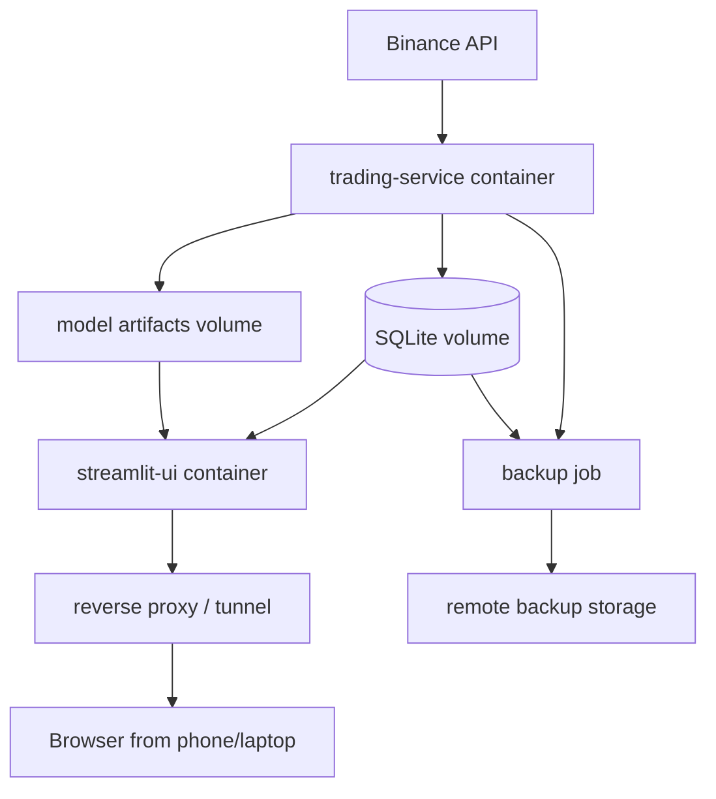
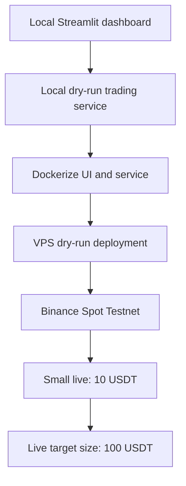
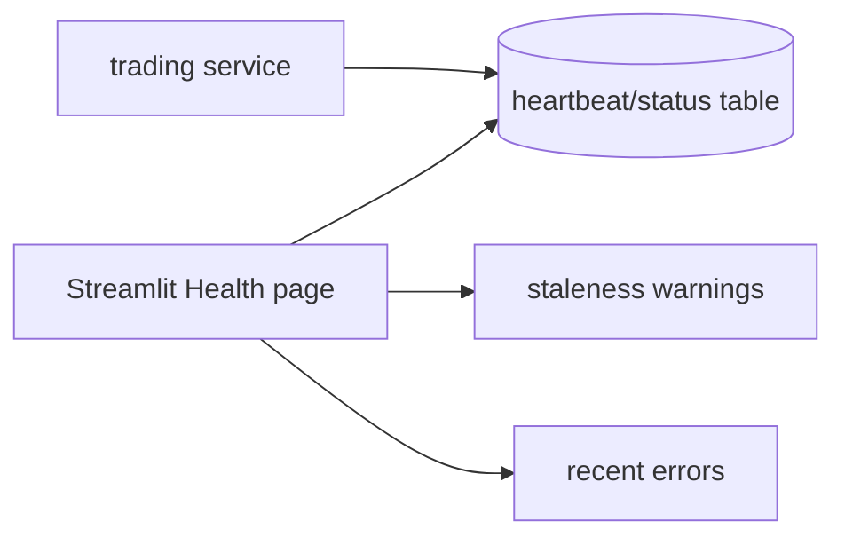

# Deployment and Operations Plan

## Purpose

Define how ChronoQuant should move from a local desktop process to a
server-style setup that can run continuously and expose the Streamlit UI from
other devices.

Google Colab is intentionally out of scope. It is useful for experiments, but it
is not a reliable 24/7 trading runtime.

## Recommendation

Use a small Linux VPS with Docker Compose for the first production-like setup.

Reasons:

- The current project uses SQLite and local model artifacts.
- The trading worker must run continuously.
- Streamlit should be reachable from other devices.
- Deployment should remain understandable and debuggable.
- Docker Compose keeps the first architecture simple.
- Moving to Postgres/cloud-managed infrastructure can happen later.

Recommended providers:

- Hetzner Cloud.
- DigitalOcean Droplet.
- AWS Lightsail.
- Any small VPS with reliable uptime and persistent disk.

Avoid for the first live version:

- Google Colab.
- Notebook runtimes.
- Serverless-only setups without persistent worker semantics.

## Target Runtime Architecture



Containers:

- `trading-service`
  - runs OHLCV/features/predictions/trading loop.
  - writes database and trading journal.
  - owns Binance order execution.
- `streamlit-ui`
  - read-only dashboard.
  - reads the same database/artifacts.
- optional `backup`
  - periodic DB and config/artifact backup.
- optional `reverse-proxy`
  - authentication, TLS, routing.

## Local Phase Before VPS

Before a server deployment, run locally with two terminals.

Terminal 1:

```powershell
uv run python scripts/run_trading_service.py --mode dry_run
```

Terminal 2:

```powershell
uv run streamlit run src/streamlit_app/main.py
```

Phase goal:

- Prove the Streamlit UI can monitor the system.
- Prove dry-run trading decisions are journaled.
- Prove no UI code is required for trading execution.

## Deployment Phases



## Phase 1: Local Streamlit Replacement

Goal:

- Replace desktop app for monitoring.
- Keep everything local.
- No live order execution.

Tasks:

- Implement Streamlit UI.
- Keep data pipeline runnable by existing scripts/worker.
- Add dry-run trading tables when trading service work starts.
- Document the desktop app as legacy.

Acceptance:

- User can view live predictions and backtest/trade history in browser on local
  machine.

## Phase 2: Headless Local Service

Goal:

- Stop relying on manual desktop app startup.
- Run a headless service loop locally.

Tasks:

- Add `scripts/run_trading_service.py`.
- Add `config/trading.json`.
- Add DB trading journal tables.
- Add dry-run executor.
- Add heartbeat table or run status row.
- Add service logs.

Acceptance:

- Service can run for a full day in `dry_run`.
- Streamlit shows fresh data and decisions.
- Restart does not duplicate decisions.

## Phase 3: Docker Compose

Goal:

- Package the service and UI reproducibly.

Proposed files:

```text
Dockerfile
docker-compose.yml
.dockerignore
ops/
  env.example
  backup.ps1 or backup.sh
```

Proposed Compose services:

```yaml
services:
  trading-service:
    build: .
    command: uv run python scripts/run_trading_service.py
    restart: unless-stopped
    volumes:
      - ./database:/app/database
      - ./models:/app/models
      - ./config:/app/config:ro
      - ./logs:/app/logs
    env_file:
      - ops/.env

  streamlit-ui:
    build: .
    command: uv run streamlit run src/streamlit_app/main.py --server.address=0.0.0.0
    restart: unless-stopped
    ports:
      - "8501:8501"
    volumes:
      - ./database:/app/database:ro
      - ./models:/app/models:ro
      - ./config:/app/config:ro
```

Notes:

- For local development, config can stay mounted from the repo.
- For server deployment, secrets should not be committed.
- SQLite read-only mount for UI is preferred where possible.

Acceptance:

- `docker compose up -d` starts both service and UI.
- UI can read current DB.
- Trading service can write the DB.

## Phase 4: VPS Deployment

Goal:

- Run continuously on a small server.
- Access UI from other devices.

Setup tasks:

- Provision Linux VPS.
- Install Docker and Docker Compose.
- Create non-root deploy user.
- Clone repo.
- Copy production config and secrets.
- Start Compose stack.
- Configure firewall.
- Configure tunnel or reverse proxy.

Recommended access options:

1. Tailscale
   - simplest private access.
   - UI reachable only from trusted devices.
2. Cloudflare Tunnel
   - no open inbound port required.
   - can add Cloudflare Access.
3. Nginx/Caddy reverse proxy
   - public HTTPS endpoint.
   - requires authentication setup.

First recommendation:

- Use Tailscale for the first server version.
- Add public HTTPS only later if needed.

Acceptance:

- Streamlit UI opens from another device.
- Service survives SSH disconnect.
- Service restarts after reboot.

## Secrets Management

Current local config:

- `config/env.json` points to `C:/connection/binance_keys.json`.

Server target:

- Use environment variables or mounted secret file outside Git.
- Never commit API keys.
- Use separate keys for:
  - data-only.
  - testnet trading.
  - live trading.

Recommended Binance key permissions:

- Disable withdrawals.
- Enable Spot trading only when needed.
- Restrict by IP if the provider gives stable outbound IP.
- Rotate keys after test phases.

Possible server secret path:

```text
/opt/chronoquant/secrets/binance_keys.json
```

Production `config/env.json` can reference that path.

## Data Storage

Phase 1 storage:

- SQLite on persistent disk.
- Daily backup.
- WAL mode can be considered if Streamlit reads while the service writes.

Potential issue:

- SQLite is fine for one writer and one UI reader, but writes can briefly lock.

Mitigations:

- Keep UI queries bounded.
- Avoid long-running UI queries.
- Use read-only connection for UI where possible.
- Consider WAL mode.
- Move to Postgres if locking becomes annoying.

Future storage:

- Postgres for trading journal and app data.
- Object storage for backups and model artifacts.

## Backup Plan

Minimum:

- Daily copy of SQLite DB.
- Daily copy of config snapshots.
- Daily copy of model and strategy artifacts.
- Keep at least 14 days.

Backup contents:

- `database/*.db`
- `config/*.json`
- `models/<active_model_id>/`
- `backtests/`
- `trading_reports/`
- `logs/`

Backup safety:

- If using SQLite, use SQLite backup API or stop writes briefly before copying.
- Do not expose Binance secrets in remote backups unless encrypted.

## Monitoring and Health

Minimum health signals:

- Last service heartbeat.
- Last OHLCV timestamp.
- Last feature timestamp.
- Last prediction timestamp.
- Last processed signal timestamp.
- Last order timestamp.
- Consecutive error count.
- Current strategy state.
- Current mode: `dry_run`, `testnet`, `live`.



Alerting can be added later:

- Telegram.
- Email.
- Discord webhook.

Do not add alerts before the health data model is stable.

## Security

Minimum security before remote UI:

- UI not publicly exposed without auth.
- Binance keys never in repo.
- Withdrawal disabled on Binance API keys.
- Firewall enabled.
- SSH key login only.
- Regular OS updates.
- Tailscale or Cloudflare Access preferred for first remote access.

Streamlit-specific:

- Treat Streamlit as internal-only unless protected.
- Do not put manual order buttons in phase 1.
- Do not display API secrets.

## Operational Runbook

Start locally:

```powershell
uv run python scripts/run_trading_service.py --mode dry_run
uv run streamlit run src/streamlit_app/main.py
```

Start on server:

```bash
docker compose up -d
docker compose logs -f trading-service
docker compose logs -f streamlit-ui
```

Stop new entries:

- Set `allow_new_entries=false` in trading config or control table.
- Restart service if config is file-based and not hot-reloaded.

Emergency stop:

```bash
docker compose stop trading-service
```

Manual review:

- Check latest trading state in Streamlit.
- Check Binance account balances.
- Check recent orders and fills.
- Do not restart live trading if reconciliation is ambiguous.

## Implementation Tasks

### OPS-1: Define deployment config

- Add `config/trading.json`.
- Add mode values: `dry_run`, `testnet`, `live`.
- Add `enabled=false` default.

Acceptance:

- Service refuses to trade live unless explicitly enabled.

### OPS-2: Add headless service entrypoint

- Add `scripts/run_trading_service.py`.
- It should run without UI.
- It should log heartbeat and status.

Acceptance:

- Local dry-run service can run for multiple cycles.

### OPS-3: Add Dockerfile

- Build Python environment.
- Copy repo.
- Install dependencies.
- Support both service and Streamlit commands.

Acceptance:

- Image builds locally.

### OPS-4: Add docker-compose.yml

- Add `trading-service`.
- Add `streamlit-ui`.
- Mount database/config/models.

Acceptance:

- `docker compose up` starts both services.

### OPS-5: Add backup script

- Backup SQLite DB and critical configs.
- Keep timestamped files.

Acceptance:

- Backup can be restored locally.

### OPS-6: Add server runbook

- VPS setup steps.
- Docker install.
- Secrets placement.
- Compose startup.
- UI access method.

Acceptance:

- A new server can be set up from the document.

### OPS-7: Add basic health status table

- Store heartbeat and latest cycle summary.

Acceptance:

- Streamlit Health page can show whether service is alive.

### OPS-8: Add remote access

- First target: Tailscale.
- Later optional: Cloudflare Tunnel or reverse proxy.

Acceptance:

- UI reachable from another trusted device.

## Open Decisions

- VPS provider.
- Whether first server uses raw `uv` or Docker Compose.
- Whether to enable SQLite WAL mode.
- Whether to keep the large historical dev DB on the server or start with a
  smaller production DB.
- When to migrate from SQLite to Postgres.
- Whether to add Telegram/email alerts in phase 2.

