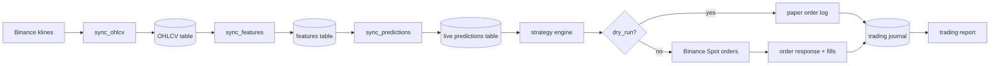
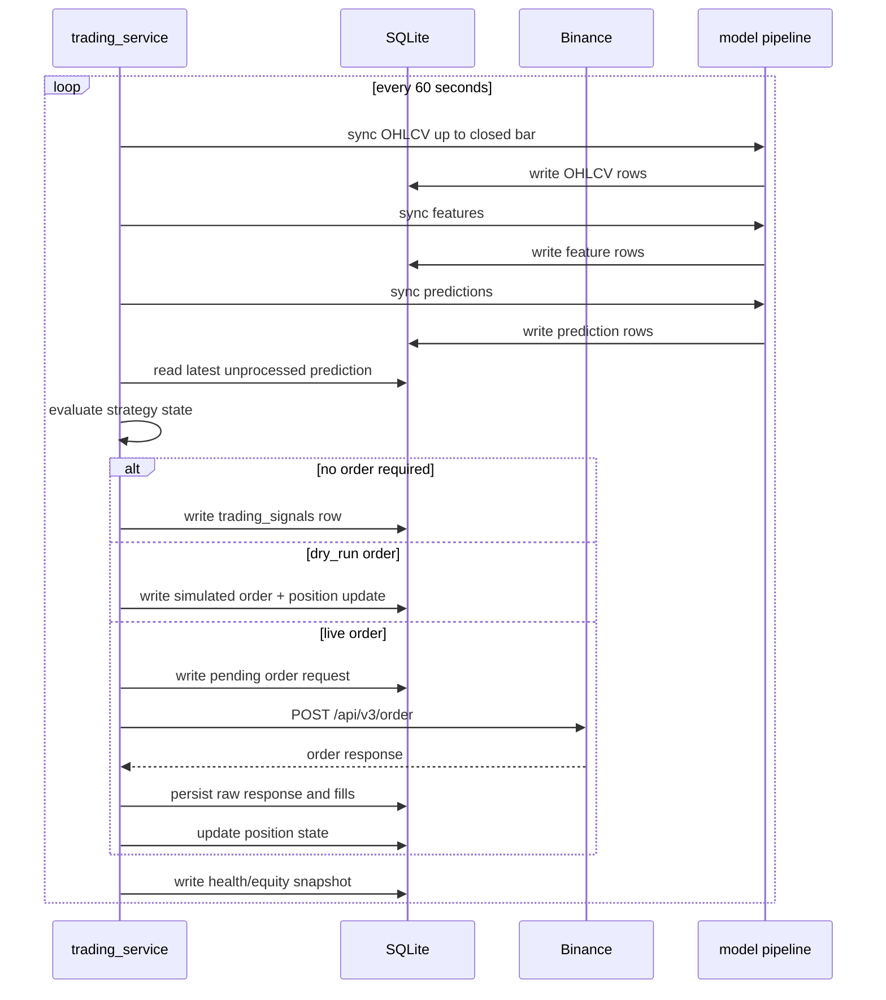
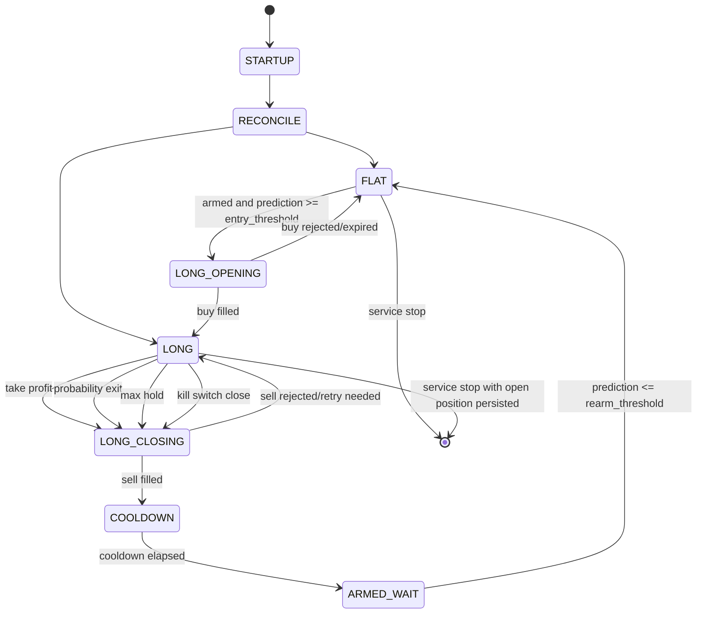
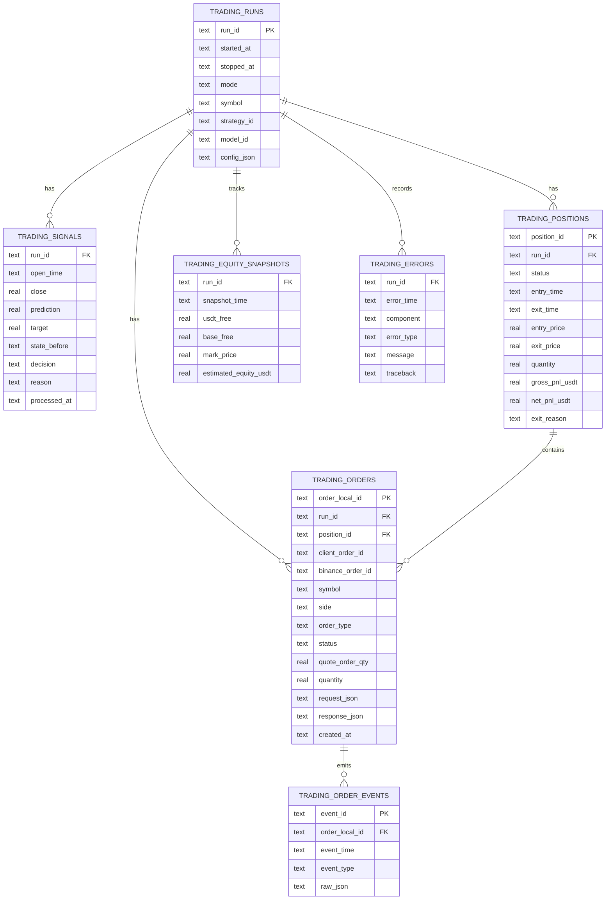
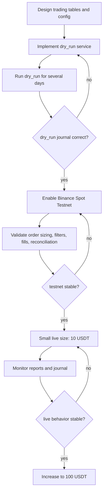

# Live Trading Plan

## Purpose

This document describes the proposed live trading architecture for running the
current ChronoQuant prediction pipeline as an automated Binance Spot trading
service.

Initial live scope:

- Exchange: Binance Spot.
- Symbol: `BCHUSDT`.
- Direction: long-only.
- Capital per entry: about `100 USDT`.
- Runtime model: `logit_l_fw240_q90_l1_v1`.
- Strategy config source: `config/strategies.json`.
- First strategy id: `lasso_long_fw240_q90_managed_v1`.
- First mode: `dry_run`, then Binance Spot Testnet, then small live size.

The trading service should be separate from the Tkinter UI worker. The UI can
display status and reports, but order execution should run as a headless,
restartable service.

## Official Binance References

- Spot new order endpoint: `POST /api/v3/order`
  - https://github.com/binance/binance-spot-api-docs/blob/master/rest-api.md
- Spot symbol filters:
  - https://github.com/binance/binance-spot-api-docs/blob/master/filters.md
- User Data Stream order/account events:
  - https://developers.binance.com/docs/binance-spot-api-docs/user-data-stream
- Spot Testnet:
  - https://developers.binance.com/docs/binance-spot-api-docs/faqs/testnet

## High-Level Architecture



Core principle:

- The model pipeline remains responsible for data and prediction generation.
- The strategy engine consumes only finalized prediction rows.
- The order executor is the only component allowed to call signed Binance
  trading endpoints.
- All decisions and exchange responses are persisted before the next decision is
  allowed.

## Current Strategy Mapping

Strategy source:

- `config/strategies.json`
- strategy id: `lasso_long_fw240_q90_managed_v1`

Current backtested rules:

| Rule | Value |
| --- | ---: |
| Side | long only |
| Entry threshold | `prediction >= 0.35` |
| Rearm threshold | `prediction <= 0.148` |
| Probability exit threshold | `prediction <= 0.105` |
| Minimum hold before probability exit | `30` minutes |
| Maximum hold | `120` minutes |
| Take profit | `1.6%` |
| Hard stop loss | disabled (`0.0`) |
| Cooldown after close | `240` minutes |
| Backtest fee assumption | `10 bps` per side |
| Backtest slippage assumption | `2 bps` per side |

Live interpretation:

- Buy when there is no open position, the strategy is armed, and the latest
  finalized prediction is at or above `0.35`.
- Buy with a Binance Spot MARKET order using `quoteOrderQty`, initially
  `100 USDT`.
- Sell when the position reaches take profit, model support deteriorates, or max
  hold time is reached.
- Sell with a Binance Spot MARKET order using the actual base asset quantity
  held, rounded according to Binance symbol filters.

## Runtime Loop

The loop should run continuously, but decisions should be made only on closed
one-minute bars.



Important timing rule:

- Do not trade on a still-forming candle.
- If the current UTC time is `12:34:xx`, the latest safe one-minute candle is
  normally `12:33:00`.

## Strategy State Machine



State notes:

- `RECONCILE` is mandatory after every restart.
- `LONG_OPENING` and `LONG_CLOSING` prevent duplicate order submission.
- `COOLDOWN` prevents immediate re-entry after a closed trade.
- `ARMED_WAIT` requires the model probability to cool below the rearm threshold
  before the next entry can be considered.

## Binance Order Flow

### Buy

Use `quoteOrderQty` for the first live version. This spends a fixed quote asset
amount and lets Binance calculate the base quantity.

Example shape:

```python
client.create_order(
    symbol="BCHUSDT",
    side="BUY",
    type="MARKET",
    quoteOrderQty="100",
    newClientOrderId="CQ_<run_id>_<open_time>_BUY",
    newOrderRespType="FULL",
)
```

### Sell

Use `quantity` for sells, because after entry the service must sell the actual
BCH amount held.

Example shape:

```python
client.create_order(
    symbol="BCHUSDT",
    side="SELL",
    type="MARKET",
    quantity="<rounded_bch_quantity>",
    newClientOrderId="CQ_<run_id>_<open_time>_SELL",
    newOrderRespType="FULL",
)
```

### Required Exchange Metadata

Before live orders, load and cache `exchangeInfo` for `BCHUSDT`:

- `LOT_SIZE`
- `MARKET_LOT_SIZE`
- `MIN_NOTIONAL`
- `PRICE_FILTER`
- `baseAssetPrecision`
- `quoteAssetPrecision`

The executor must round sell quantities down to the allowed step size and reject
orders that do not satisfy minimum notional rules.

## Proposed Config

Create `config/trading.json`.

```json
{
    "schema_version": 1,
    "enabled": false,
    "mode": "dry_run",
    "exchange": "binance_spot",
    "symbol": "BCHUSDT",
    "strategy_id": "lasso_long_fw240_q90_managed_v1",
    "quote_order_qty": 100.0,
    "poll_seconds": 60,
    "trade_on_closed_bars_only": true,
    "max_open_positions": 1,
    "allow_new_entries": true,
    "close_position_on_kill_switch": false,
    "order": {
        "type": "MARKET",
        "new_order_resp_type": "FULL",
        "recv_window_ms": 5000
    },
    "risk": {
        "max_daily_trades": 10,
        "max_daily_loss_usdt": 20.0,
        "max_consecutive_order_errors": 3
    },
    "journal": {
        "report_dir": "trading_reports",
        "snapshot_every_minutes": 5
    }
}
```

Mode meanings:

- `dry_run`: no Binance order is sent; decisions and simulated orders are
  journaled.
- `testnet`: signed orders are sent to Binance Spot Testnet.
- `live`: signed orders are sent to Binance Spot production.

## Proposed Database Tables

Keep trading history separate from the application-facing live predictions
table.



Minimum viable table set for phase 1:

- `trading_runs`
- `trading_signals`
- `trading_positions`
- `trading_orders`
- `trading_errors`

Add `trading_order_events` and `trading_equity_snapshots` before live mode.

## Idempotency and Duplicate Protection

The service must be safe to restart.

Rules:

- Each prediction row can be processed once per strategy/run mode.
- Each order must have a deterministic `newClientOrderId`.
- Before sending an order, insert a local pending order record.
- After sending an order, persist the full raw Binance response.
- On restart, reconcile local state with Binance account balances, open orders,
  and recent trades before making a new decision.
- Never send a new entry when local state or Binance balances imply an open
  position already exists.

Suggested unique keys:

- `trading_signals`: `(strategy_id, open_time)`
- `trading_orders`: `client_order_id`
- `trading_positions`: `position_id`

## Reconciliation

Startup reconciliation should:

1. Load the latest local position.
2. Query Binance account balances.
3. Query open orders for `BCHUSDT`.
4. Query recent trades if there was a pending order at shutdown.
5. Decide one of:
   - continue as `FLAT`,
   - continue as `LONG`,
   - mark local order as rejected/unknown,
   - stop service and require manual review.

Do not let the service trade if reconciliation is ambiguous.

## Risk Controls

Minimum controls before live mode:

- `enabled=false` by default.
- `mode=dry_run` by default.
- max one open position.
- max daily trades.
- max daily loss in USDT.
- max consecutive API/order errors.
- kill switch that blocks new entries immediately.
- optional kill switch close behavior, disabled by default.
- no order if prediction data is stale.
- no order if OHLCV/features/predictions are not aligned.
- no order if system time differs materially from Binance server time.

Recommended first live settings:

- Start with `quote_order_qty=10`.
- Run for several days.
- Increase to `100` only after journal/reconciliation behavior is verified.

## Reporting

Generate `trading_reports/<run_id>/report.html` and keep a rolling latest report.

Report sections:

- service mode and config snapshot.
- active model and strategy.
- current state.
- latest prediction and decision.
- open position details, if any.
- realized PnL.
- unrealized PnL.
- trade count, win rate, average hold, max drawdown.
- recent signals.
- recent orders.
- recent errors.
- health timestamps:
  - last OHLCV row.
  - last features row.
  - last prediction row.
  - last processed signal.
  - last Binance account check.

## Rollout Plan



## Implementation Tasks

Recommended order:

1. Add `config/trading.json`.
2. Add `utils.load_trading_config()`.
3. Add `src/trading/` package.
4. Add trading table creation helpers.
5. Add strategy state evaluator that consumes latest prediction rows.
6. Add dry-run executor.
7. Add report generation.
8. Add CLI script: `scripts/run_trading_service.py`.
9. Add Binance executor behind `mode=testnet/live`.
10. Add startup reconciliation.
11. Add User Data Stream event persistence.
12. Add tests for state transitions and idempotency.

Proposed package layout:

```text
src/trading/
  __init__.py
  config.py
  journal.py
  state.py
  strategy.py
  exchange.py
  binance_spot.py
  service.py
  reports.py
scripts/
  run_trading_service.py
```

## Open Decisions

- Whether to add a hard stop loss before live mode. The backtest did not use
  one, but live gap/tail risk may justify a small protective stop or emergency
  max-loss rule.
- Whether exit orders should be MARKET only, or whether take profit should use a
  resting LIMIT sell after entry.
- Whether to keep the current 60-second polling loop or add websocket-based
  User Data Stream for immediate fill updates.
- Whether the live model should be switched in `config/env.json` from the
  current p-value baseline to `logit_l_fw240_q90_l1_v1` before dry-run trading.
- Whether production should use SQLite only, or move trading journal tables to a
  more operational database later.

