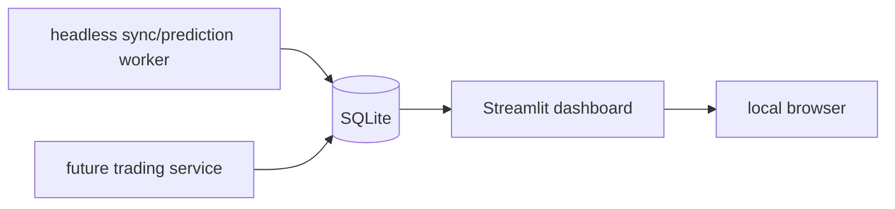
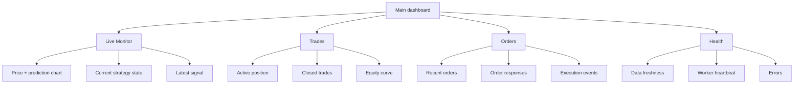

# Streamlit UI Migration Plan

## Purpose

Replace the current desktop UI with a local Streamlit dashboard.

Phase 1 scope:

- Run locally on the same machine as the SQLite database.
- Replace the current Tkinter-style app as the main monitoring UI.
- Keep the UI read-only.
- Do not place order execution logic in the UI.
- Display live price, live predictions, active position, historical trades,
  orders, errors, and service health.

The Streamlit app should be a dashboard over persisted data. The data pipeline
and future trading service should run separately.

## Current State

Legacy UI code removed by the first Streamlit implementation:

- `src/app/ui.py`
- `src/app/worker.py`
- `src/app/settings.py`
- `src/plotting/prediction_view.py`
- `main_app.py`
- `packaging/main_app.spec`

The removed desktop worker responsibilities were mixed:

- sync OHLCV.
- sync features.
- sync predictions.
- update plot.
- show logs.

Target design:

- pipeline/trading workers run headless.
- Streamlit reads tables and renders status.
- UI does not control the trading loop in phase 1.



## Phase 1 User Experience

Run command:

```powershell
uv run streamlit run src/streamlit_app/main.py
```

Initial browser view:

- Current mode: local dashboard.
- Symbol: `BCHUSDT`.
- Active model and strategy.
- Last OHLCV timestamp.
- Last feature timestamp.
- Last prediction timestamp.
- Last processed trading signal timestamp, when trading tables exist.
- Warning if any table is stale.

Recommended page layout:

```text
src/streamlit_app/
  main.py
  pages/
    01_Live_Monitor.py
    02_Trades.py
    03_Orders.py
    04_Health.py
  components/
    charts.py
    tables.py
    metrics.py
  data.py
```

## Navigation



## Page 1: Live Monitor

Goal:

- Show what the model is saying now and how it relates to the trading strategy.

Content:

- Price chart for `BCHUSDT`.
- Prediction chart.
- Horizontal threshold lines:
  - entry threshold: `0.35`.
  - rearm threshold: `0.148`.
  - probability exit threshold: `0.105`.
- Latest prediction card.
- Latest close price card.
- Current state card:
  - `FLAT`
  - `LONG`
  - `COOLDOWN`
  - `UNKNOWN`
- Latest decision:
  - `NO_ACTION`
  - `ENTRY_SIGNAL`
  - `EXIT_SIGNAL`
  - `COOLDOWN`
  - `STALE_DATA`

Initial data source:

- `bchusdt_1m_predictions` for `open_time`, `close`, `prediction`, `target`.
- Later: `trading_signals` for persisted decisions.

Chart requirements:

- Use a shared chart helper.
- Show last `N` hours, configurable in the sidebar.
- Default lookback: 24 hours.
- Include threshold lines.
- Mark entry/exit points if trading tables exist.

## Page 2: Trades

Goal:

- Show active and historical strategy performance.

Content:

- Active position panel:
  - status.
  - entry time.
  - entry price.
  - current price.
  - quantity.
  - unrealized PnL.
  - hold minutes.
  - take-profit price.
  - max-hold remaining minutes.
- Closed trades table:
  - entry time.
  - exit time.
  - entry price.
  - exit price.
  - quantity.
  - net PnL.
  - return percent.
  - exit reason.
- Summary cards:
  - total trades.
  - win rate.
  - total PnL.
  - average hold.
  - max drawdown.
- Equity chart.

Initial fallback:

- Before live trading tables exist, read the latest backtest artifacts from:
  - `backtests/lasso_long_fw240_q90_managed_v1/trades.csv`
  - `backtests/lasso_long_fw240_q90_managed_v1/equity_curve.csv`

Live data source later:

- `trading_positions`
- `trading_equity_snapshots`

## Page 3: Orders

Goal:

- Make order execution auditable.

Content:

- Recent order table:
  - local order id.
  - Binance order id.
  - client order id.
  - side.
  - type.
  - status.
  - quote order quantity.
  - executed quantity.
  - average fill price.
  - created time.
- Raw response expander for selected order.
- Execution events table if available.

Phase 1:

- Show empty state if trading order tables do not exist.
- Do not implement order submission controls.

Live data source later:

- `trading_orders`
- `trading_order_events`

## Page 4: Health

Goal:

- Quickly answer whether the system is alive and data is fresh.

Content:

- DB path.
- Active environment from `config/db.json`.
- Runtime model from `config/env.json`.
- Strategy id from `config/trading.json` when available.
- Table row counts and latest timestamps:
  - OHLCV.
  - features.
  - predictions.
  - trading signals.
  - trading positions.
  - trading orders.
  - trading errors.
- Staleness checks:
  - OHLCV latest row older than expected.
  - features behind OHLCV.
  - predictions behind features.
  - trading service heartbeat missing.
- Recent errors.

## Data Access Layer

Add `src/streamlit_app/data.py`.

Responsibilities:

- Load configs using existing `utils`.
- Read SQLite with small, bounded queries.
- Check if optional trading tables exist.
- Return pandas DataFrames ready for rendering.
- Cache read-only queries with Streamlit cache where useful.

Required functions:

```python
load_dashboard_config() -> dict
table_exists(table_name: str) -> bool
latest_table_timestamp(table_name: str) -> str | None
prediction_history(lookback_hours: int) -> pd.DataFrame
latest_prediction() -> dict | None
active_position() -> dict | None
closed_trades(limit: int = 500) -> pd.DataFrame
recent_orders(limit: int = 200) -> pd.DataFrame
recent_errors(limit: int = 100) -> pd.DataFrame
table_health() -> pd.DataFrame
```

Important:

- Do not import or run `sync_ohlcv`, `sync_features`, or `sync_predictions` from
  the Streamlit app in phase 1.
- The UI reads only.
- Optional tables must not crash the UI if they do not exist yet.

## Visual Design

Keep the UI operational and dense:

- No landing page.
- No marketing hero.
- First screen should show system status and latest prediction.
- Use tabs/pages for workflows.
- Use metric cards sparingly for high-value numbers.
- Use charts for price/prediction/equity.
- Use tables for trades/orders/errors.
- Keep color meanings consistent:
  - green: profitable / healthy.
  - red: loss / error.
  - yellow/orange: stale/warning.
  - neutral gray: no position/no action.

## Development Tasks

### Task UI-1: Add Streamlit dependency

- Add `streamlit` to `pyproject.toml`.
- Verify `uv sync` or `uv run streamlit --version`.

Acceptance:

- `uv run streamlit --version` works.

### Task UI-2: Create Streamlit package skeleton

- Add `src/streamlit_app/main.py`.
- Add `src/streamlit_app/data.py`.
- Add `src/streamlit_app/components/`.
- Add page files under `src/streamlit_app/pages/`.

Acceptance:

- `uv run streamlit run src/streamlit_app/main.py` starts locally.
- Main page shows DB path, model id, latest prediction timestamp.

### Task UI-3: Implement read-only data helpers

- Implement bounded SQLite query helpers.
- Implement optional table checks.
- Implement config loading.

Acceptance:

- Missing trading tables render clean empty states.
- Existing predictions table is displayed without running the pipeline.

### Task UI-4: Build Live Monitor page

- Price and prediction chart.
- Threshold lines from `config/strategies.json`.
- Latest prediction cards.
- Staleness warning.

Acceptance:

- User can inspect last 1h, 6h, 24h, 7d of predictions.
- Chart does not fail if there are no rows.

### Task UI-5: Build Trades page

- Backtest fallback from latest managed strategy artifacts.
- Later live table support.
- Summary metrics and trade table.

Acceptance:

- Page shows `backtests/lasso_long_fw240_q90_managed_v1/trades.csv` before live
  trading tables exist.

### Task UI-6: Build Orders page

- Empty state for missing order tables.
- Recent order table when `trading_orders` exists.
- Raw JSON expander for selected rows if available.

Acceptance:

- No crash before trading implementation exists.

### Task UI-7: Build Health page

- Table latest timestamps.
- Staleness flags.
- Config summary.
- Recent error table.

Acceptance:

- Health page makes it clear whether OHLCV/features/predictions are aligned.

### Task UI-8: Remove desktop app path

- Remove `src/app/`.
- Remove `main_app.py`.
- Remove the old PyInstaller app spec.
- Remove app-only plotting helper code.

Acceptance:

- Engineering docs and tests point to Streamlit as the primary UI.

### Task UI-9: Add tests for data helpers

- Test optional table behavior.
- Test prediction query shape.
- Test latest timestamp helper.

Acceptance:

- `uv run pytest` passes.

## Out of Scope for Phase 1

- Order submission buttons.
- Manual close button.
- Editing strategy config from UI.
- Authentication.
- Remote hosting.
- Multi-user support.
- Postgres migration.

These belong to the deployment and live trading phases.
